# SambungChat Architecture Documentation

This document provides comprehensive architecture documentation for the SambungChat project, including visual diagrams, component relationships, data flows, and design decisions.

## Table of Contents

1. [Overview](#overview)
2. [Technology Stack](#technology-stack)
   - [Frontend Layer](#frontend-layer)
   - [Backend Layer](#backend-layer)
   - [Authentication & Authorization](#authentication--authorization)
   - [Data Layer](#data-layer)
   - [Build & Development Tools](#build--development-tools)
   - [Tech Stack Layers](#tech-stack-layers)
3. [Project Structure](#project-structure)
4. [System Architecture](#system-architecture)
5. [Database Schema](#database-schema)
6. [Authentication Flow](#authentication-flow)
7. [API Request Flow](#api-request-flow)
8. [Data Flow](#data-flow)
9. [Development Workflow](#development-workflow)
10. [Design Decisions](#design-decisions)
11. [Contributor Onboarding](#contributor-onboarding)

---

## Overview

SambungChat is a modern full-stack application built with TypeScript, utilizing a monorepo architecture managed by Turborepo. The application demonstrates best practices for type-safe API development, authentication, and database management.

### Key Characteristics

- **Type-Safe**: End-to-end TypeScript with ORPC for type-safe APIs
- **Monorepo**: Turborepo-managed workspace with shared packages
- **Modern Stack**: SvelteKit frontend, Hono backend, Drizzle ORM
- **Secure**: Better-Auth integration with session-based authentication
- **Developer Experience**: Hot reload, type checking, integrated tooling

### Architecture Philosophy

The architecture follows these core principles:

1. **Separation of Concerns**: Clear boundaries between frontend, backend, and shared packages
2. **Type Safety First**: Leverage TypeScript and ORPC for compile-time guarantees
3. **Developer Experience**: Optimized for rapid development and maintenance
4. **Scalability**: Modular design allows easy extension and modification

---

## Technology Stack

### Frontend Layer

| Technology | Purpose | Version |
|------------|---------|---------|
| **SvelteKit** | Web framework for building reactive user interfaces | Latest |
| **TailwindCSS** | Utility-first CSS framework for rapid styling | Latest |
| **shadcn/ui** | Pre-built, accessible UI components | Latest |
| **TypeScript** | Type-safe JavaScript for frontend code | Latest |

**Why this stack?**
- SvelteKit provides excellent performance and developer experience
- TailwindCSS enables rapid UI development without leaving components
- shadcn/ui offers accessible, customizable components without runtime dependencies
- TypeScript ensures type safety across the entire frontend

### Backend Layer

| Technology | Purpose | Version |
|------------|---------|---------|
| **Hono** | Lightweight, fast web framework for the API server | Latest |
| **ORPC** | End-to-end type-safe RPC framework with OpenAPI support | Latest |
| **TypeScript** | Type-safe backend development | Latest |
| **Bun** | Fast JavaScript runtime and package manager | Latest |

**Why this stack?**
- Hono offers superior performance and modern middleware patterns
- ORPC provides type safety from backend to frontend with auto-completion
- Bun delivers fast startup times and native TypeScript support

### Authentication & Authorization

| Technology | Purpose | Version |
|------------|---------|---------|
| **Better-Auth** | Flexible authentication library with session management | Latest |
| **Drizzle Adapter** | Database adapter for Better-Auth using Drizzle ORM | Latest |

**Why this stack?**
- Better-Auth is framework-agnostic and highly customizable
- Seamless integration with Drizzle ORM for session storage
- Built-in support for OAuth, email verification, and role-based access

### Data Layer

| Technology | Purpose | Version |
|------------|---------|---------|
| **Drizzle ORM** | TypeScript-first ORM with SQL-like API | Latest |
| **PostgreSQL** | Relational database engine | Latest |
| **Drizzle Kit** | Migration and schema management toolkit | Latest |

**Why this stack?**
- Drizzle provides type-safe queries with excellent TypeScript integration
- PostgreSQL offers robust relational data management
- Schema-based migrations ensure database version control

### Build & Development Tools

| Technology | Purpose | Version |
|------------|---------|---------|
| **Turborepo** | High-performance build system for monorepos | Latest |
| **TypeScript** | Shared TypeScript configuration across packages | Latest |
| **ESLint** | Code linting and style enforcement | Latest |
| **Prettier** | Code formatting and consistency | Latest |

**Why this stack?**
- Turborepo optimizes build times with intelligent caching
- Shared configs ensure consistency across all packages
- Automated linting and formatting maintain code quality

### Tech Stack Layers

The following diagram visualizes the complete technology stack organized into four distinct layers, showing how each layer builds upon the one below it:

```mermaid
flowchart TB
    subgraph Presentation["🎨 Presentation Layer - User Interface"]
        direction LR
        SvelteKit["⚡ SvelteKit<br/>Web Framework"]
        Tailwind["🎨 TailwindCSS<br/>Styling"]
        Shadcn["🧩 shadcn/ui<br/>Components"]
        Browser["🌐 Web Browser"]
    end

    subgraph APILayer["📡 API Layer - Request Handling"]
        direction LR
        Hono["🚀 Hono<br/>Web Server"]
        ORPC["🔌 ORPC<br/>Type-Safe RPC"]
        Middleware["🛡️ Middleware<br/>CORS, Logging, Errors"]
    end

    subgraph Business["💼 Business Logic - Domain Logic"]
        direction LR
        AuthPackage["🔐 packages/auth<br/>Better-Auth Config"]
        APIPackage["📦 packages/api<br/>Routers & Procedures"]
        Validation["✅ Zod Validation<br/>Schema Validation"]
    end

    subgraph Data["💾 Data Layer - Data Management"]
        direction LR
        Drizzle["🗃️ Drizzle ORM<br/>Type-Safe Queries"]
        PostgreSQL["🐘 PostgreSQL<br/>Relational Database"]
        Migrations["📋 Migrations<br/>Schema Management"]
    end

    %% Connections between layers
    Browser --> SvelteKit
    SvelteKit --> Tailwind
    SvelteKit --> Shadcn

    Tailwind --> Hono
    Shadcn --> Hono
    SvelteKit -.->|HTTP Request| Hono

    Hono --> Middleware
    Middleware --> ORPC

    ORPC --> AuthPackage
    ORPC --> APIPackage
    ORPC --> Validation

    AuthPackage --> APIPackage
    APIPackage --> Drizzle
    Validation --> Drizzle

    Drizzle --> PostgreSQL
    Drizzle --> Migrations
    Migrations -.->|Sync| PostgreSQL

    %% Response flow (dotted lines)
    PostgreSQL -.->|Query Results| Drizzle
    Drizzle -.->|Typed Data| APIPackage
    APIPackage -.->|Response| ORPC
    ORPC -.->|JSON| Hono
    Hono -.->|HTTP Response| SvelteKit
    SvelteKit -.->|Render UI| Browser

    %% Styling
    classDef presentationNode fill:#3b82f6,stroke:#1d4ed8,color:#fff,stroke-width:2px
    classDef apiNode fill:#8b5cf6,stroke:#6d28d9,color:#fff,stroke-width:2px
    classDef businessNode fill:#f59e0b,stroke:#d97706,color:#fff,stroke-width:2px
    classDef dataNode fill:#10b981,stroke:#059669,color:#fff,stroke-width:2px

    class SvelteKit,Tailwind,Shadcn,Browser presentationNode
    class Hono,ORPC,Middleware apiNode
    class AuthPackage,APIPackage,Validation businessNode
    class Drizzle,PostgreSQL,Migrations dataNode
```



**Layer Responsibilities:**

1. **Presentation Layer** (Blue)
   - **SvelteKit**: Reactive web framework for building user interfaces
   - **TailwindCSS**: Utility-first CSS framework for rapid styling
   - **shadcn/ui**: Pre-built, accessible UI components
   - **Web Browser**: Client-side rendering and user interaction

2. **API Layer** (Purple)
   - **Hono**: Lightweight, high-performance web server
   - **ORPC**: End-to-end type-safe RPC framework
   - **Middleware**: Cross-cutting concerns (CORS, logging, error handling)

3. **Business Logic Layer** (Orange)
   - **packages/auth**: Authentication and authorization logic
   - **packages/api**: Domain-specific procedures and routers
   - **Zod Validation**: Runtime type validation and schema enforcement

4. **Data Layer** (Green)
   - **Drizzle ORM**: Type-safe database queries and migrations
   - **PostgreSQL**: Reliable relational database engine
   - **Migrations**: Schema version control and evolution

**Data Flow:**

```
Request Flow:
Browser → SvelteKit → Hono → ORPC → Business Logic → Drizzle → PostgreSQL

Response Flow:
PostgreSQL → Drizzle → Business Logic → ORPC → Hono → SvelteKit → Browser
```

**Layer Interactions:**

- **Top-Down**: Each layer calls only the layer directly below it
- **Bottom-Up**: Responses flow back through the same path
- **Type Safety**: TypeScript types flow seamlessly across all layers
- **Separation of Concerns**: Each layer has a single, well-defined responsibility

---

## Project Structure

### Monorepo Layout

```
sambung-chat/
├── apps/
│   ├── web/              # SvelteKit frontend application
│   │   ├── src/
│   │   │   ├── routes/   # File-based routing
│   │   │   ├── lib/      # Frontend utilities
│   │   │   └── hooks/    # SvelteKit hooks
│   │   ├── static/       # Static assets
│   │   └── tests/        # Frontend tests
│   │
│   └── server/           # Hono backend application
│       ├── src/
│       │   ├── index.ts  # Server entry point
│       │   ├── routes/   # API route handlers
│       │   └── middleware/ # Custom middleware
│       └── tests/        # Backend tests
│
├── packages/
│   ├── api/              # Shared API layer (ORPC routers & procedures)
│   │   ├── src/
│   │   │   ├── router/   # API router definitions
│   │   │   ├── procedures/ # Individual API procedures
│   │   │   └── index.ts  # Main ORPC router export
│   │   └── tests/        # API tests
│   │
│   ├── auth/             # Authentication configuration (Better-Auth)
│   │   ├── src/
│   │   │   ├── auth.ts   # Better-Auth instance configuration
│   │   │   └── index.ts  # Auth exports
│   │   └── tests/        # Auth tests
│   │
│   ├── db/               # Database schema and queries (Drizzle)
│   │   ├── src/
│   │   │   ├── schema/   # Drizzle schema definitions
│   │   │   │   ├── auth.ts      # Auth tables (user, session, account)
│   │   │   │   ├── todo.ts      # Application tables
│   │   │   │   └── index.ts     # Schema export
│   │   │   ├── migrations/ # Database migrations
│   │   │   └── index.ts  # Database connection export
│   │   └── tests/        # Database tests
│   │
│   ├── env/              # Environment variable validation
│   │   ├── src/
│   │   │   └── env.ts    # Shared environment schema
│   │
│   ├── config/           # Shared TypeScript configurations
│   │   ├── base.json     # Base tsconfig
│   │   ├── nextjs.json   # Next.js-specific config (if needed)
│   │   └── react-library.json # React/Svelte config
│   │
│   └── ui/               # Shared UI components (shadcn/ui)
│       ├── src/
│       │   ├── components/ # Reusable UI components
│       │   └── index.ts  # Component exports
│       └── tests/        # UI tests
│
├── docs/                 # Documentation
│   ├── README.md         # Documentation overview
│   ├── diagrams/         # Diagram source files
│   │   ├── TOOL_EVALUATION.md  # Tool evaluation rationale
│   │   └── MERMAID_GUIDE.md   # Mermaid.js quick reference
│   └── architecture.md   # This file
│
├── package.json          # Root package.json (Turborepo config)
├── turbo.json            # Turborepo configuration
├── bun.lockb            # Dependency lock file
└── README.md            # Project overview
```

### Package Dependencies


**Dependency Summary:**

| Application | Direct Dependencies |
|-------------|-------------------|
| **apps/web** | `@sambung-chat/api`, `@sambung-chat/auth`, `@sambung-chat/env`, `@sambung-chat/config` |
| **apps/server** | `@sambung-chat/api`, `@sambung-chat/auth`, `@sambung-chat/db`, `@sambung-chat/env`, `@sambung-chat/config` |

| Package | Direct Dependencies |
|---------|-------------------|
| **packages/api** | `@sambung-chat/db`, `@sambung-chat/auth`, `@sambung-chat/env` |
| **packages/auth** | `@sambung-chat/db`, `@sambung-chat/env` |
| **packages/db** | `@sambung-chat/env` |
| **packages/ui** | `@sambung-chat/config` |
| **packages/env** | None (leaf package) |
| **packages/config** | None (leaf package) |

**Dependency Flow:**
```
apps/web ──┐
           ├──► packages/api ──► packages/auth ──► packages/db ──► packages/env
apps/server ─┘                                              (leaf)
                           │
                           └──► packages/config (leaf)
```

---

## System Architecture

### High-Level Architecture

```mermaid
flowchart TB
    subgraph Client["Client Layer"]
        Browser[🌐 Web Browser]
    end

    subgraph Frontend["Frontend Layer - SvelteKit"]
        WebApp[SvelteKit App]
        Components[UI Components]
        State[Client State]
    end

    subgraph Backend["Backend Layer - Hono"]
        Server[Hono Server]
        Middleware[Custom Middleware]
    end

    subgraph API["API Layer - ORPC"]
        Router[ORPC Router]
        Procedures[API Procedures]
        Validation[Zod Validation]
    end

    subgraph Business["Business Logic"]
        Auth[Authentication]
        TodoLogic[Todo Logic]
    end

    subgraph Data["Data Layer"]
        Drizzle[Drizzle ORM]
        PostgreSQL[(💾 PostgreSQL Database)]
    end

    Browser -->|HTTPS| WebApp
    WebApp --> Components
    WebApp --> State
    WebApp -->|HTTP Request| Server

    Server --> Middleware
    Server --> Router

    Router --> Procedures
    Procedures --> Validation
    Procedures --> Auth
    Procedures --> TodoLogic

    Auth --> Drizzle
    TodoLogic --> Drizzle
    Drizzle --> PostgreSQL

    PostgreSQL -->|Query Results| Drizzle
    Drizzle -->|Typed Data| Procedures
    Procedures -->|Response| Router
    Router -->|HTTP Response| Server
    Server -->|JSON| WebApp
    WebApp -->|Rendered UI| Browser

    classDef frontend fill:#3b82f6,stroke:#1d4ed8,color:#fff
    classDef backend fill:#8b5cf6,stroke:#6d28d9,color:#fff
    classDef api fill:#f59e0b,stroke:#d97706,color:#fff
    classDef business fill:#10b981,stroke:#059669,color:#fff
    classDef data fill:#ef4444,stroke:#dc2626,color:#fff

    class WebApp,Components,State frontend
    class Server,Middleware backend
    class Router,Procedures,Validation api
    class Auth,TodoLogic business
    class Drizzle,PostgreSQL data
```



### Component Interaction Flow

The following diagram shows how the major components interact during a typical API request, including authentication, data validation, and database operations:


**Key Interactions:**

1. **Frontend Request Flow:**
   - User interacts with SvelteKit pages and components
   - ORPC client makes type-safe requests to the backend
   - All requests are validated with Zod schemas before sending

2. **Backend Processing:**
   - Hono server handles incoming HTTP requests with middleware chain (CORS, logging, error handling)
   - ORPC router routes requests to appropriate API routers (auth, todo, etc.)
   - Protected procedures check authentication via middleware

3. **Authentication & Authorization:**
   - Auth middleware validates session tokens
   - Unauthenticated requests are rejected at the protected procedure level
   - Public procedures bypass authentication checks

4. **Business Logic & Validation:**
   - Input validation ensures data integrity before processing
   - Business logic services (auth, todo) handle domain-specific operations
   - Output validation ensures responses match expected types

5. **Database Operations:**
   - Drizzle ORM provides type-safe database access
   - Connection pooling manages database connections efficiently
   - All database operations are transactional and type-safe

6. **Response Flow:**
   - Database results flow back through ORM as typed data
   - Responses are validated against Zod schemas
   - Type-safe JSON responses returned to frontend
   - Frontend updates UI with fully typed data

**Error Handling:**
- Errors at any level propagate to the error handler
- Consistent error responses returned to frontend
- Frontend receives typed error information

**Type Safety:**
- End-to-end type safety from frontend to database
- Zod schemas ensure runtime validation
- TypeScript types inferred from schemas
- Compile-time guarantees prevent type mismatches

### Request Flow Overview

1. **User Interaction**: User interacts with SvelteKit frontend in browser
2. **HTTP Request**: Frontend makes HTTP request to Hono backend
3. **ORPC Routing**: Hono routes request to ORPC router
4. **Validation**: ORPC validates request using Zod schemas
5. **Business Logic**: Procedures call business logic in packages/api
6. **Database Access**: Drizzle ORM executes SQL queries
7. **Response**: Data flows back through the stack with type safety
8. **UI Update**: Frontend updates UI with typed response

Detailed sequence diagrams will be added in Phase 4 and 5.

---

## Database Schema

### Schema Overview

The database uses PostgreSQL with Drizzle ORM. Schemas are organized by domain:

#### Authentication Schema

- **user** - User accounts with email verification
- **session** - User sessions with IP tracking and expiration
- **account** - OAuth provider accounts and credentials
- **verification** - Email verification tokens

#### Application Schema

- **todo** - Example application entity (extend as needed)

### Entity Relationships

```mermaid
classDiagram
    direction TB

    class User {
        +uuid id 🗝️ PK
        +string email 📧 UK
        +string password 🔒
        +string name 👤
        +boolean emailVerified
        +dateTime createdAt ⏰
        +dateTime updatedAt ⏰
        +index(email)
    }

    class Session {
        +uuid id 🗝️ PK
        +uuid userId 🔗 FK
        +string token 🎫
        +string ipAddress 🌐
        +dateTime expiresAt ⏰
        +dateTime createdAt ⏰
        +index(userId)
        +index(token)
        +onDelete(cascade)
    }

    class Account {
        +uuid id 🗝️ PK
        +uuid userId 🔗 FK
        +string provider 🔐
        +string providerAccountId
        +jsonb credentials
        +dateTime createdAt ⏰
        +dateTime updatedAt ⏰
        +index(userId)
        +index(provider)
    }

    class Verification {
        +uuid id 🗝️ PK
        +string identifier 📧
        +string token 🔑
        +dateTime expiresAt ⏰
        +index(identifier)
        +index(token)
    }

    class Todo {
        +uuid id 🗝️ PK
        +uuid userId 🔗 FK
        +string title 📝
        +boolean completed ✅
        +dateTime createdAt ⏰
        +dateTime updatedAt ⏰
        +index(userId)
        +onDelete(cascade)
    }

    User "1" -- "*" Session : has >
    User "1" -- "*" Account : has >
    User "1" -- "*" Todo : owns >
    User "1" -- "*" Verification : verifies >

    Note beside User "Core authentication entity"
    Note beside Session "Short-lived session tokens"
    Note beside Account "OAuth integrations"
    Note beside Verification "Email verification tokens"
    Note beside Todo "Application data"
```

**Relationships:**
- One user can have multiple sessions (active logins)
- One user can have multiple accounts (OAuth providers)
- One user can have multiple todos
- One user can have multiple verification tokens
- Cascade delete ensures data integrity

### Database Design Principles

1. **UUID Primary Keys**: All tables use UUIDs for security and distributed system compatibility
2. **Timestamps**: Every table tracks `createdAt` and `updatedAt` for auditing
3. **Indexes**: Strategic indexes on foreign keys and query fields for performance
4. **Cascade Deletes**: Referential integrity with automatic cleanup
5. **Type Safety**: Drizzle ensures TypeScript types match database schema

Detailed ERD diagrams and migration documentation will be added in Phase 3.

---

## Authentication Flow

### Authentication Architecture

The application uses **Better-Auth** for session-based authentication with the following flow:


### Authentication Features

- **Session-Based**: Secure server-side sessions with HTTP-only cookies
- **Password Hashing**: bcrypt for secure password storage
- **Email Verification**: Optional email verification flow
- **OAuth Support**: Ready for OAuth provider integration (Google, GitHub, etc.)
- **Session Management**: Automatic session expiration and refresh
- **Protected Routes**: Middleware-based route protection with ORPC

### Security Considerations

1. **HTTP-Only Cookies**: Prevents XSS attacks on session tokens
2. **Secure Flag**: Cookies only sent over HTTPS in production
3. **Password Hashing**: bcrypt with appropriate work factor
4. **CSRF Protection**: Built-in CSRF token validation
5. **Session Expiration**: Automatic timeout of inactive sessions
6. **IP Tracking**: Session IP validation for enhanced security

Detailed authentication sequence diagrams will be added in Phase 4.

---

## API Request Flow

### ORPC Architecture

ORPC provides end-to-end type safety with the following request lifecycle:


### API Layer Components

1. **Router**: Top-level API router organizing all endpoints
2. **Procedures**: Individual API operations with input/output schemas
3. **Middleware**: Reusable logic (auth, logging, validation)
4. **Context**: Per-request data (user, session, database connection)

### Procedure Types

- **publicProcedure**: No authentication required
- **protectedProcedure**: Requires valid session (user context available)
- **adminProcedure**: Requires admin role (if implemented)

### Type Safety Flow


**Benefits:**
- **No API Contracts**: Types automatically inferred from implementation
- **Auto-completion**: IDE suggestions for requests and responses
- **Refactoring Safety**: Changes propagate across frontend and backend
- **Validation**: Runtime validation ensures data integrity

Detailed API request diagrams will be added in Phase 5.

---

## Data Flow

### System-Level Data Flow


### Data Integrity Layers

1. **Client Validation**: Immediate user feedback, reduced server load
2. **Type Safety**: Compile-time guarantees with TypeScript
3. **Schema Validation**: Runtime validation with Zod
4. **Database Constraints**: Enforced data integrity with PostgreSQL
5. **Transaction Safety**: ACID guarantees for complex operations

Detailed data flow diagrams will be added in Phase 6.

---

## Development Workflow

### Local Development

```mermaid
flowchart LR
    Start([Start Development]) --> Install[Install Dependencies]
    Install -->|bun install| EnvSetup[Setup Environment]
    EnvSetup -->|Configure .env| DBSetup[Setup Database]
    DBSetup -->|bun run db:push| Dev[Start Dev Server]
    Dev -->|bun run dev| DevServer[🌐 Web: localhost:5173<br/>⚡ API: localhost:3000]

    DevServer --> Code[Write Code]
    Code -->|Hot Reload| Check{Type Check}
    Check -->|Types OK| Test[Manual Test]
    Check -->|Type Error| FixCode[Fix Types]
    FixCode --> Code

    Test --> DBChange{Database<br/>Change?}
    DBChange -->|Yes| Migration[Create Migration]
    Migration -->|bun run db:push| Test
    DBChange -->|No| Commit[Commit Code]

    Commit -->|git commit| Push[Push Changes]
    Push --> CI{CI/CD}

    CI -->|Pass| Deploy([Deploy])
    CI -->|Fail| FixTests[Fix Tests]
    FixTests --> Code
```



### Development Scripts

| Command | Purpose |
|---------|---------|
| `bun install` | Install all dependencies |
| `bun run dev` | Start all applications in development mode |
| `bun run dev:web` | Start only the web application |
| `bun run dev:server` | Start only the server |
| `bun run build` | Build all applications for production |
| `bun run check-types` | Type-check all packages |
| `bun run db:push` | Push schema changes to database |
| `bun run db:studio` | Open Drizzle Studio for database GUI |
| `bun run lint` | Lint all packages |
| `bun run format` | Format all code with Prettier |

### Database Workflow


### Turborepo Build Optimization

Turborepo provides intelligent build caching:

1. **Package Caching**: Rebuilds only changed packages
2. **Task Pipelines**: Parallel execution of independent tasks
3. **Remote Caching**: Share cache across team (if configured)
4. **Incremental Builds**: Fast iteration during development

Detailed workflow diagrams will be added in Phase 7.

---

## Design Decisions

### Technology Choices

#### Why Turborepo over Nx or Lerna?

- **Simplicity**: Minimal configuration required
- **Performance**: Built-in caching and parallel execution
- **Bun Integration**: Excellent Bun runtime support
- **Developer Experience**: Easy to set up and maintain

#### Why ORPC over tRPC?

- **OpenAPI Support**: Built-in OpenAPI specification generation
- **Framework Agnostic**: Works with any TypeScript framework
- **Better Type Inference**: Improved type inference for complex schemas
- **Modern Design**: Active development with modern patterns

#### Why Better-Auth over NextAuth or Lucia?

- **Framework Agnostic**: Works with SvelteKit, Hono, Next.js, etc.
- **Flexible Configuration**: Highly customizable auth flows
- **Drizzle Integration**: Native Drizzle ORM adapter
- **Type Safety**: First-class TypeScript support

#### Why Drizzle over Prisma?

- **SQL-Like API**: Familiar query syntax for SQL developers
- **Performance**: No query engine overhead, direct SQL execution
- **Type Safety**: Excellent TypeScript inference
- **Migration Control**: Explicit migration files, full control
- **Bundle Size**: Smaller bundle size for serverless deployments

### Architecture Decisions

#### Monorepo Structure

**Benefits:**
- Shared code across frontend and backend (types, utilities)
- Consistent tooling and configurations
- Atomic commits across packages
- Simplified dependency management

**Trade-offs:**
- Slightly more complex initial setup
- Requires monorepo-aware tooling

#### Session-Based Authentication

**Benefits:**
- Server-controlled sessions (easy to invalidate)
- No JWT complexity (refresh tokens, rotation, etc.)
- Simple session management with database storage
- Enhanced security with IP tracking

**Trade-offs:**
- Requires database lookup for each request (mitigated with connection pooling)
- Session storage overhead

#### Type-First Development

**Benefits:**
- Catch errors at compile time
- Self-documenting code with TypeScript types
- Improved IDE experience (autocomplete, inline docs)
- Refactoring safety across codebase

**Trade-offs:**
- Initial learning curve for team members
- More verbose type definitions

---

## Contributor Onboarding

### Quick Start Path

Follow these steps to understand the architecture:

1. **Read This Document** (15 min)
   - Get familiar with the tech stack
   - Understand the project structure

2. **Explore the Database Schema** (15 min)
   - See [Database Schema](#database-schema) section
   - Open Drizzle Studio: `bun run db:studio`

3. **Run the Application** (10 min)
   - Follow setup instructions in README.md
   - Explore the running application

4. **Trace a Request** (20 min)
   - Open [API Request Flow](#api-request-flow) diagrams
   - Follow the code: frontend → ORPC → backend → database
   - Add a breakpoint and step through a request

5. **Review Authentication** (15 min)
   - Read [Authentication Flow](#authentication-flow) section
   - Create a test account and observe session creation

6. **Make a Simple Change** (30 min)
   - Add a field to a database table
   - Update the schema
   - Run migration
   - Update UI to display new field

### Recommended Reading Order

1. **High-Level Overview**
   - [Overview](#overview)
   - [Technology Stack](#technology-stack)
   - [Project Structure](#project-structure)

2. **How Data Flows**
   - [System Architecture](#system-architecture)
   - [Data Flow](#data-flow)
   - [API Request Flow](#api-request-flow)

3. **Authentication & Security**
   - [Authentication Flow](#authentication-flow)

4. **Database Understanding**
   - [Database Schema](#database-schema)

5. **Development Practices**
   - [Development Workflow](#development-workflow)
   - [Design Decisions](#design-decisions)

### Key Concepts to Understand

1. **ORPC Procedures**: How type-safe APIs work
2. **Middleware Chain**: Auth, logging, validation
3. **Drizzle Schema**: Database-to-type mapping
4. **Better-Auth Sessions**: Session lifecycle
5. **Monorepo Dependencies**: How packages reference each other

### Common Tasks

#### Adding a New API Endpoint

1. Define procedure in `packages/api/src/procedures/`
2. Add to router in `packages/api/src/router/`
3. Call from frontend using ORPC client
4. Types automatically available

#### Adding a New Database Table

1. Create schema in `packages/db/src/schema/`
2. Generate migration: `bun run db:generate`
3. Apply migration: `bun run db:push`
4. Types automatically available in code

#### Adding a New UI Component

1. Add to `packages/ui/src/components/`
2. Export from `packages/ui/src/index.ts`
3. Import and use in `apps/web`

### Getting Help

- **Documentation**: Check relevant sections of this document
- **Code Examples**: Refer to existing procedures and components
- **Diagrams**: Visualize flows using the provided diagrams
- **Team**: Ask questions in team channels

---

## Appendix

### Environment Variables

Key environment variables (see `packages/env/src/env.ts` for complete list):

#### Database
- `DATABASE_URL`: PostgreSQL connection string

#### Authentication
- `BETTER_AUTH_SECRET`: Secret for session encryption
- `BETTER_AUTH_URL`: Base URL for auth redirects

#### Application
- `WEB_PORT`: Web application port (default: 5173)
- `SERVER_PORT`: API server port (default: 3000)

### TypeScript Configuration

- **Base Config**: `packages/config/base.json`
- **Strict Mode**: Enabled for all packages
- **Path Aliases**: Configured for clean imports

### Code Style

- **Linter**: ESLint with TypeScript rules
- **Formatter**: Prettier with consistent config
- **Commit Convention**: Conventional commits recommended

### Performance Considerations

1. **Database Indexing**: Strategic indexes on foreign keys and query fields
2. **Connection Pooling**: Drizzle manages database connections efficiently
3. **Lazy Loading**: SvelteKit implements code splitting automatically
4. **API Response Caching**: Can be added with ORPC middleware
5. **Static Assets**: Served from `static/` directory with cache headers

### Security Best Practices

1. **Environment Variables**: Never commit `.env` files
2. **Secrets Management**: Use proper secret management in production
3. **SQL Injection**: Prevented by Drizzle parameterized queries
4. **XSS Prevention**: Svelte automatically escapes content
5. **CSRF Protection**: Built into Better-Auth
6. **Session Security**: HTTP-only, secure, same-site cookies

---

## Changelog

| Version | Date | Changes |
|---------|------|---------|
| 0.1.0 | 2025-01-11 | Initial architecture documentation created |

---

**Last Updated:** 2025-01-11

**Maintained By:** SambungChat Development Team

**Related Documentation:**
- [README.md](./README.md) - Project overview
- [docs/README.md](./docs/README.md) - Additional documentation
- [docs/diagrams/TOOL_EVALUATION.md](./docs/diagrams/TOOL_EVALUATION.md) - Diagram tool evaluation
- [docs/diagrams/MERMAID_GUIDE.md](./docs/diagrams/MERMAID_GUIDE.md) - Mermaid.js quick reference
