# SambungChat Architecture Documentation

This document provides comprehensive architecture documentation for the SambungChat project, including visual diagrams, component relationships, data flows, and design decisions.

## Table of Contents

1. [Overview](#overview)
2. [Technology Stack](#technology-stack)
   - [Frontend Layer](#frontend-layer)
   - [Backend Layer](#backend-layer)
   - [Authentication & Authorization](#authentication--authorization)
   - [Data Layer](#data-layer)
   - [Build & Development Tools](#build--development-tools)
   - [Tech Stack Layers](#tech-stack-layers)
3. [Project Structure](#project-structure)
4. [System Architecture](#system-architecture)
5. [Database Schema](#database-schema)
   - [Schema Overview](#schema-overview)
   - [Authentication Schema ERD](#authentication-schema-erd)
   - [Application Schema ERD](#application-schema-erd)
   - [Entity Relationships](#entity-relationships)
   - [Drizzle Relations and Constraints](#drizzle-relations-and-constraints)
6. [Authentication Flow](#authentication-flow)
   - [Authentication Architecture](#authentication-architecture)
   - [Login Flow (Detailed)](#login-flow-detailed)
   - [Protected Route Access Sequence](#protected-route-access-sequence)
   - [Session Management Flow](#session-management-flow)
   - [Authentication Features](#authentication-features)
   - [Security Considerations](#security-considerations)
7. [API Request Flow](#api-request-flow)
8. [Data Flow](#data-flow)
9. [Development Workflow](#development-workflow)
10. [Design Decisions](#design-decisions)
11. [Contributor Onboarding](#contributor-onboarding)

---

## Overview

SambungChat is a modern full-stack application built with TypeScript, utilizing a monorepo architecture managed by Turborepo. The application demonstrates best practices for type-safe API development, authentication, and database management.

### Key Characteristics

- **Type-Safe**: End-to-end TypeScript with ORPC for type-safe APIs
- **Monorepo**: Turborepo-managed workspace with shared packages
- **Modern Stack**: SvelteKit frontend, Hono backend, Drizzle ORM
- **Secure**: Better-Auth integration with session-based authentication
- **Developer Experience**: Hot reload, type checking, integrated tooling

### Architecture Philosophy

The architecture follows these core principles:

1. **Separation of Concerns**: Clear boundaries between frontend, backend, and shared packages
2. **Type Safety First**: Leverage TypeScript and ORPC for compile-time guarantees
3. **Developer Experience**: Optimized for rapid development and maintenance
4. **Scalability**: Modular design allows easy extension and modification

---

## Technology Stack

### Frontend Layer

| Technology | Purpose | Version |
|------------|---------|---------|
| **SvelteKit** | Web framework for building reactive user interfaces | Latest |
| **TailwindCSS** | Utility-first CSS framework for rapid styling | Latest |
| **shadcn/ui** | Pre-built, accessible UI components | Latest |
| **TypeScript** | Type-safe JavaScript for frontend code | Latest |

**Why this stack?**
- SvelteKit provides excellent performance and developer experience
- TailwindCSS enables rapid UI development without leaving components
- shadcn/ui offers accessible, customizable components without runtime dependencies
- TypeScript ensures type safety across the entire frontend

### Backend Layer

| Technology | Purpose | Version |
|------------|---------|---------|
| **Hono** | Lightweight, fast web framework for the API server | Latest |
| **ORPC** | End-to-end type-safe RPC framework with OpenAPI support | Latest |
| **TypeScript** | Type-safe backend development | Latest |
| **Bun** | Fast JavaScript runtime and package manager | Latest |

**Why this stack?**
- Hono offers superior performance and modern middleware patterns
- ORPC provides type safety from backend to frontend with auto-completion
- Bun delivers fast startup times and native TypeScript support

### Authentication & Authorization

| Technology | Purpose | Version |
|------------|---------|---------|
| **Better-Auth** | Flexible authentication library with session management | Latest |
| **Drizzle Adapter** | Database adapter for Better-Auth using Drizzle ORM | Latest |

**Why this stack?**
- Better-Auth is framework-agnostic and highly customizable
- Seamless integration with Drizzle ORM for session storage
- Built-in support for OAuth, email verification, and role-based access

### Data Layer

| Technology | Purpose | Version |
|------------|---------|---------|
| **Drizzle ORM** | TypeScript-first ORM with SQL-like API | Latest |
| **PostgreSQL** | Relational database engine | Latest |
| **Drizzle Kit** | Migration and schema management toolkit | Latest |

**Why this stack?**
- Drizzle provides type-safe queries with excellent TypeScript integration
- PostgreSQL offers robust relational data management
- Schema-based migrations ensure database version control

### Build & Development Tools

| Technology | Purpose | Version |
|------------|---------|---------|
| **Turborepo** | High-performance build system for monorepos | Latest |
| **TypeScript** | Shared TypeScript configuration across packages | Latest |
| **ESLint** | Code linting and style enforcement | Latest |
| **Prettier** | Code formatting and consistency | Latest |

**Why this stack?**
- Turborepo optimizes build times with intelligent caching
- Shared configs ensure consistency across all packages
- Automated linting and formatting maintain code quality

### Tech Stack Layers

The following diagram visualizes the complete technology stack organized into four distinct layers, showing how each layer builds upon the one below it:

```mermaid
flowchart TB
    subgraph Presentation["🎨 Presentation Layer - User Interface"]
        direction LR
        SvelteKit["⚡ SvelteKit<br/>Web Framework"]
        Tailwind["🎨 TailwindCSS<br/>Styling"]
        Shadcn["🧩 shadcn/ui<br/>Components"]
        Browser["🌐 Web Browser"]
    end

    subgraph APILayer["📡 API Layer - Request Handling"]
        direction LR
        Hono["🚀 Hono<br/>Web Server"]
        ORPC["🔌 ORPC<br/>Type-Safe RPC"]
        Middleware["🛡️ Middleware<br/>CORS, Logging, Errors"]
    end

    subgraph Business["💼 Business Logic - Domain Logic"]
        direction LR
        AuthPackage["🔐 packages/auth<br/>Better-Auth Config"]
        APIPackage["📦 packages/api<br/>Routers & Procedures"]
        Validation["✅ Zod Validation<br/>Schema Validation"]
    end

    subgraph Data["💾 Data Layer - Data Management"]
        direction LR
        Drizzle["🗃️ Drizzle ORM<br/>Type-Safe Queries"]
        PostgreSQL["🐘 PostgreSQL<br/>Relational Database"]
        Migrations["📋 Migrations<br/>Schema Management"]
    end

    %% Connections between layers
    Browser --> SvelteKit
    SvelteKit --> Tailwind
    SvelteKit --> Shadcn

    Tailwind --> Hono
    Shadcn --> Hono
    SvelteKit -.->|HTTP Request| Hono

    Hono --> Middleware
    Middleware --> ORPC

    ORPC --> AuthPackage
    ORPC --> APIPackage
    ORPC --> Validation

    AuthPackage --> APIPackage
    APIPackage --> Drizzle
    Validation --> Drizzle

    Drizzle --> PostgreSQL
    Drizzle --> Migrations
    Migrations -.->|Sync| PostgreSQL

    %% Response flow (dotted lines)
    PostgreSQL -.->|Query Results| Drizzle
    Drizzle -.->|Typed Data| APIPackage
    APIPackage -.->|Response| ORPC
    ORPC -.->|JSON| Hono
    Hono -.->|HTTP Response| SvelteKit
    SvelteKit -.->|Render UI| Browser

    %% Styling
    classDef presentationNode fill:#3b82f6,stroke:#1d4ed8,color:#fff,stroke-width:2px
    classDef apiNode fill:#8b5cf6,stroke:#6d28d9,color:#fff,stroke-width:2px
    classDef businessNode fill:#f59e0b,stroke:#d97706,color:#fff,stroke-width:2px
    classDef dataNode fill:#10b981,stroke:#059669,color:#fff,stroke-width:2px

    class SvelteKit,Tailwind,Shadcn,Browser presentationNode
    class Hono,ORPC,Middleware apiNode
    class AuthPackage,APIPackage,Validation businessNode
    class Drizzle,PostgreSQL,Migrations dataNode
```



**Layer Responsibilities:**

1. **Presentation Layer** (Blue)
   - **SvelteKit**: Reactive web framework for building user interfaces
   - **TailwindCSS**: Utility-first CSS framework for rapid styling
   - **shadcn/ui**: Pre-built, accessible UI components
   - **Web Browser**: Client-side rendering and user interaction

2. **API Layer** (Purple)
   - **Hono**: Lightweight, high-performance web server
   - **ORPC**: End-to-end type-safe RPC framework
   - **Middleware**: Cross-cutting concerns (CORS, logging, error handling)

3. **Business Logic Layer** (Orange)
   - **packages/auth**: Authentication and authorization logic
   - **packages/api**: Domain-specific procedures and routers
   - **Zod Validation**: Runtime type validation and schema enforcement

4. **Data Layer** (Green)
   - **Drizzle ORM**: Type-safe database queries and migrations
   - **PostgreSQL**: Reliable relational database engine
   - **Migrations**: Schema version control and evolution

**Data Flow:**

```
Request Flow:
Browser → SvelteKit → Hono → ORPC → Business Logic → Drizzle → PostgreSQL

Response Flow:
PostgreSQL → Drizzle → Business Logic → ORPC → Hono → SvelteKit → Browser
```

**Layer Interactions:**

- **Top-Down**: Each layer calls only the layer directly below it
- **Bottom-Up**: Responses flow back through the same path
- **Type Safety**: TypeScript types flow seamlessly across all layers
- **Separation of Concerns**: Each layer has a single, well-defined responsibility

---

## Project Structure

### Monorepo Layout

```
sambung-chat/
├── apps/
│   ├── web/              # SvelteKit frontend application
│   │   ├── src/
│   │   │   ├── routes/   # File-based routing
│   │   │   ├── lib/      # Frontend utilities
│   │   │   └── hooks/    # SvelteKit hooks
│   │   ├── static/       # Static assets
│   │   └── tests/        # Frontend tests
│   │
│   └── server/           # Hono backend application
│       ├── src/
│       │   ├── index.ts  # Server entry point
│       │   ├── routes/   # API route handlers
│       │   └── middleware/ # Custom middleware
│       └── tests/        # Backend tests
│
├── packages/
│   ├── api/              # Shared API layer (ORPC routers & procedures)
│   │   ├── src/
│   │   │   ├── router/   # API router definitions
│   │   │   ├── procedures/ # Individual API procedures
│   │   │   └── index.ts  # Main ORPC router export
│   │   └── tests/        # API tests
│   │
│   ├── auth/             # Authentication configuration (Better-Auth)
│   │   ├── src/
│   │   │   ├── auth.ts   # Better-Auth instance configuration
│   │   │   └── index.ts  # Auth exports
│   │   └── tests/        # Auth tests
│   │
│   ├── db/               # Database schema and queries (Drizzle)
│   │   ├── src/
│   │   │   ├── schema/   # Drizzle schema definitions
│   │   │   │   ├── auth.ts      # Auth tables (user, session, account)
│   │   │   │   ├── todo.ts      # Application tables
│   │   │   │   └── index.ts     # Schema export
│   │   │   ├── migrations/ # Database migrations
│   │   │   └── index.ts  # Database connection export
│   │   └── tests/        # Database tests
│   │
│   ├── env/              # Environment variable validation
│   │   ├── src/
│   │   │   └── env.ts    # Shared environment schema
│   │
│   ├── config/           # Shared TypeScript configurations
│   │   ├── base.json     # Base tsconfig
│   │   ├── nextjs.json   # Next.js-specific config (if needed)
│   │   └── react-library.json # React/Svelte config
│   │
│   └── ui/               # Shared UI components (shadcn/ui)
│       ├── src/
│       │   ├── components/ # Reusable UI components
│       │   └── index.ts  # Component exports
│       └── tests/        # UI tests
│
├── docs/                 # Documentation
│   ├── README.md         # Documentation overview
│   ├── diagrams/         # Diagram source files
│   │   ├── TOOL_EVALUATION.md  # Tool evaluation rationale
│   │   └── MERMAID_GUIDE.md   # Mermaid.js quick reference
│   └── architecture.md   # This file
│
├── package.json          # Root package.json (Turborepo config)
├── turbo.json            # Turborepo configuration
├── bun.lockb            # Dependency lock file
└── README.md            # Project overview
```

### Package Dependencies


**Dependency Summary:**

| Application | Direct Dependencies |
|-------------|-------------------|
| **apps/web** | `@sambung-chat/api`, `@sambung-chat/auth`, `@sambung-chat/env`, `@sambung-chat/config` |
| **apps/server** | `@sambung-chat/api`, `@sambung-chat/auth`, `@sambung-chat/db`, `@sambung-chat/env`, `@sambung-chat/config` |

| Package | Direct Dependencies |
|---------|-------------------|
| **packages/api** | `@sambung-chat/db`, `@sambung-chat/auth`, `@sambung-chat/env` |
| **packages/auth** | `@sambung-chat/db`, `@sambung-chat/env` |
| **packages/db** | `@sambung-chat/env` |
| **packages/ui** | `@sambung-chat/config` |
| **packages/env** | None (leaf package) |
| **packages/config** | None (leaf package) |

**Dependency Flow:**
```
apps/web ──┐
           ├──► packages/api ──► packages/auth ──► packages/db ──► packages/env
apps/server ─┘                                              (leaf)
                           │
                           └──► packages/config (leaf)
```

---

## System Architecture

### High-Level Architecture

```mermaid
flowchart TB
    subgraph Client["Client Layer"]
        Browser[🌐 Web Browser]
    end

    subgraph Frontend["Frontend Layer - SvelteKit"]
        WebApp[SvelteKit App]
        Components[UI Components]
        State[Client State]
    end

    subgraph Backend["Backend Layer - Hono"]
        Server[Hono Server]
        Middleware[Custom Middleware]
    end

    subgraph API["API Layer - ORPC"]
        Router[ORPC Router]
        Procedures[API Procedures]
        Validation[Zod Validation]
    end

    subgraph Business["Business Logic"]
        Auth[Authentication]
        TodoLogic[Todo Logic]
    end

    subgraph Data["Data Layer"]
        Drizzle[Drizzle ORM]
        PostgreSQL[(💾 PostgreSQL Database)]
    end

    Browser -->|HTTPS| WebApp
    WebApp --> Components
    WebApp --> State
    WebApp -->|HTTP Request| Server

    Server --> Middleware
    Server --> Router

    Router --> Procedures
    Procedures --> Validation
    Procedures --> Auth
    Procedures --> TodoLogic

    Auth --> Drizzle
    TodoLogic --> Drizzle
    Drizzle --> PostgreSQL

    PostgreSQL -->|Query Results| Drizzle
    Drizzle -->|Typed Data| Procedures
    Procedures -->|Response| Router
    Router -->|HTTP Response| Server
    Server -->|JSON| WebApp
    WebApp -->|Rendered UI| Browser

    classDef frontend fill:#3b82f6,stroke:#1d4ed8,color:#fff
    classDef backend fill:#8b5cf6,stroke:#6d28d9,color:#fff
    classDef api fill:#f59e0b,stroke:#d97706,color:#fff
    classDef business fill:#10b981,stroke:#059669,color:#fff
    classDef data fill:#ef4444,stroke:#dc2626,color:#fff

    class WebApp,Components,State frontend
    class Server,Middleware backend
    class Router,Procedures,Validation api
    class Auth,TodoLogic business
    class Drizzle,PostgreSQL data
```



### Component Interaction Flow

The following diagram shows how the major components interact during a typical API request, including authentication, data validation, and database operations:


**Key Interactions:**

1. **Frontend Request Flow:**
   - User interacts with SvelteKit pages and components
   - ORPC client makes type-safe requests to the backend
   - All requests are validated with Zod schemas before sending

2. **Backend Processing:**
   - Hono server handles incoming HTTP requests with middleware chain (CORS, logging, error handling)
   - ORPC router routes requests to appropriate API routers (auth, todo, etc.)
   - Protected procedures check authentication via middleware

3. **Authentication & Authorization:**
   - Auth middleware validates session tokens
   - Unauthenticated requests are rejected at the protected procedure level
   - Public procedures bypass authentication checks

4. **Business Logic & Validation:**
   - Input validation ensures data integrity before processing
   - Business logic services (auth, todo) handle domain-specific operations
   - Output validation ensures responses match expected types

5. **Database Operations:**
   - Drizzle ORM provides type-safe database access
   - Connection pooling manages database connections efficiently
   - All database operations are transactional and type-safe

6. **Response Flow:**
   - Database results flow back through ORM as typed data
   - Responses are validated against Zod schemas
   - Type-safe JSON responses returned to frontend
   - Frontend updates UI with fully typed data

**Error Handling:**
- Errors at any level propagate to the error handler
- Consistent error responses returned to frontend
- Frontend receives typed error information

**Type Safety:**
- End-to-end type safety from frontend to database
- Zod schemas ensure runtime validation
- TypeScript types inferred from schemas
- Compile-time guarantees prevent type mismatches

### Request Flow Overview

1. **User Interaction**: User interacts with SvelteKit frontend in browser
2. **HTTP Request**: Frontend makes HTTP request to Hono backend
3. **ORPC Routing**: Hono routes request to ORPC router
4. **Validation**: ORPC validates request using Zod schemas
5. **Business Logic**: Procedures call business logic in packages/api
6. **Database Access**: Drizzle ORM executes SQL queries
7. **Response**: Data flows back through the stack with type safety
8. **UI Update**: Frontend updates UI with typed response

Detailed sequence diagrams will be added in Phase 4 and 5.

---

## Database Schema

### Schema Overview

The database uses PostgreSQL with Drizzle ORM. Schemas are organized by domain:

#### Authentication Schema

- **user** - User accounts with email verification
- **session** - User sessions with IP tracking and expiration
- **account** - OAuth provider accounts and credentials
- **verification** - Email verification tokens

#### Application Schema

- **todo** - Example application entity (extend as needed)

### Authentication Schema ERD

The following detailed Entity Relationship Diagram (ERD) shows the complete authentication schema with all fields, data types, constraints, indexes, and relationships:

```mermaid
classDiagram
    direction TB

    class User {
        +text id 🗝️ PK
        +text name 👤 NOT NULL
        +text email 📧 NOT NULL UK
        +boolean emailVerified ✅ NOT NULL
        +text image 🖼️ NULLABLE
        +timestamp createdAt ⏰ NOT NULL DEFAULT now()
        +timestamp updatedAt ⏰ NOT NULL AUTO-UPDATE
    }

    class Session {
        +text id 🗝️ PK
        +text userId 🔗 FK NOT NULL
        +text token 🎫 NOT NULL UK
        +timestamp expiresAt ⏰ NOT NULL
        +timestamp createdAt ⏰ NOT NULL DEFAULT now()
        +timestamp updatedAt ⏰ NOT NULL AUTO-UPDATE
        +text ipAddress 🌐 NULLABLE
        +text userAgent 🌍 NULLABLE
        +index(userId)
        +onDelete(CASCADE)
    }

    class Account {
        +text id 🗝️ PK
        +text userId 🔗 FK NOT NULL
        +text accountId 🔑 NOT NULL
        +text providerId 🔐 NOT NULL
        +text accessToken 🎫 NULLABLE
        +text refreshToken 🔄 NULLABLE
        +text idToken 📋 NULLABLE
        +timestamp accessTokenExpiresAt ⏰ NULLABLE
        +timestamp refreshTokenExpiresAt ⏰ NULLABLE
        +text scope 📝 NULLABLE
        +text password 🔒 NULLABLE
        +timestamp createdAt ⏰ NOT NULL DEFAULT now()
        +timestamp updatedAt ⏰ NOT NULL AUTO-UPDATE
        +index(userId)
        +onDelete(CASCADE)
    }

    class Verification {
        +text id 🗝️ PK
        +text identifier 📧 NOT NULL
        +text value 🔑 NOT NULL
        +timestamp expiresAt ⏰ NOT NULL
        +timestamp createdAt ⏰ NOT NULL DEFAULT now()
        +timestamp updatedAt ⏰ NOT NULL AUTO-UPDATE
        +index(identifier)
    }

    User "1" -- "0..*" Session : has >
    User "1" -- "0..*" Account : has >
    Note beside User "Core authentication entity<br/>One user can have multiple<br/>sessions across devices"
    Note beside Session "Short-lived session tokens<br/>Deleted when user is deleted<br/>CASCADE delete"
    Note beside Account "OAuth provider accounts<br/>Users can link multiple<br/>providers (Google, GitHub, etc.)<br/>Deleted when user is deleted<br/>CASCADE delete"
    Note beside Verification "Standalone table for<br/>email verification &<br/>password reset tokens<br/>No direct foreign key to user"
```

**Relationship Details:**

1. **User to Session (1:N)**
   - **Cardinality**: One user can have zero or more sessions
   - **Foreign Key**: `session.user_id` → `user.id`
   - **Constraint**: `ON DELETE CASCADE` - When a user is deleted, all their sessions are automatically deleted
   - **Index**: `session_userId_idx` on `user_id` for fast session lookups by user
   - **Use Case**: Allows users to be logged in on multiple devices simultaneously

2. **User to Account (1:N)**
   - **Cardinality**: One user can have zero or more accounts
   - **Foreign Key**: `account.user_id` → `user.id`
   - **Constraint**: `ON DELETE CASCADE` - When a user is deleted, all their linked accounts are automatically deleted
   - **Index**: `account_userId_idx` on `user_id` for fast account lookups by user
   - **Use Case**: Users can link multiple OAuth providers (Google, GitHub, etc.) or have both OAuth and credential-based authentication

3. **Verification (Standalone)**
   - **No Direct Relationship**: The verification table has no foreign key to the user table
   - **Index**: `verification_identifier_idx` on `identifier` for fast token lookups
   - **Design Rationale**: Verification tokens are looked up by email/identifier, not by user ID, for security and simplicity
   - **Use Case**: Email verification, password reset, and other temporary verification flows

**Field Details:**

| Table | Field | Data Type | Constraints | Purpose |
|-------|-------|-----------|-------------|---------|
| **user** | id | text | PRIMARY KEY | UUID identifier |
| | email | text | NOT NULL, UNIQUE | User's unique email address |
| | emailVerified | boolean | NOT NULL, DEFAULT: false | Email verification status |
| **session** | userId | text | FOREIGN KEY, NOT NULL | Reference to user |
| | token | text | UNIQUE, NOT NULL | Session token (UUID) |
| | expiresAt | timestamp | NOT NULL | Session expiration time |
| | ipAddress | text | NULLABLE | IP address of session creation |
| | userAgent | text | NULLABLE | Browser/user agent string |
| **account** | userId | text | FOREIGN KEY, NOT NULL | Reference to user |
| | accountId | text | NOT NULL | Provider's account ID |
| | providerId | text | NOT NULL | OAuth provider (google, github, etc.) |
| | accessToken | text | NULLABLE | OAuth access token |
| | refreshToken | text | NULLABLE | OAuth refresh token |
| | password | text | NULLABLE | Hashed password (credential auth) |
| **verification** | identifier | text | NOT NULL | Email address or user identifier |
| | value | text | NOT NULL | Verification token/code |
| | expiresAt | timestamp | NOT NULL | Token expiration time |

**Cascade Behavior:**

- **session.userId**: `ON DELETE CASCADE` - Deleting a user automatically deletes all their sessions
- **account.userId**: `ON DELETE CASCADE` - Deleting a user automatically deletes all their linked accounts
- **verification**: No cascade (standalone table, tokens expire naturally)

**Design Patterns:**

1. **UUID Primary Keys**: All auth tables use `text` type for UUIDs (security & distributed systems)
2. **Timestamp Tracking**: All tables have `createdAt` and `updatedAt` with automatic management
3. **Strategic Indexes**: Indexes on foreign keys (`user_id`) and lookup fields (`token`, `identifier`)
4. **Nullable Fields**: Optional data (images, tokens, IP addresses) use nullable fields
5. **Unique Constraints**: Ensure data integrity (unique emails, session tokens, account IDs)

### Application Schema ERD

The following Entity Relationship Diagram (ERD) shows the current application schema for the `todo` table, along with potential relationships and enhancements:

```mermaid
classDiagram
    direction TB

    class User {
        +text id 🗝️ PK
        +text name 👤 NOT NULL
        +text email 📧 NOT NULL UK
        +boolean emailVerified ✅ NOT NULL
        +text image 🖼️ NULLABLE
        +timestamp createdAt ⏰ NOT NULL DEFAULT now()
        +timestamp updatedAt ⏰ NOT NULL AUTO-UPDATE
    }

    class Todo {
        +serial id 🗝️ PK AUTO-INCREMENT
        +text text 📝 NOT NULL
        +boolean completed ✅ NOT NULL DEFAULT: false
    }

    class TodoEnhanced {
        +serial id 🗝️ PK AUTO-INCREMENT
        +text userId 🔗 FK NOT NULL
        +text title 📝 NOT NULL
        +text description 📄 NULLABLE
        +boolean completed ✅ NOT NULL DEFAULT: false
        +integer priority 🔢 NULLABLE
        +timestamp dueDate 📅 NULLABLE
        +timestamp createdAt ⏰ NOT NULL DEFAULT now()
        +timestamp updatedAt ⏰ NOT NULL AUTO-UPDATE
        +timestamp completedAt ⏰ NULLABLE
        +index(userId)
        +index(userId, completed)
        +onDelete(CASCADE)
    }

    User "1" -- "0..*" TodoEnhanced : owns >
    Note beside User "User owns todos<br/>(potential relationship)"
    Note beside Todo "🔵 Current State<br/>Minimal structure for demo<br/>No user association yet<br/>No timestamps"
    Note beside TodoEnhanced "🟢 Potential Enhancement<br/>Add user relationship<br/>Add timestamps<br/>Add metadata fields<br/>Add performance indexes"
```

**Current State (todo table):**

The todo table is currently a minimal example table with no user association:

| Field | Type | Constraints | Purpose |
|-------|------|-------------|---------|
| `id` | serial | PRIMARY KEY, AUTO-INCREMENT | Unique todo identifier |
| `text` | text | NOT NULL | Todo item description |
| `completed` | boolean | NOT NULL, DEFAULT: false | Completion status |

**Current Characteristics:**
- ✅ Simple structure suitable for demonstration
- ⚠️ No user association (all users see all todos)
- ⚠️ No timestamp tracking (created, updated, completed)
- ⚠️ No metadata fields (priority, due date, tags)
- ⚠️ No indexes beyond primary key
- ⚠️ No foreign key relationships

**Potential Enhancements:**

To make the todo table production-ready, consider these enhancements:

1. **Add User Association**
   - Add `user_id` foreign key referencing `user.id`
   - Enables proper data isolation (users only see their own todos)
   - Add `ON DELETE CASCADE` to automatically clean up todos when user is deleted

2. **Add Timestamp Tracking**
   - `created_at` - Track when todo was created
   - `updated_at` - Track when todo was last modified
   - `completed_at` - Track when todo was marked complete

3. **Add Metadata Fields**
   - `priority` - Integer priority level (1-5, or custom)
   - `due_date` - Optional due date for time-sensitive tasks
   - `description` - Extended description field beyond the title
   - `tags` - Categorization (could use JSONB or separate table)

4. **Add Performance Indexes**
   - Index on `(user_id, completed)` for efficient queries (e.g., "show incomplete todos for user")
   - Index on `due_date` if time-based queries are common
   - Composite index on `(user_id, priority)` for priority-based views

**Recommended Migration Path:**

```sql
-- Step 1: Add user_id column (nullable initially to avoid breaking existing data)
ALTER TABLE todo ADD COLUMN user_id text REFERENCES user(id) ON DELETE CASCADE;

-- Step 2: Add timestamp columns
ALTER TABLE todo ADD COLUMN created_at timestamp NOT NULL DEFAULT now();
ALTER TABLE todo ADD COLUMN updated_at timestamp NOT NULL DEFAULT now();
ALTER TABLE todo ADD COLUMN completed_at timestamp;

-- Step 3: Add metadata columns (all nullable initially)
ALTER TABLE todo ADD COLUMN priority integer;
ALTER TABLE todo ADD COLUMN due_date timestamp;

-- Step 4: Create indexes for performance
CREATE INDEX todo_userId_idx ON todo(user_id);
CREATE INDEX todo_userId_completed_idx ON todo(user_id, completed);

-- Step 5: Populate user_id for existing todos (if applicable)
-- UPDATE todo SET user_id = 'default-user-id' WHERE user_id IS NULL;

-- Step 6: Make user_id NOT NULL (after data migration)
-- ALTER TABLE todo ALTER COLUMN user_id SET NOT NULL;
```

**Current Relationship Status:**

```
┌─────────────────────────────────────────────────────────────┐
│ Current State                                               │
├─────────────────────────────────────────────────────────────┤
│ todo (standalone) - No foreign key relationships           │
│ All todos are visible to all users (no data isolation)      │
└─────────────────────────────────────────────────────────────┘

┌─────────────────────────────────────────────────────────────┐
│ Recommended State                                           │
├─────────────────────────────────────────────────────────────┤
│ user (1) ──────< (N) todo                                  │
│                                                             │
│ One user can have many todos                               │
│ Each todo belongs to exactly one user                      │
│ Deleting a user cascades to delete all their todos         │
└─────────────────────────────────────────────────────────────┘
```

**Design Considerations:**

1. **Data Isolation**: Adding `user_id` is critical for multi-user applications to ensure users can only access their own data
2. **Performance**: Composite index on `(user_id, completed)` optimizes the most common query pattern
3. **Data Integrity**: Cascade delete ensures orphans don't exist when a user is deleted
4. **Flexibility**: Keep optional metadata fields nullable to accommodate different todo use cases
5. **Audit Trail**: Timestamps enable sorting by creation/modification date and tracking completion time

### Entity Relationships

```mermaid
classDiagram
    direction TB

    class User {
        +uuid id 🗝️ PK
        +string email 📧 UK
        +string password 🔒
        +string name 👤
        +boolean emailVerified
        +dateTime createdAt ⏰
        +dateTime updatedAt ⏰
        +index(email)
    }

    class Session {
        +uuid id 🗝️ PK
        +uuid userId 🔗 FK
        +string token 🎫
        +string ipAddress 🌐
        +dateTime expiresAt ⏰
        +dateTime createdAt ⏰
        +index(userId)
        +index(token)
        +onDelete(cascade)
    }

    class Account {
        +uuid id 🗝️ PK
        +uuid userId 🔗 FK
        +string provider 🔐
        +string providerAccountId
        +jsonb credentials
        +dateTime createdAt ⏰
        +dateTime updatedAt ⏰
        +index(userId)
        +index(provider)
    }

    class Verification {
        +uuid id 🗝️ PK
        +string identifier 📧
        +string token 🔑
        +dateTime expiresAt ⏰
        +index(identifier)
        +index(token)
    }

    class Todo {
        +uuid id 🗝️ PK
        +uuid userId 🔗 FK
        +string title 📝
        +boolean completed ✅
        +dateTime createdAt ⏰
        +dateTime updatedAt ⏰
        +index(userId)
        +onDelete(cascade)
    }

    User "1" -- "*" Session : has >
    User "1" -- "*" Account : has >
    User "1" -- "*" Todo : owns >
    User "1" -- "*" Verification : verifies >

    Note beside User "Core authentication entity"
    Note beside Session "Short-lived session tokens"
    Note beside Account "OAuth integrations"
    Note beside Verification "Email verification tokens"
    Note beside Todo "Application data"
```

**Relationships:**
- One user can have multiple sessions (active logins)
- One user can have multiple accounts (OAuth providers)
- One user can have multiple todos
- One user can have multiple verification tokens
- Cascade delete ensures data integrity

### Database Design Principles

1. **UUID Primary Keys**: All tables use UUIDs for security and distributed system compatibility
2. **Timestamps**: Every table tracks `createdAt` and `updatedAt` for auditing
3. **Indexes**: Strategic indexes on foreign keys and query fields for performance
4. **Cascade Deletes**: Referential integrity with automatic cleanup
5. **Type Safety**: Drizzle ensures TypeScript types match database schema

### Drizzle Relations and Constraints

#### Understanding Drizzle Relations

Drizzle ORM provides a powerful relation system that defines how tables relate to each other. These relations enable type-safe queries with automatic joins and cascading behaviors.

**How Relations Are Defined:**

In Drizzle, relations are defined in schema files using the `relations()` function. This creates a relationship map that Drizzle uses to:

1. **Enable type-safe queries** - Automatically infer types when joining related tables
2. **Handle cascading operations** - Automatically delete or update related records
3. **Simplify data access** - Query related data without manual JOIN statements

**Current Relations in SambungChat:**

```typescript
// User relations (defined in packages/db/src/schema/auth.ts)
export const userRelations = relations(user, ({ many }) => ({
  sessions: many(session),  // One user has many sessions
  accounts: many(account),  // One user has many accounts
}))

// Session relations
export const sessionRelations = relations(session, ({ one }) => ({
  user: one(user, {
    fields: [session.userId],      // Foreign key field
    references: [user.id],         // Referenced primary key
    relationName: "sessionToUser"
  })
}))

// Account relations
export const accountRelations = relations(account, ({ one }) => ({
  user: one(user, {
    fields: [account.userId],      // Foreign key field
    references: [user.id],         // Referenced primary key
    relationName: "accountToUser"
  })
}))
```

**Relation Types:**

- **`many()`**: One-to-many relationship (e.g., user → sessions)
- **`one()`**: Many-to-one relationship (e.g., session → user)
- **Fields**: The foreign key column in the child table
- **References**: The primary key column in the parent table

**Benefits of Drizzle Relations:**

1. **Type Safety**: TypeScript automatically infers related data types
2. **Query Simplification**: Use `db.query.user.findFirst({ with: { sessions: true } })` instead of complex JOINs
3. **IntelliSense Support**: IDE auto-completion for related fields
4. **Automatic Validation**: Ensures referential integrity at query time

#### Cascade Deletes

Cascade deletes are a database constraint that automatically deletes related records when a parent record is deleted. This ensures data integrity and prevents orphaned records.

**What Are Cascade Deletes?**

When you delete a user, cascade deletes automatically remove:
- All sessions belonging to that user
- All accounts linked to that user
- Any other records with foreign keys pointing to that user

**Current Cascade Behavior in SambungChat:**

| Table | Foreign Key | Cascade Behavior | Purpose |
|-------|-------------|------------------|---------|
| `session` | `user_id` → `user.id` | `ON DELETE CASCADE` | Delete all user sessions when user is deleted |
| `account` | `user_id` → `user.id` | `ON DELETE CASCADE` | Delete all linked OAuth accounts when user is deleted |

**How Cascade Deletes Work:**

```sql
-- Example: Deleting a user
DELETE FROM users WHERE id = 'user-123';

-- Database automatically executes:
DELETE FROM sessions WHERE user_id = 'user-123';
DELETE FROM accounts WHERE user_id = 'user-123';

-- This happens in a single transaction for data integrity
```

**Why Use Cascade Deletes?**

1. **Data Integrity**: Prevents orphaned records (sessions without users)
2. **Privacy Compliance**: Automatically removes all user data on account deletion (GDPR, CCPA)
3. **Simplified Application Logic**: No need to manually delete related records
4. **Atomic Operations**: All deletions happen in a single database transaction

**Important Considerations:**

⚠️ **Permanent Data Loss**: Cascade deletes are irreversible. Once deleted, all related data is gone.

⚠️ **Backup Before Delete**: Always backup data before performing deletions that cascade.

⚠️ **Soft Deletes Alternative**: For audit trails, consider adding `deleted_at` timestamps instead of hard deletes.

**Example: Soft Delete Pattern (Not Currently Implemented)**

```sql
-- Instead of CASCADE, use soft deletes
ALTER TABLE users ADD COLUMN deleted_at timestamp NULLABLE;

-- Mark user as deleted (keeps data)
UPDATE users SET deleted_at = now() WHERE id = 'user-123';

-- Query only active users
SELECT * FROM users WHERE deleted_at IS NULL;
```

#### Database Indexes

Indexes are database structures that dramatically improve query performance by allowing fast lookups without scanning entire tables.

**What Are Indexes?**

Think of indexes like a book's index:
- **Without index**: Database scans every row (like reading every page)
- **With index**: Database jumps directly to matching rows (like jumping to specific pages)

**Current Indexes in SambungChat:**

| Table | Index Name | Indexed Columns | Query Optimization |
|-------|-----------|-----------------|-------------------|
| `session` | `session_userId_idx` | `user_id` | Fast lookup of all sessions for a user |
| `account` | `account_userId_idx` | `user_id` | Fast lookup of all OAuth accounts for a user |
| `verification` | `verification_identifier_idx` | `identifier` | Fast token verification by email/identifier |

**How Indexes Improve Performance:**

```typescript
// Without index: Scans entire session table (slow)
const sessions = await db.select().from(session).where(eq(session.userId, 'user-123'));

// With index on user_id: Direct lookup (fast - 100x+ faster)
const sessions = await db.select().from(session).where(eq(session.userId, 'user-123'));
```

**Index Types Used:**

1. **Single-Column Indexes** (current):
   - `user_id` indexes on session and account tables
   - `identifier` index on verification table

2. **Composite Indexes** (recommended for future):
   - `(user_id, completed)` for queries filtering by both user and completion status
   - `(user_id, created_at)` for queries showing user's recent todos

**When to Create Indexes:**

✅ **Create indexes on:**
- Foreign keys (already done: `user_id`)
- Frequently filtered columns (e.g., `completed`, `priority`)
- Columns used in ORDER BY (e.g., `created_at`)
- Columns used in JOIN conditions

❌ **Avoid indexes on:**
- Small tables (< 100 rows)
- Rarely queried columns
- Frequently updated columns (write performance penalty)
- Columns with low cardinality (e.g., boolean with 90% true)

**Index Trade-offs:**

| Benefit | Cost |
|---------|------|
| Faster SELECT queries | Slower INSERT/UPDATE/DELETE |
| Improved user experience | Increased storage (5-20% per index) |
| Reduced database load | More complex query planning |

**Recommended Indexes for Todo Table (Future Enhancement):**

```sql
-- For querying user's incomplete todos
CREATE INDEX todo_userId_completed_idx ON todo(user_id, completed);

-- For time-based queries
CREATE INDEX todo_userId_createdAt_idx ON todo(user_id, created_at DESC);

-- For priority-based views
CREATE INDEX todo_userId_priority_idx ON todo(user_id, priority, created_at DESC);
```

#### Database Constraints Summary

**Primary Keys (PK):**
- Uniquely identify each record
- Automatically indexed
- Used by foreign keys for relationships
- Types: `text` (UUID) for auth tables, `serial` (auto-increment) for app tables

**Foreign Keys (FK):**
- Enforce referential integrity between tables
- Ensure child records reference valid parent records
- Support cascade deletes for automatic cleanup
- Current: 2 foreign keys (session→user, account→user)

**Unique Constraints:**
- Ensure column values are unique across all rows
- Prevent duplicate data
- Automatically indexed
- Current: `user.email`, `session.token`

**Not Null Constraints:**
- Ensure columns always have values
- Prevent incomplete data
- Required for primary keys and foreign keys

**Check Constraints:**
- Validate data meets specific conditions
- Example: `email_verified IN (true, false)`
- Example: `completed = false OR completed_at IS NOT NULL`

**Default Values:**
- Automatically populate columns on insert
- Current: `created_at DEFAULT now()`, `completed DEFAULT false`

---

## Authentication Flow

### Authentication Architecture

The application uses **Better-Auth** for session-based authentication with the following flow:


### Login Flow (Detailed)

The following sequence diagram shows the complete login flow with detailed steps from user input through session creation:

```mermaid
sequenceDiagram
    autonumber
    actor User as 👤 User
    participant SignInForm as 📝 SignInForm<br/>(Svelte Component)
    participant AuthClient as 🔐 AuthClient<br/>(Better-Auth Svelte)
    participant Hono as ⚡ Hono Server
    participant BetterAuth as 🔦 Better-Auth<br/>Handler
    participant Drizzle as 🗃️ Drizzle ORM
    participant PostgreSQL as 💾 PostgreSQL

    User->>SignInForm: 1. Enter email & password
    User->>SignInForm: 2. Click "Sign In" button

    Note over SignInForm,AuthClient: Client-side validation
    SignInForm->>SignInForm: 3. Validate form inputs

    alt Invalid Input
        SignInForm-->>User: Show validation error
    else Valid Input
        SignInForm->>AuthClient: 4. authClient.signIn.email()<br/>{ email, password }

        Note over AuthClient,Hono: HTTPS Request
        AuthClient->>Hono: 5. POST /api/auth/sign-in/email<br/>Headers: { Content-Type, Origin }<br/>Body: { email, password }

        Note over Hono: CORS Middleware
        Hono->>Hono: 6. Validate CORS origin<br/>Check credentials: true

        Hono->>BetterAuth: 7. Route to auth.handler(req)

        Note over BetterAuth: Better-Auth Processing
        BetterAuth->>Drizzle: 8. Query user by email<br/>db.select().from(user)<br/>.where(eq(user.email, email))

        Drizzle->>PostgreSQL: 9. SELECT * FROM user<br/>WHERE email = $1

        PostgreSQL-->>Drizzle: 10. User record or null

        alt User Not Found
            Drizzle-->>BetterAuth: null
            BetterAuth-->>Hono: 401 Unauthorized<br/>{ error: "Invalid credentials" }
            Hono-->>AuthClient: HTTP 401
            AuthClient-->>SignInForm: onError callback
            SignInForm-->>User: Show "Invalid email or password"
        else User Found
            Drizzle-->>BetterAuth: User object<br/>{ id, name, email, ... }

            Note over BetterAuth: Password Verification
            BetterAuth->>BetterAuth: 11. Extract password hash<br/>from account table

            BetterAuth->>Drizzle: 12. Query account table<br/>db.select().from(account)<br/>.where(eq(account.userId, userId))

            Drizzle->>PostgreSQL: 13. SELECT * FROM account<br/>WHERE userId = $1

            PostgreSQL-->>Drizzle: 14. Account record<br/>{ password: hashed_password }

            Drizzle-->>BetterAuth: Account with password

            BetterAuth->>BetterAuth: 15. Verify password hash<br/>bcrypt.compare(password, hash)

            alt Password Invalid
                BetterAuth-->>Hono: 401 Unauthorized<br/>{ error: "Invalid credentials" }
                Hono-->>AuthClient: HTTP 401
                AuthClient-->>SignInForm: onError callback
                SignInForm-->>User: Show "Invalid email or password"
            else Password Valid
                Note over BetterAuth,PostgreSQL: Session Creation
                BetterAuth->>BetterAuth: 16. Generate session token<br/>cryptographically random string
                BetterAuth->>BetterAuth: 17. Calculate expiration<br/>expiresAt = now() + 30 days
                BetterAuth->>Drizzle: 18. Insert session record<br/>db.insert(session).values({<br/>  id, userId, token,<br/>  expiresAt, ipAddress,<br/>  userAgent<br/>})

                Drizzle->>PostgreSQL: 19. INSERT INTO session<br/>(id, userId, token,<br/>expiresAt, ipAddress,<br/>userAgent, createdAt)<br/>VALUES ($1, $2, $3, $4, $5, $6, $7)

                PostgreSQL-->>Drizzle: 20. Session created successfully

                Drizzle-->>BetterAuth: Session object

                Note over BetterAuth,Hono: Response with Cookie
                BetterAuth-->>Hono: 21. Success response<br/>Headers: {<br/>  Set-Cookie: session_token=<token>;<br/>             Path=/; HttpOnly;<br/>             Secure; SameSite=None<br/>}<br/>Body: {<br/>  user: { id, name, email },<br/>  session: { id, expiresAt }<br/>}

                Hono-->>AuthClient: 22. HTTP 200 OK<br/>With Set-Cookie header

                Note over AuthClient: Browser stores cookie automatically<br/>(HttpOnly, Secure)

                AuthClient-->>SignInForm: 23. onSuccess callback<br/>{ user, session }

                SignInForm->>SignInForm: 24. Navigate to dashboard<br/>goto('/dashboard')

                SignInForm-->>User: 25. Redirect to /dashboard
            end
        end
    end

    Note over User,PostgreSQL: Subsequent requests will include<br/>the session cookie automatically
```

#### Key Steps Explained

1. **User Input**: User enters credentials in the SignInForm Svelte component
2. **Client Validation**: Form inputs are validated before making the request
3. **Auth Client**: Better-Auth Svelte client (`createAuthClient`) handles the API call
4. **CORS Processing**: Hono server validates CORS origin and credentials
5. **User Lookup**: Drizzle ORM queries the `user` table by email
6. **Password Retrieval**: Account table is queried to get the hashed password
7. **Password Verification**: Better-Auth uses bcrypt to verify the password
8. **Session Creation**: On success, a new session record is created with:
   - Cryptographically random token
   - User ID foreign key
   - Expiration timestamp (30 days)
   - IP address and user agent for security
9. **Cookie Setting**: Server sets HTTP-only, Secure, SameSite=None cookie
10. **Client Storage**: Browser automatically stores the cookie (inaccessible to JavaScript)
11. **Redirect**: User is redirected to the dashboard

#### Database Operations

**Tables Accessed:**
- `user` - Lookup by email (indexed)
- `account` - Retrieve password hash for user (indexed by userId)
- `session` - Insert new session record on successful authentication

**Indexes Used:**
- `user.email` (UNIQUE) - Fast email lookup
- `account.userId` (INDEX) - Fast password retrieval
- `session.token` (UNIQUE) - Prevents duplicate session tokens

#### Security Features

✅ **Password Hashing**: bcrypt with salt (via Better-Auth)
✅ **HTTP-Only Cookies**: Prevents XSS access to session tokens
✅ **Secure Flag**: Cookies only sent over HTTPS
✅ **SameSite=None**: Allows cross-origin requests (required for SPA)
✅ **Session Tokens**: Cryptographically random, not reversible
✅ **Session Expiration**: Automatic timeout (30 days default)
✅ **IP & User Agent Tracking**: Stored for security validation

#### Error Scenarios

| Scenario | Response | User Experience |
|----------|----------|-----------------|
| Invalid email format | Client validation error | "Please enter a valid email" |
| User not found | 401 Unauthorized | "Invalid email or password" |
| Wrong password | 401 Unauthorized | "Invalid email or password" |
| Database error | 500 Internal Server Error | "Login failed. Please try again." |
| Network error | Network error | "Connection failed. Check your internet." |

### Protected Route Access Sequence

The following sequence diagram shows how the `protectedProcedure` middleware validates sessions and authorizes requests to protected API endpoints:

```mermaid
sequenceDiagram
    autonumber
    actor User as 👤 User
    participant Client as 🌐 SvelteKit Client
    participant ORPC as 🔌 ORPC Router
    participant Context as 📦 Context Creator
    participant BetterAuth as 🔐 Better-Auth<br/>getSession()
    participant Drizzle as 🗃️ Drizzle ORM
    participant PostgreSQL as 💾 PostgreSQL
    participant Middleware as 🛡️ Auth Middleware
    participant Handler as ⚙️ Procedure Handler

    Note over User,Handler: User requests protected resource

    User->>Client: 1. Navigate to protected page<br/>e.g., /dashboard or /todos
    Client->>Client: 2. Check client-side auth state<br/>authClient.useSession()

    alt No client-side session
        Client-->>User: Redirect to /login
    else Has client-side session
        Client->>ORPC: 3. Call protectedProcedure<br/>api.todos.query()

        Note over ORPC,Context: Request includes session cookie<br/>automatically by browser

        ORPC->>Context: 4. Create request context<br/>createContext({ req })

        Context->>BetterAuth: 5. Extract session from headers<br/>auth.api.getSession({ headers })

        Note over BetterAuth: Parse session cookie from request headers
        BetterAuth->>BetterAuth: 6. Read session token from cookie

        BetterAuth->>Drizzle: 7. Query session by token<br/>db.select().from(session)<br/>.where(eq(session.token, token))

        Drizzle->>PostgreSQL: 8. SELECT * FROM session<br/>WHERE token = ?<br/>AND expiresAt > NOW()

        PostgreSQL-->>Drizzle: 9. Session record or null

        alt Session not found or expired
            Drizzle-->>BetterAuth: null
            BetterAuth-->>Context: { session: null }
            Context-->>ORPC: { session: null }

            ORPC->>Middleware: 10. Execute requireAuth middleware

            Middleware->>Middleware: 11. Check context.session?.user

            alt No session or user
                Middleware-->>ORPC: 12. throw ORPCError("UNAUTHORIZED")

                ORPC-->>Client: 13. 401 Unauthorized<br/>{ error: "Not authenticated" }

                Client->>Client: 14. Clear session state<br/>Redirect to login
                Client-->>User: 15. Show login form
            end
        else Session found and valid
            Drizzle-->>BetterAuth: Session record<br/>{ id, userId, token, expiresAt, ... }

            Note over BetterAuth,PostgreSQL: Join with user table
            BetterAuth->>Drizzle: 16. Query user by userId<br/>db.select().from(user)<br/>.where(eq(user.id, userId))

            Drizzle->>PostgreSQL: 17. SELECT * FROM user<br/>WHERE id = ?

            PostgreSQL-->>Drizzle: 18. User record

            Drizzle-->>BetterAuth: User object<br/>{ id, name, email, ... }

            BetterAuth-->>Context: 19. { session: { session, user } }

            Context-->>ORPC: 20. { session: { ...user } }

            ORPC->>Middleware: 21. Execute requireAuth middleware

            Middleware->>Middleware: 22. Check context.session?.user

            alt Session has user data
                Middleware->>Middleware: 23. User is authenticated ✅

                Middleware-->>Handler: 24. next({ context })<br/>Pass authenticated context

                Note over Handler: Procedure receives guaranteed<br/>authenticated session

                Handler->>Handler: 25. Access context.session.user<br/>Execute business logic

                alt Business logic needs database
                    Handler->>Drizzle: 26. Query data<br/>e.g., SELECT * FROM todos<br/>WHERE userId = ?
                    Drizzle->>PostgreSQL: 27. Execute query
                    PostgreSQL-->>Drizzle: 28. Query results
                    Drizzle-->>Handler: 29. Data
                end

                Handler-->>ORPC: 30. Return result<br/>{ data, user }

                ORPC-->>Client: 31. 200 OK<br/>{ data, user }

                Client-->>User: 32. Render protected content
            end
        end
    end

    Note over User,PostgreSQL: Subsequent requests automatically<br/>include the session cookie
```



#### Key Steps Explained

1. **User Navigation**: User navigates to a protected page or triggers a protected API call
2. **Client-Side Check**: Svelte client checks reactive session state via `authClient.useSession()`
3. **ORPC Request**: If client has session, ORPC calls the protected procedure
4. **Cookie Inclusion**: Browser automatically includes session cookie in request headers
5. **Context Creation**: ORPC creates context by calling `createContext()` for every request
6. **Session Extraction**: Better-Auth's `getSession()` reads and parses session token from cookie
7. **Database Query**: Drizzle queries the `session` table by token (indexed) with expiration check
8. **Session Validation**: PostgreSQL returns session record if token exists and not expired
9. **User Lookup**: If session valid, Drizzle queries the `user` table by `userId` (indexed, cascade)
10. **Middleware Check**: `requireAuth` middleware checks if `context.session?.user` exists
11. **Authorization Decision**: Middleware throws `ORPCError("UNAUTHORIZED")` or calls `next()`
12. **Protected Handler**: On success, handler receives guaranteed authenticated context with user data
13. **Business Logic**: Handler can safely access `context.session.user` without null checks
14. **Data Query**: Handler queries data (e.g., todos) filtered by authenticated user's ID
15. **Response**: Result returned to client with user data for display

#### Database Operations

**Tables Accessed:**
- `session` - Validate token and expiration (indexed by token)
- `user` - Retrieve user data for authenticated session (indexed by id, cascade from session)

**Indexes Used:**
- `session.token` (UNIQUE) - Fast session lookup by token
- `session.userId` (INDEX) - Fast cascade delete on user deletion
- `user.id` (PRIMARY KEY) - Fast user lookup for session validation

**Query Pattern:**
```sql
-- Step 1: Validate session token
SELECT * FROM session
WHERE token = ? AND expiresAt > NOW();

-- Step 2: Get user data (only if session valid)
SELECT * FROM user WHERE id = ?;
```

#### Middleware Flow

**ORPC Context Creation:**
```typescript
// packages/api/src/context.ts
export async function createContext({ context }) {
  const session = await auth.api.getSession({
    headers: context.req.raw.headers,
  });
  return { session }; // null if not authenticated
}
```

**Auth Middleware (requireAuth):**
```typescript
// packages/api/src/index.ts
const requireAuth = o.middleware(async ({ context, next }) => {
  if (!context.session?.user) {
    throw new ORPCError("UNAUTHORIZED");
  }
  return next({
    context: {
      session: context.session, // Guaranteed to have user
    },
  });
});

export const protectedProcedure = publicProcedure.use(requireAuth);
```

**Procedure Handler Usage:**
```typescript
// packages/api/src/index.ts
export const appRouter = router({
  getPrivateData: protectedProcedure
    .query(async ({ context }) => {
      // context.session.user is guaranteed to exist
      const userId = context.session.user.id;

      // Query user-specific data
      const todos = await db.select()
        .from(todoTable)
        .where(eq(todoTable.userId, userId));

      return { todos, user: context.session.user };
    }),
});
```

#### Security Features

✅ **Server-Side Validation**: Session validated on every request (not just client-side)
✅ **HTTP-Only Cookies**: Session token inaccessible to JavaScript (XSS protection)
✅ **Secure Flag**: Cookies only transmitted over HTTPS
✅ **SameSite=None**: Allows cross-origin requests for SPA architecture
✅ **Automatic Expiration**: Sessions expire after configured timeout (30 days)
✅ **Cascade Deletes**: User deletion removes all sessions (data integrity)
✅ **Guaranteed Auth Context**: Protected procedures always have valid user data
✅ **Type Safety**: TypeScript ensures context.session.user exists in protected procedures

#### Error Scenarios

| Scenario | Detection | Response | User Experience |
|----------|-----------|----------|-----------------|
| No session cookie | Cookie not in headers | 401 Unauthorized | Redirect to /login |
| Invalid/expired token | PostgreSQL returns null | 401 Unauthorized | Redirect to /login |
| Session missing user | Session.userId not found | 401 Unauthorized | Redirect to /login |
| Database error | Exception in query | 500 Internal Server Error | "Request failed. Try again." |
| Network timeout | Request timeout | 504 Gateway Timeout | "Connection timeout. Retry." |

#### Performance Considerations

**Query Optimization:**
- `session.token` is UNIQUE indexed → O(log n) lookup
- `user.id` is PRIMARY KEY → O(log n) lookup
- Only 2 database queries per protected request
- Queries use indexed columns (optimal performance)

**Caching Strategy:**
- Sessions cached in memory by Better-Auth (configurable)
- User data cached per session (reduces database hits)
- Context created once per request (reused across middleware chain)

**Security vs Performance Trade-off:**
- Every protected request hits database → 100% security
- Caching reduces load but may delay logout propagation
- Current implementation prioritizes security (recommended for auth)

### Authentication Features

- **Session-Based**: Secure server-side sessions with HTTP-only cookies
- **Password Hashing**: bcrypt for secure password storage
- **Email Verification**: Optional email verification flow
- **OAuth Support**: Ready for OAuth provider integration (Google, GitHub, etc.)
- **Session Management**: Automatic session expiration and refresh
- **Protected Routes**: Middleware-based route protection with ORPC

### Security Considerations

1. **HTTP-Only Cookies**: Prevents XSS attacks on session tokens
2. **Secure Flag**: Cookies only sent over HTTPS in production
3. **Password Hashing**: bcrypt with appropriate work factor
4. **CSRF Protection**: Built-in CSRF token validation
5. **Session Expiration**: Automatic timeout of inactive sessions
6. **IP Tracking**: Session IP validation for enhanced security

### Session Management Flow

The following flow diagram illustrates the complete session lifecycle including creation, validation, and destruction:

```mermaid
flowchart TB
    subgraph Creation ["🎟️ Session Creation (After Login)"]
        direction TB
        Login[User successfully signs in]
        Generate[Generate cryptographically random token]
        CreateRecord[Create session record in database]
        SetCookie[Set HTTP-only, Secure cookie]
        ReturnSession[Return session to client]

        Login --> Generate
        Generate --> CreateRecord
        CreateRecord --> SetCookie
        SetCookie --> ReturnSession

        note1[Store in session table:<br/>• userId (FK to user)<br/>• token (unique, random)<br/>• expiresAt (30 days)<br/>• ipAddress (from request)<br/>• userAgent (from request)]
        CreateRecord -.-> note1

        note2[Cookie attributes:<br/>• HttpOnly (no JS access)<br/>• Secure (HTTPS only)<br/>• SameSite=None<br/>• Path=/]
        SetCookie -.-> note2
    end

    subgraph Validation ["🔍 Session Validation (Every Request)"]
        direction TB
        Request[Client makes protected request]
        ExtractCookie[Browser includes session cookie]
        GetSession[Better-Auth getSession extracts token]
        QueryDB[Query session table by token]
        CheckExpire[Check expiration timestamp]
        JoinUser[Join with user table]
        ValidSession[Return session with user data]
        InvalidSession[Return null session]

        Request --> ExtractCookie
        ExtractCookie --> GetSession
        GetSession --> QueryDB
        QueryDB --> CheckExpire
        CheckExpire -->|Session exists & not expired| JoinUser
        CheckExpire -->|Not found or expired| InvalidSession
        JoinUser --> ValidSession

        note3[Indexes used:<br/>• session.token (UNIQUE)<br/>• session.userId (INDEX)<br/>• user.id (PRIMARY KEY)]
        QueryDB -.-> note3
    end

    subgraph Destruction ["🗑️ Session Destruction (Logout)"]
        direction TB
        Logout[User clicks sign out]
        SignOutRequest[POST /api/auth/sign-out]
        DeleteSession[Delete session from database]
        ClearCookie[Clear session cookie<br/>(set expired date)]
        ClearState[Clear client-side state]
        Redirect[Redirect to home/login]

        Logout --> SignOutRequest
        SignOutRequest --> DeleteSession
        DeleteSession --> ClearCookie
        ClearCookie --> ClearState
        ClearState --> Redirect

        note4[SQL: DELETE FROM session<br/>WHERE token = ?<br/>Cascade: None (manual delete)]
        DeleteSession -.-> note4
    end

    Creation --> Validation
    Validation -.->|Optional auto-refresh| Creation
    Validation --> Destruction

    style Creation fill:#dbeafe,stroke:#3b82f6,color:#1e40af
    style Validation fill:#fef3c7,stroke:#f59e0b,color:#92400e
    style Destruction fill:#fee2e2,stroke:#ef4444,color:#991b1b
```

#### Session Lifecycle States

```mermaid
stateDiagram-v2
    [*] --> NoSession: Application starts

    NoSession --> Creating: User submits credentials
    Creating --> Active: Login successful

    Active --> Validating: Client makes request
    Validating --> Active: Session valid
    Validating --> Expired: Session expired

    Active --> Destroying: User logs out
    Expired --> Destroying: Cleanup

    Destroying --> NoSession: Session deleted
    Expired --> NoSession: Auto-logout

    note right of Active
        Session stored in:
        • Database (session table)
        • Browser cookie (HttpOnly)
        • Client state (Svelte store)
    end note

    note right of Validating
        Every protected request:
        1. Extract token from cookie
        2. Query database
        3. Check expiration
        4. Return user data
    end note
```



#### Session Creation Process

**Trigger:** Successful login via `/api/auth/sign-in/email`

**Steps:**
1. **Token Generation**: Better-Auth generates cryptographically random session token
2. **Database Insert**: Create session record with:
   - `id` - UUID primary key
   - `userId` - Foreign key to user table (cascade delete)
   - `token` - Unique random string (indexed)
   - `expiresAt` - Timestamp (default: current date + 30 days)
   - `ipAddress` - Client IP address (from request)
   - `userAgent` - Browser user agent (from request)
3. **Cookie Setting**: Set session cookie with:
   - `HttpOnly=true` - Prevent JavaScript access (XSS protection)
   - `Secure=true` - HTTPS only transmission
   - `SameSite=None` - Cross-origin support for SPA
   - `Path=/` - Available on all routes
4. **Client Storage**: Browser stores cookie and sends automatically on subsequent requests
5. **Reactive Update**: Svelte store updates with session data

**Database Query:**
```sql
INSERT INTO session (id, userId, token, expiresAt, ipAddress, userAgent)
VALUES (?, ?, ?, ?, ?, ?);
```

#### Session Validation Process

**Trigger:** Every protected API request via ORPC

**Steps:**
1. **Cookie Extraction**: Better-Auth `getSession()` reads session token from request headers
2. **Database Query**: Drizzle queries session table by token (indexed lookup)
3. **Expiration Check**: Verify `expiresAt > NOW()`
4. **User Join**: If session valid, join with user table via `userId`
5. **Context Population**: Return `{ session: { session, user } }` to ORPC context
6. **Middleware Check**: `requireAuth` middleware validates `context.session?.user` exists
7. **Handler Execution**: Protected procedure receives guaranteed authenticated context

**Database Query:**
```sql
-- Step 1: Validate session token
SELECT * FROM session
WHERE token = ? AND expiresAt > NOW();

-- Step 2: Get user data (if session valid)
SELECT * FROM user WHERE id = ?;
```

**Performance:**
- Indexes on `session.token` (UNIQUE) and `user.id` (PRIMARY KEY)
- O(log n) lookup complexity
- 2 database queries per protected request
- Optional caching reduces database load

#### Session Destruction Process

**Trigger:** User clicks sign out button

**Steps:**
1. **Client Request**: `authClient.signOut()` sends POST to `/api/auth/sign-out`
2. **Session Deletion**: Better-Auth deletes session record from database
3. **Cookie Clearing**: Server clears cookie by setting:
   - Same cookie name and path
   - `expires` attribute to past date (e.g., `Thu, 01 Jan 1970 00:00:00 GMT`)
   - Browser removes expired cookie
4. **State Clearing**: Client-side Svelte store cleared (session becomes `null`)
5. **Navigation**: `onSuccess` callback redirects to home or login page

**Database Query:**
```sql
DELETE FROM session WHERE token = ?;
```

**Cookie Clearing:**
```http
Set-Cookie: session_token=; Path=/; Expires=Thu, 01 Jan 1970 00:00:00 GMT; HttpOnly; Secure; SameSite=None
```

#### Session Security Features

✅ **HTTP-Only Cookies**: JavaScript cannot access session token (XSS protection)
✅ **Secure Flag**: Token only transmitted over HTTPS (MITM protection)
✅ **SameSite=None**: Allows cross-origin requests while maintaining security
✅ **Token Randomness**: Cryptographically random tokens prevent guessing attacks
✅ **Expiration**: Sessions expire after 30 days (configurable)
✅ **IP Tracking**: Optional IP validation for enhanced security
✅ **User Agent Tracking**: Detect suspicious session changes
✅ **Database Validation**: Every request validated server-side (not just client-side)
✅ **Cascade Deletes**: User deletion removes all sessions automatically

#### Session Management Best Practices

**Security:**
- Never expose session token in URLs or JavaScript
- Use HTTPS in production (required for `Secure` flag)
- Implement logout functionality for explicit session termination
- Consider session timeout for inactivity (not currently implemented)

**Performance:**
- Leverage database indexes on `token` and `userId` columns
- Cache sessions in memory to reduce database hits
- Use efficient queries (avoid `SELECT *` when possible)

**User Experience:**
- Provide clear sign out functionality
- Show active sessions in user settings (future enhancement)
- Allow users to revoke all sessions (future enhancement)
- Implement "remember me" option (extend expiration)

**Monitoring:**
- Log failed session validations (potential attacks)
- Track session creation/deletion for audit trail
- Monitor unusual patterns (multiple sessions from different IPs)
- Alert on session hijacking attempts

#### Error Scenarios

| Scenario | Detection | Response | User Experience |
|----------|-----------|----------|-----------------|
| Invalid token | Database returns null | 401 Unauthorized | Redirect to login |
| Expired session | `expiresAt < NOW()` | 401 Unauthorized | Redirect to login |
| Missing cookie | Cookie not in headers | 401 Unauthorized | Redirect to login |
| Database error | Exception in query | 500 Internal Server Error | "Request failed. Try again." |
| Session deletion failed | DELETE returns 0 rows | 200 OK (idempotent) | Session already cleared |
| Cookie setting failed | Browser rejects cookie | Error on next request | Show error message |

---

## API Request Flow

### ORPC Architecture

ORPC provides end-to-end type safety with the following request lifecycle:


### API Layer Components

1. **Router**: Top-level API router organizing all endpoints
2. **Procedures**: Individual API operations with input/output schemas
3. **Middleware**: Reusable logic (auth, logging, validation)
4. **Context**: Per-request data (user, session, database connection)

### Procedure Types

- **publicProcedure**: No authentication required
- **protectedProcedure**: Requires valid session (user context available)
- **adminProcedure**: Requires admin role (if implemented)

### Type Safety Flow


**Benefits:**
- **No API Contracts**: Types automatically inferred from implementation
- **Auto-completion**: IDE suggestions for requests and responses
- **Refactoring Safety**: Changes propagate across frontend and backend
- **Validation**: Runtime validation ensures data integrity

Detailed API request diagrams will be added in Phase 5.

---

## Data Flow

### System-Level Data Flow


### Data Integrity Layers

1. **Client Validation**: Immediate user feedback, reduced server load
2. **Type Safety**: Compile-time guarantees with TypeScript
3. **Schema Validation**: Runtime validation with Zod
4. **Database Constraints**: Enforced data integrity with PostgreSQL
5. **Transaction Safety**: ACID guarantees for complex operations

Detailed data flow diagrams will be added in Phase 6.

---

## Development Workflow

### Local Development


### Development Scripts

| Command | Purpose |
|---------|---------|
| `bun install` | Install all dependencies |
| `bun run dev` | Start all applications in development mode |
| `bun run dev:web` | Start only the web application |
| `bun run dev:server` | Start only the server |
| `bun run build` | Build all applications for production |
| `bun run check-types` | Type-check all packages |
| `bun run db:push` | Push schema changes to database |
| `bun run db:studio` | Open Drizzle Studio for database GUI |
| `bun run lint` | Lint all packages |
| `bun run format` | Format all code with Prettier |

### Database Workflow


### Turborepo Build Optimization

Turborepo provides intelligent build caching:

1. **Package Caching**: Rebuilds only changed packages
2. **Task Pipelines**: Parallel execution of independent tasks
3. **Remote Caching**: Share cache across team (if configured)
4. **Incremental Builds**: Fast iteration during development

Detailed workflow diagrams will be added in Phase 7.

---

## Design Decisions

### Technology Choices

#### Why Turborepo over Nx or Lerna?

- **Simplicity**: Minimal configuration required
- **Performance**: Built-in caching and parallel execution
- **Bun Integration**: Excellent Bun runtime support
- **Developer Experience**: Easy to set up and maintain

#### Why ORPC over tRPC?

- **OpenAPI Support**: Built-in OpenAPI specification generation
- **Framework Agnostic**: Works with any TypeScript framework
- **Better Type Inference**: Improved type inference for complex schemas
- **Modern Design**: Active development with modern patterns

#### Why Better-Auth over NextAuth or Lucia?

- **Framework Agnostic**: Works with SvelteKit, Hono, Next.js, etc.
- **Flexible Configuration**: Highly customizable auth flows
- **Drizzle Integration**: Native Drizzle ORM adapter
- **Type Safety**: First-class TypeScript support

#### Why Drizzle over Prisma?

- **SQL-Like API**: Familiar query syntax for SQL developers
- **Performance**: No query engine overhead, direct SQL execution
- **Type Safety**: Excellent TypeScript inference
- **Migration Control**: Explicit migration files, full control
- **Bundle Size**: Smaller bundle size for serverless deployments

### Architecture Decisions

#### Monorepo Structure

**Benefits:**
- Shared code across frontend and backend (types, utilities)
- Consistent tooling and configurations
- Atomic commits across packages
- Simplified dependency management

**Trade-offs:**
- Slightly more complex initial setup
- Requires monorepo-aware tooling

#### Session-Based Authentication

**Benefits:**
- Server-controlled sessions (easy to invalidate)
- No JWT complexity (refresh tokens, rotation, etc.)
- Simple session management with database storage
- Enhanced security with IP tracking

**Trade-offs:**
- Requires database lookup for each request (mitigated with connection pooling)
- Session storage overhead

#### Type-First Development

**Benefits:**
- Catch errors at compile time
- Self-documenting code with TypeScript types
- Improved IDE experience (autocomplete, inline docs)
- Refactoring safety across codebase

**Trade-offs:**
- Initial learning curve for team members
- More verbose type definitions

---

## Contributor Onboarding

### Quick Start Path

Follow these steps to understand the architecture:

1. **Read This Document** (15 min)
   - Get familiar with the tech stack
   - Understand the project structure

2. **Explore the Database Schema** (15 min)
   - See [Database Schema](#database-schema) section
   - Open Drizzle Studio: `bun run db:studio`

3. **Run the Application** (10 min)
   - Follow setup instructions in README.md
   - Explore the running application

4. **Trace a Request** (20 min)
   - Open [API Request Flow](#api-request-flow) diagrams
   - Follow the code: frontend → ORPC → backend → database
   - Add a breakpoint and step through a request

5. **Review Authentication** (15 min)
   - Read [Authentication Flow](#authentication-flow) section
   - Create a test account and observe session creation

6. **Make a Simple Change** (30 min)
   - Add a field to a database table
   - Update the schema
   - Run migration
   - Update UI to display new field

### Recommended Reading Order

1. **High-Level Overview**
   - [Overview](#overview)
   - [Technology Stack](#technology-stack)
   - [Project Structure](#project-structure)

2. **How Data Flows**
   - [System Architecture](#system-architecture)
   - [Data Flow](#data-flow)
   - [API Request Flow](#api-request-flow)

3. **Authentication & Security**
   - [Authentication Flow](#authentication-flow)

4. **Database Understanding**
   - [Database Schema](#database-schema)

5. **Development Practices**
   - [Development Workflow](#development-workflow)
   - [Design Decisions](#design-decisions)

### Key Concepts to Understand

1. **ORPC Procedures**: How type-safe APIs work
2. **Middleware Chain**: Auth, logging, validation
3. **Drizzle Schema**: Database-to-type mapping
4. **Better-Auth Sessions**: Session lifecycle
5. **Monorepo Dependencies**: How packages reference each other

### Common Tasks

#### Adding a New API Endpoint

1. Define procedure in `packages/api/src/procedures/`
2. Add to router in `packages/api/src/router/`
3. Call from frontend using ORPC client
4. Types automatically available

#### Adding a New Database Table

1. Create schema in `packages/db/src/schema/`
2. Generate migration: `bun run db:generate`
3. Apply migration: `bun run db:push`
4. Types automatically available in code

#### Adding a New UI Component

1. Add to `packages/ui/src/components/`
2. Export from `packages/ui/src/index.ts`
3. Import and use in `apps/web`

### Getting Help

- **Documentation**: Check relevant sections of this document
- **Code Examples**: Refer to existing procedures and components
- **Diagrams**: Visualize flows using the provided diagrams
- **Team**: Ask questions in team channels

---

## Appendix

### Environment Variables

Key environment variables (see `packages/env/src/env.ts` for complete list):

#### Database
- `DATABASE_URL`: PostgreSQL connection string

#### Authentication
- `BETTER_AUTH_SECRET`: Secret for session encryption
- `BETTER_AUTH_URL`: Base URL for auth redirects

#### Application
- `WEB_PORT`: Web application port (default: 5173)
- `SERVER_PORT`: API server port (default: 3000)

### TypeScript Configuration

- **Base Config**: `packages/config/base.json`
- **Strict Mode**: Enabled for all packages
- **Path Aliases**: Configured for clean imports

### Code Style

- **Linter**: ESLint with TypeScript rules
- **Formatter**: Prettier with consistent config
- **Commit Convention**: Conventional commits recommended

### Performance Considerations

1. **Database Indexing**: Strategic indexes on foreign keys and query fields
2. **Connection Pooling**: Drizzle manages database connections efficiently
3. **Lazy Loading**: SvelteKit implements code splitting automatically
4. **API Response Caching**: Can be added with ORPC middleware
5. **Static Assets**: Served from `static/` directory with cache headers

### Security Best Practices

1. **Environment Variables**: Never commit `.env` files
2. **Secrets Management**: Use proper secret management in production
3. **SQL Injection**: Prevented by Drizzle parameterized queries
4. **XSS Prevention**: Svelte automatically escapes content
5. **CSRF Protection**: Built into Better-Auth
6. **Session Security**: HTTP-only, secure, same-site cookies

---

## Changelog

| Version | Date | Changes |
|---------|------|---------|
| 0.1.0 | 2025-01-11 | Initial architecture documentation created |

---

**Last Updated:** 2025-01-11

**Maintained By:** SambungChat Development Team

**Related Documentation:**
- [README.md](./README.md) - Project overview
- [docs/README.md](./docs/README.md) - Additional documentation
- [docs/diagrams/TOOL_EVALUATION.md](./docs/diagrams/TOOL_EVALUATION.md) - Diagram tool evaluation
- [docs/diagrams/MERMAID_GUIDE.md](./docs/diagrams/MERMAID_GUIDE.md) - Mermaid.js quick reference
