# SambungChat Architecture Documentation

This document provides comprehensive architecture documentation for the SambungChat project, including visual diagrams, component relationships, data flows, and design decisions.

## Table of Contents

1. [Overview](#overview)
2. [Technology Stack](#technology-stack)
   - [Frontend Layer](#frontend-layer)
   - [Backend Layer](#backend-layer)
   - [Authentication & Authorization](#authentication--authorization)
   - [Data Layer](#data-layer)
   - [Build & Development Tools](#build--development-tools)
   - [Tech Stack Layers](#tech-stack-layers)
3. [Project Structure](#project-structure)
4. [System Architecture](#system-architecture)
5. [Database Schema](#database-schema)
   - [Schema Overview](#schema-overview)
   - [Authentication Schema ERD](#authentication-schema-erd)
   - [Application Schema ERD](#application-schema-erd)
   - [Entity Relationships](#entity-relationships)
   - [Drizzle Relations and Constraints](#drizzle-relations-and-constraints)
6. [Authentication Flow](#authentication-flow)
   - [Authentication Architecture](#authentication-architecture)
   - [Login Flow (Detailed)](#login-flow-detailed)
   - [Protected Route Access Sequence](#protected-route-access-sequence)
   - [Session Management Flow](#session-management-flow)
   - [Authentication Features](#authentication-features)
   - [Security Considerations](#security-considerations)
7. [API Request Flow](#api-request-flow)
   - [ORPC Architecture](#orpc-architecture)
   - [ORPC Request Lifecycle (Protected Procedure)](#orpc-request-lifecycle-protected-procedure)
   - [ORPC Request Lifecycle (Public Procedure)](#orpc-request-lifecycle-public-procedure)
   - [Key Steps Explained](#key-steps-explained)
   - [Database Operations](#database-operations)
   - [Middleware Flow](#middleware-flow)
   - [Type Safety Benefits](#type-safety-benefits)
   - [Error Scenarios](#error-scenarios)
   - [CRUD Operation Sequences](#crud-operation-sequences)
     - [Create Todo Operation](#create-todo-operation)
     - [Read Todos Operation](#read-todos-operation)
     - [Update Todo Operation](#update-todo-operation)
     - [Delete Todo Operation](#delete-todo-operation)
   - [Error Handling Flow](#error-handling-flow)
8. [Data Flow](#data-flow)
   - [System-Level Data Flow Overview](#system-level-data-flow-overview)
   - [Data Flow Layers Explained](#data-flow-layers-explained)
   - [Bidirectional Data Flow Summary](#bidirectional-data-flow-summary)
   - [Data Flow Characteristics](#data-flow-characteristics)
   - [Data Flow Examples](#data-flow-examples)
   - [Data Integrity Layers](#data-integrity-layers)
   - [Data Flow Best Practices](#data-flow-best-practices)
   - [Type Safety Flow](#type-safety-flow)
9. [Development Workflow](#development-workflow)
   - [Local Development](#local-development)
   - [Development Scripts](#development-scripts)
   - [Database Workflow](#database-workflow)
   - [Turborepo Build Optimization](#turborepo-build-optimization)
   - [Complete Development Workflow](#complete-development-workflow)
10. [Design Decisions](#design-decisions)
11. [Contributor Onboarding](#contributor-onboarding)

---

## Overview

SambungChat is a modern full-stack application built with TypeScript, utilizing a monorepo architecture managed by Turborepo. The application demonstrates best practices for type-safe API development, authentication, and database management.

### Key Characteristics

- **Type-Safe**: End-to-end TypeScript with ORPC for type-safe APIs
- **Monorepo**: Turborepo-managed workspace with shared packages
- **Modern Stack**: SvelteKit frontend, Hono backend, Drizzle ORM
- **Secure**: Better-Auth integration with session-based authentication
- **Developer Experience**: Hot reload, type checking, integrated tooling

### Architecture Philosophy

The architecture follows these core principles:

1. **Separation of Concerns**: Clear boundaries between frontend, backend, and shared packages
2. **Type Safety First**: Leverage TypeScript and ORPC for compile-time guarantees
3. **Developer Experience**: Optimized for rapid development and maintenance
4. **Scalability**: Modular design allows easy extension and modification

---

## Technology Stack

### Frontend Layer

| Technology | Purpose | Version |
|------------|---------|---------|
| **SvelteKit** | Web framework for building reactive user interfaces | Latest |
| **TailwindCSS** | Utility-first CSS framework for rapid styling | Latest |
| **shadcn/ui** | Pre-built, accessible UI components | Latest |
| **TypeScript** | Type-safe JavaScript for frontend code | Latest |

**Why this stack?**
- SvelteKit provides excellent performance and developer experience
- TailwindCSS enables rapid UI development without leaving components
- shadcn/ui offers accessible, customizable components without runtime dependencies
- TypeScript ensures type safety across the entire frontend

### Backend Layer

| Technology | Purpose | Version |
|------------|---------|---------|
| **Hono** | Lightweight, fast web framework for the API server | Latest |
| **ORPC** | End-to-end type-safe RPC framework with OpenAPI support | Latest |
| **TypeScript** | Type-safe backend development | Latest |
| **Bun** | Fast JavaScript runtime and package manager | Latest |

**Why this stack?**
- Hono offers superior performance and modern middleware patterns
- ORPC provides type safety from backend to frontend with auto-completion
- Bun delivers fast startup times and native TypeScript support

### Authentication & Authorization

| Technology | Purpose | Version |
|------------|---------|---------|
| **Better-Auth** | Flexible authentication library with session management | Latest |
| **Drizzle Adapter** | Database adapter for Better-Auth using Drizzle ORM | Latest |

**Why this stack?**
- Better-Auth is framework-agnostic and highly customizable
- Seamless integration with Drizzle ORM for session storage
- Built-in support for OAuth, email verification, and role-based access

### Data Layer

| Technology | Purpose | Version |
|------------|---------|---------|
| **Drizzle ORM** | TypeScript-first ORM with SQL-like API | Latest |
| **PostgreSQL** | Relational database engine | Latest |
| **Drizzle Kit** | Migration and schema management toolkit | Latest |

**Why this stack?**
- Drizzle provides type-safe queries with excellent TypeScript integration
- PostgreSQL offers robust relational data management
- Schema-based migrations ensure database version control

### Build & Development Tools

| Technology | Purpose | Version |
|------------|---------|---------|
| **Turborepo** | High-performance build system for monorepos | Latest |
| **TypeScript** | Shared TypeScript configuration across packages | Latest |
| **ESLint** | Code linting and style enforcement | Latest |
| **Prettier** | Code formatting and consistency | Latest |

**Why this stack?**
- Turborepo optimizes build times with intelligent caching
- Shared configs ensure consistency across all packages
- Automated linting and formatting maintain code quality

### Tech Stack Layers

The following diagram visualizes the complete technology stack organized into four distinct layers, showing how each layer builds upon the one below it:

```mermaid
flowchart TB
    subgraph Presentation["🎨 Presentation Layer - User Interface"]
        direction LR
        SvelteKit["⚡ SvelteKit<br/>Web Framework"]
        Tailwind["🎨 TailwindCSS<br/>Styling"]
        Shadcn["🧩 shadcn/ui<br/>Components"]
        Browser["🌐 Web Browser"]
    end

    subgraph APILayer["📡 API Layer - Request Handling"]
        direction LR
        Hono["🚀 Hono<br/>Web Server"]
        ORPC["🔌 ORPC<br/>Type-Safe RPC"]
        Middleware["🛡️ Middleware<br/>CORS, Logging, Errors"]
    end

    subgraph Business["💼 Business Logic - Domain Logic"]
        direction LR
        AuthPackage["🔐 packages/auth<br/>Better-Auth Config"]
        APIPackage["📦 packages/api<br/>Routers & Procedures"]
        Validation["✅ Zod Validation<br/>Schema Validation"]
    end

    subgraph Data["💾 Data Layer - Data Management"]
        direction LR
        Drizzle["🗃️ Drizzle ORM<br/>Type-Safe Queries"]
        PostgreSQL["🐘 PostgreSQL<br/>Relational Database"]
        Migrations["📋 Migrations<br/>Schema Management"]
    end

    %% Connections between layers
    Browser --> SvelteKit
    SvelteKit --> Tailwind
    SvelteKit --> Shadcn

    Tailwind --> Hono
    Shadcn --> Hono
    SvelteKit -.->|HTTP Request| Hono

    Hono --> Middleware
    Middleware --> ORPC

    ORPC --> AuthPackage
    ORPC --> APIPackage
    ORPC --> Validation

    AuthPackage --> APIPackage
    APIPackage --> Drizzle
    Validation --> Drizzle

    Drizzle --> PostgreSQL
    Drizzle --> Migrations
    Migrations -.->|Sync| PostgreSQL

    %% Response flow (dotted lines)
    PostgreSQL -.->|Query Results| Drizzle
    Drizzle -.->|Typed Data| APIPackage
    APIPackage -.->|Response| ORPC
    ORPC -.->|JSON| Hono
    Hono -.->|HTTP Response| SvelteKit
    SvelteKit -.->|Render UI| Browser

    %% Styling
    classDef presentationNode fill:#3b82f6,stroke:#1d4ed8,color:#fff,stroke-width:2px
    classDef apiNode fill:#8b5cf6,stroke:#6d28d9,color:#fff,stroke-width:2px
    classDef businessNode fill:#f59e0b,stroke:#d97706,color:#fff,stroke-width:2px
    classDef dataNode fill:#10b981,stroke:#059669,color:#fff,stroke-width:2px

    class SvelteKit,Tailwind,Shadcn,Browser presentationNode
    class Hono,ORPC,Middleware apiNode
    class AuthPackage,APIPackage,Validation businessNode
    class Drizzle,PostgreSQL,Migrations dataNode
```



**Layer Responsibilities:**

1. **Presentation Layer** (Blue)
   - **SvelteKit**: Reactive web framework for building user interfaces
   - **TailwindCSS**: Utility-first CSS framework for rapid styling
   - **shadcn/ui**: Pre-built, accessible UI components
   - **Web Browser**: Client-side rendering and user interaction

2. **API Layer** (Purple)
   - **Hono**: Lightweight, high-performance web server
   - **ORPC**: End-to-end type-safe RPC framework
   - **Middleware**: Cross-cutting concerns (CORS, logging, error handling)

3. **Business Logic Layer** (Orange)
   - **packages/auth**: Authentication and authorization logic
   - **packages/api**: Domain-specific procedures and routers
   - **Zod Validation**: Runtime type validation and schema enforcement

4. **Data Layer** (Green)
   - **Drizzle ORM**: Type-safe database queries and migrations
   - **PostgreSQL**: Reliable relational database engine
   - **Migrations**: Schema version control and evolution

**Data Flow:**

```
Request Flow:
Browser → SvelteKit → Hono → ORPC → Business Logic → Drizzle → PostgreSQL

Response Flow:
PostgreSQL → Drizzle → Business Logic → ORPC → Hono → SvelteKit → Browser
```

**Layer Interactions:**

- **Top-Down**: Each layer calls only the layer directly below it
- **Bottom-Up**: Responses flow back through the same path
- **Type Safety**: TypeScript types flow seamlessly across all layers
- **Separation of Concerns**: Each layer has a single, well-defined responsibility

---

## Project Structure

### Monorepo Layout

```
sambung-chat/
├── apps/
│   ├── web/              # SvelteKit frontend application
│   │   ├── src/
│   │   │   ├── routes/   # File-based routing
│   │   │   ├── lib/      # Frontend utilities
│   │   │   └── hooks/    # SvelteKit hooks
│   │   ├── static/       # Static assets
│   │   └── tests/        # Frontend tests
│   │
│   └── server/           # Hono backend application
│       ├── src/
│       │   ├── index.ts  # Server entry point
│       │   ├── routes/   # API route handlers
│       │   └── middleware/ # Custom middleware
│       └── tests/        # Backend tests
│
├── packages/
│   ├── api/              # Shared API layer (ORPC routers & procedures)
│   │   ├── src/
│   │   │   ├── router/   # API router definitions
│   │   │   ├── procedures/ # Individual API procedures
│   │   │   └── index.ts  # Main ORPC router export
│   │   └── tests/        # API tests
│   │
│   ├── auth/             # Authentication configuration (Better-Auth)
│   │   ├── src/
│   │   │   ├── auth.ts   # Better-Auth instance configuration
│   │   │   └── index.ts  # Auth exports
│   │   └── tests/        # Auth tests
│   │
│   ├── db/               # Database schema and queries (Drizzle)
│   │   ├── src/
│   │   │   ├── schema/   # Drizzle schema definitions
│   │   │   │   ├── auth.ts      # Auth tables (user, session, account)
│   │   │   │   ├── todo.ts      # Application tables
│   │   │   │   └── index.ts     # Schema export
│   │   │   ├── migrations/ # Database migrations
│   │   │   └── index.ts  # Database connection export
│   │   └── tests/        # Database tests
│   │
│   ├── env/              # Environment variable validation
│   │   ├── src/
│   │   │   └── env.ts    # Shared environment schema
│   │
│   ├── config/           # Shared TypeScript configurations
│   │   ├── base.json     # Base tsconfig
│   │   ├── nextjs.json   # Next.js-specific config (if needed)
│   │   └── react-library.json # React/Svelte config
│   │
│   └── ui/               # Shared UI components (shadcn/ui)
│       ├── src/
│       │   ├── components/ # Reusable UI components
│       │   └── index.ts  # Component exports
│       └── tests/        # UI tests
│
├── docs/                 # Documentation
│   ├── README.md         # Documentation overview
│   ├── diagrams/         # Diagram source files
│   │   ├── TOOL_EVALUATION.md  # Tool evaluation rationale
│   │   └── MERMAID_GUIDE.md   # Mermaid.js quick reference
│   └── architecture.md   # This file
│
├── package.json          # Root package.json (Turborepo config)
├── turbo.json            # Turborepo configuration
├── bun.lockb            # Dependency lock file
└── README.md            # Project overview
```

### Package Dependencies


**Dependency Summary:**

| Application | Direct Dependencies |
|-------------|-------------------|
| **apps/web** | `@sambung-chat/api`, `@sambung-chat/auth`, `@sambung-chat/env`, `@sambung-chat/config` |
| **apps/server** | `@sambung-chat/api`, `@sambung-chat/auth`, `@sambung-chat/db`, `@sambung-chat/env`, `@sambung-chat/config` |

| Package | Direct Dependencies |
|---------|-------------------|
| **packages/api** | `@sambung-chat/db`, `@sambung-chat/auth`, `@sambung-chat/env` |
| **packages/auth** | `@sambung-chat/db`, `@sambung-chat/env` |
| **packages/db** | `@sambung-chat/env` |
| **packages/ui** | `@sambung-chat/config` |
| **packages/env** | None (leaf package) |
| **packages/config** | None (leaf package) |

**Dependency Flow:**
```
apps/web ──┐
           ├──► packages/api ──► packages/auth ──► packages/db ──► packages/env
apps/server ─┘                                              (leaf)
                           │
                           └──► packages/config (leaf)
```

---

## System Architecture

### High-Level Architecture

```mermaid
flowchart TB
    subgraph Client["Client Layer"]
        Browser[🌐 Web Browser]
    end

    subgraph Frontend["Frontend Layer - SvelteKit"]
        WebApp[SvelteKit App]
        Components[UI Components]
        State[Client State]
    end

    subgraph Backend["Backend Layer - Hono"]
        Server[Hono Server]
        Middleware[Custom Middleware]
    end

    subgraph API["API Layer - ORPC"]
        Router[ORPC Router]
        Procedures[API Procedures]
        Validation[Zod Validation]
    end

    subgraph Business["Business Logic"]
        Auth[Authentication]
        TodoLogic[Todo Logic]
    end

    subgraph Data["Data Layer"]
        Drizzle[Drizzle ORM]
        PostgreSQL[(💾 PostgreSQL Database)]
    end

    Browser -->|HTTPS| WebApp
    WebApp --> Components
    WebApp --> State
    WebApp -->|HTTP Request| Server

    Server --> Middleware
    Server --> Router

    Router --> Procedures
    Procedures --> Validation
    Procedures --> Auth
    Procedures --> TodoLogic

    Auth --> Drizzle
    TodoLogic --> Drizzle
    Drizzle --> PostgreSQL

    PostgreSQL -->|Query Results| Drizzle
    Drizzle -->|Typed Data| Procedures
    Procedures -->|Response| Router
    Router -->|HTTP Response| Server
    Server -->|JSON| WebApp
    WebApp -->|Rendered UI| Browser

    classDef frontend fill:#3b82f6,stroke:#1d4ed8,color:#fff
    classDef backend fill:#8b5cf6,stroke:#6d28d9,color:#fff
    classDef api fill:#f59e0b,stroke:#d97706,color:#fff
    classDef business fill:#10b981,stroke:#059669,color:#fff
    classDef data fill:#ef4444,stroke:#dc2626,color:#fff

    class WebApp,Components,State frontend
    class Server,Middleware backend
    class Router,Procedures,Validation api
    class Auth,TodoLogic business
    class Drizzle,PostgreSQL data
```



### Component Interaction Flow

The following diagram shows how the major components interact during a typical API request, including authentication, data validation, and database operations:


**Key Interactions:**

1. **Frontend Request Flow:**
   - User interacts with SvelteKit pages and components
   - ORPC client makes type-safe requests to the backend
   - All requests are validated with Zod schemas before sending

2. **Backend Processing:**
   - Hono server handles incoming HTTP requests with middleware chain (CORS, logging, error handling)
   - ORPC router routes requests to appropriate API routers (auth, todo, etc.)
   - Protected procedures check authentication via middleware

3. **Authentication & Authorization:**
   - Auth middleware validates session tokens
   - Unauthenticated requests are rejected at the protected procedure level
   - Public procedures bypass authentication checks

4. **Business Logic & Validation:**
   - Input validation ensures data integrity before processing
   - Business logic services (auth, todo) handle domain-specific operations
   - Output validation ensures responses match expected types

5. **Database Operations:**
   - Drizzle ORM provides type-safe database access
   - Connection pooling manages database connections efficiently
   - All database operations are transactional and type-safe

6. **Response Flow:**
   - Database results flow back through ORM as typed data
   - Responses are validated against Zod schemas
   - Type-safe JSON responses returned to frontend
   - Frontend updates UI with fully typed data

**Error Handling:**
- Errors at any level propagate to the error handler
- Consistent error responses returned to frontend
- Frontend receives typed error information

**Type Safety:**
- End-to-end type safety from frontend to database
- Zod schemas ensure runtime validation
- TypeScript types inferred from schemas
- Compile-time guarantees prevent type mismatches

### Request Flow Overview

1. **User Interaction**: User interacts with SvelteKit frontend in browser
2. **HTTP Request**: Frontend makes HTTP request to Hono backend
3. **ORPC Routing**: Hono routes request to ORPC router
4. **Validation**: ORPC validates request using Zod schemas
5. **Business Logic**: Procedures call business logic in packages/api
6. **Database Access**: Drizzle ORM executes SQL queries
7. **Response**: Data flows back through the stack with type safety
8. **UI Update**: Frontend updates UI with typed response

Detailed sequence diagrams will be added in Phase 4 and 5.

---

## Database Schema

### Schema Overview

The database uses PostgreSQL with Drizzle ORM. Schemas are organized by domain:

#### Authentication Schema

- **user** - User accounts with email verification
- **session** - User sessions with IP tracking and expiration
- **account** - OAuth provider accounts and credentials
- **verification** - Email verification tokens

#### Application Schema

- **todo** - Example application entity (extend as needed)

### Authentication Schema ERD

The following detailed Entity Relationship Diagram (ERD) shows the complete authentication schema with all fields, data types, constraints, indexes, and relationships:

```mermaid
classDiagram
    direction TB

    class User {
        +text id 🗝️ PK
        +text name 👤 NOT NULL
        +text email 📧 NOT NULL UK
        +boolean emailVerified ✅ NOT NULL
        +text image 🖼️ NULLABLE
        +timestamp createdAt ⏰ NOT NULL DEFAULT now()
        +timestamp updatedAt ⏰ NOT NULL AUTO-UPDATE
    }

    class Session {
        +text id 🗝️ PK
        +text userId 🔗 FK NOT NULL
        +text token 🎫 NOT NULL UK
        +timestamp expiresAt ⏰ NOT NULL
        +timestamp createdAt ⏰ NOT NULL DEFAULT now()
        +timestamp updatedAt ⏰ NOT NULL AUTO-UPDATE
        +text ipAddress 🌐 NULLABLE
        +text userAgent 🌍 NULLABLE
        +index(userId)
        +onDelete(CASCADE)
    }

    class Account {
        +text id 🗝️ PK
        +text userId 🔗 FK NOT NULL
        +text accountId 🔑 NOT NULL
        +text providerId 🔐 NOT NULL
        +text accessToken 🎫 NULLABLE
        +text refreshToken 🔄 NULLABLE
        +text idToken 📋 NULLABLE
        +timestamp accessTokenExpiresAt ⏰ NULLABLE
        +timestamp refreshTokenExpiresAt ⏰ NULLABLE
        +text scope 📝 NULLABLE
        +text password 🔒 NULLABLE
        +timestamp createdAt ⏰ NOT NULL DEFAULT now()
        +timestamp updatedAt ⏰ NOT NULL AUTO-UPDATE
        +index(userId)
        +onDelete(CASCADE)
    }

    class Verification {
        +text id 🗝️ PK
        +text identifier 📧 NOT NULL
        +text value 🔑 NOT NULL
        +timestamp expiresAt ⏰ NOT NULL
        +timestamp createdAt ⏰ NOT NULL DEFAULT now()
        +timestamp updatedAt ⏰ NOT NULL AUTO-UPDATE
        +index(identifier)
    }

    User "1" -- "0..*" Session : has >
    User "1" -- "0..*" Account : has >
    Note beside User "Core authentication entity<br/>One user can have multiple<br/>sessions across devices"
    Note beside Session "Short-lived session tokens<br/>Deleted when user is deleted<br/>CASCADE delete"
    Note beside Account "OAuth provider accounts<br/>Users can link multiple<br/>providers (Google, GitHub, etc.)<br/>Deleted when user is deleted<br/>CASCADE delete"
    Note beside Verification "Standalone table for<br/>email verification &<br/>password reset tokens<br/>No direct foreign key to user"
```

**Relationship Details:**

1. **User to Session (1:N)**
   - **Cardinality**: One user can have zero or more sessions
   - **Foreign Key**: `session.user_id` → `user.id`
   - **Constraint**: `ON DELETE CASCADE` - When a user is deleted, all their sessions are automatically deleted
   - **Index**: `session_userId_idx` on `user_id` for fast session lookups by user
   - **Use Case**: Allows users to be logged in on multiple devices simultaneously

2. **User to Account (1:N)**
   - **Cardinality**: One user can have zero or more accounts
   - **Foreign Key**: `account.user_id` → `user.id`
   - **Constraint**: `ON DELETE CASCADE` - When a user is deleted, all their linked accounts are automatically deleted
   - **Index**: `account_userId_idx` on `user_id` for fast account lookups by user
   - **Use Case**: Users can link multiple OAuth providers (Google, GitHub, etc.) or have both OAuth and credential-based authentication

3. **Verification (Standalone)**
   - **No Direct Relationship**: The verification table has no foreign key to the user table
   - **Index**: `verification_identifier_idx` on `identifier` for fast token lookups
   - **Design Rationale**: Verification tokens are looked up by email/identifier, not by user ID, for security and simplicity
   - **Use Case**: Email verification, password reset, and other temporary verification flows

**Field Details:**

| Table | Field | Data Type | Constraints | Purpose |
|-------|-------|-----------|-------------|---------|
| **user** | id | text | PRIMARY KEY | UUID identifier |
| | email | text | NOT NULL, UNIQUE | User's unique email address |
| | emailVerified | boolean | NOT NULL, DEFAULT: false | Email verification status |
| **session** | userId | text | FOREIGN KEY, NOT NULL | Reference to user |
| | token | text | UNIQUE, NOT NULL | Session token (UUID) |
| | expiresAt | timestamp | NOT NULL | Session expiration time |
| | ipAddress | text | NULLABLE | IP address of session creation |
| | userAgent | text | NULLABLE | Browser/user agent string |
| **account** | userId | text | FOREIGN KEY, NOT NULL | Reference to user |
| | accountId | text | NOT NULL | Provider's account ID |
| | providerId | text | NOT NULL | OAuth provider (google, github, etc.) |
| | accessToken | text | NULLABLE | OAuth access token |
| | refreshToken | text | NULLABLE | OAuth refresh token |
| | password | text | NULLABLE | Hashed password (credential auth) |
| **verification** | identifier | text | NOT NULL | Email address or user identifier |
| | value | text | NOT NULL | Verification token/code |
| | expiresAt | timestamp | NOT NULL | Token expiration time |

**Cascade Behavior:**

- **session.userId**: `ON DELETE CASCADE` - Deleting a user automatically deletes all their sessions
- **account.userId**: `ON DELETE CASCADE` - Deleting a user automatically deletes all their linked accounts
- **verification**: No cascade (standalone table, tokens expire naturally)

**Design Patterns:**

1. **UUID Primary Keys**: All auth tables use `text` type for UUIDs (security & distributed systems)
2. **Timestamp Tracking**: All tables have `createdAt` and `updatedAt` with automatic management
3. **Strategic Indexes**: Indexes on foreign keys (`user_id`) and lookup fields (`token`, `identifier`)
4. **Nullable Fields**: Optional data (images, tokens, IP addresses) use nullable fields
5. **Unique Constraints**: Ensure data integrity (unique emails, session tokens, account IDs)

### Application Schema ERD

The following Entity Relationship Diagram (ERD) shows the current application schema for the `todo` table, along with potential relationships and enhancements:

```mermaid
classDiagram
    direction TB

    class User {
        +text id 🗝️ PK
        +text name 👤 NOT NULL
        +text email 📧 NOT NULL UK
        +boolean emailVerified ✅ NOT NULL
        +text image 🖼️ NULLABLE
        +timestamp createdAt ⏰ NOT NULL DEFAULT now()
        +timestamp updatedAt ⏰ NOT NULL AUTO-UPDATE
    }

    class Todo {
        +serial id 🗝️ PK AUTO-INCREMENT
        +text text 📝 NOT NULL
        +boolean completed ✅ NOT NULL DEFAULT: false
    }

    class TodoEnhanced {
        +serial id 🗝️ PK AUTO-INCREMENT
        +text userId 🔗 FK NOT NULL
        +text title 📝 NOT NULL
        +text description 📄 NULLABLE
        +boolean completed ✅ NOT NULL DEFAULT: false
        +integer priority 🔢 NULLABLE
        +timestamp dueDate 📅 NULLABLE
        +timestamp createdAt ⏰ NOT NULL DEFAULT now()
        +timestamp updatedAt ⏰ NOT NULL AUTO-UPDATE
        +timestamp completedAt ⏰ NULLABLE
        +index(userId)
        +index(userId, completed)
        +onDelete(CASCADE)
    }

    User "1" -- "0..*" TodoEnhanced : owns >
    Note beside User "User owns todos<br/>(potential relationship)"
    Note beside Todo "🔵 Current State<br/>Minimal structure for demo<br/>No user association yet<br/>No timestamps"
    Note beside TodoEnhanced "🟢 Potential Enhancement<br/>Add user relationship<br/>Add timestamps<br/>Add metadata fields<br/>Add performance indexes"
```

**Current State (todo table):**

The todo table is currently a minimal example table with no user association:

| Field | Type | Constraints | Purpose |
|-------|------|-------------|---------|
| `id` | serial | PRIMARY KEY, AUTO-INCREMENT | Unique todo identifier |
| `text` | text | NOT NULL | Todo item description |
| `completed` | boolean | NOT NULL, DEFAULT: false | Completion status |

**Current Characteristics:**
- ✅ Simple structure suitable for demonstration
- ⚠️ No user association (all users see all todos)
- ⚠️ No timestamp tracking (created, updated, completed)
- ⚠️ No metadata fields (priority, due date, tags)
- ⚠️ No indexes beyond primary key
- ⚠️ No foreign key relationships

**Potential Enhancements:**

To make the todo table production-ready, consider these enhancements:

1. **Add User Association**
   - Add `user_id` foreign key referencing `user.id`
   - Enables proper data isolation (users only see their own todos)
   - Add `ON DELETE CASCADE` to automatically clean up todos when user is deleted

2. **Add Timestamp Tracking**
   - `created_at` - Track when todo was created
   - `updated_at` - Track when todo was last modified
   - `completed_at` - Track when todo was marked complete

3. **Add Metadata Fields**
   - `priority` - Integer priority level (1-5, or custom)
   - `due_date` - Optional due date for time-sensitive tasks
   - `description` - Extended description field beyond the title
   - `tags` - Categorization (could use JSONB or separate table)

4. **Add Performance Indexes**
   - Index on `(user_id, completed)` for efficient queries (e.g., "show incomplete todos for user")
   - Index on `due_date` if time-based queries are common
   - Composite index on `(user_id, priority)` for priority-based views

**Recommended Migration Path:**

```sql
-- Step 1: Add user_id column (nullable initially to avoid breaking existing data)
ALTER TABLE todo ADD COLUMN user_id text REFERENCES user(id) ON DELETE CASCADE;

-- Step 2: Add timestamp columns
ALTER TABLE todo ADD COLUMN created_at timestamp NOT NULL DEFAULT now();
ALTER TABLE todo ADD COLUMN updated_at timestamp NOT NULL DEFAULT now();
ALTER TABLE todo ADD COLUMN completed_at timestamp;

-- Step 3: Add metadata columns (all nullable initially)
ALTER TABLE todo ADD COLUMN priority integer;
ALTER TABLE todo ADD COLUMN due_date timestamp;

-- Step 4: Create indexes for performance
CREATE INDEX todo_userId_idx ON todo(user_id);
CREATE INDEX todo_userId_completed_idx ON todo(user_id, completed);

-- Step 5: Populate user_id for existing todos (if applicable)
-- UPDATE todo SET user_id = 'default-user-id' WHERE user_id IS NULL;

-- Step 6: Make user_id NOT NULL (after data migration)
-- ALTER TABLE todo ALTER COLUMN user_id SET NOT NULL;
```

**Current Relationship Status:**

```
┌─────────────────────────────────────────────────────────────┐
│ Current State                                               │
├─────────────────────────────────────────────────────────────┤
│ todo (standalone) - No foreign key relationships           │
│ All todos are visible to all users (no data isolation)      │
└─────────────────────────────────────────────────────────────┘

┌─────────────────────────────────────────────────────────────┐
│ Recommended State                                           │
├─────────────────────────────────────────────────────────────┤
│ user (1) ──────< (N) todo                                  │
│                                                             │
│ One user can have many todos                               │
│ Each todo belongs to exactly one user                      │
│ Deleting a user cascades to delete all their todos         │
└─────────────────────────────────────────────────────────────┘
```

**Design Considerations:**

1. **Data Isolation**: Adding `user_id` is critical for multi-user applications to ensure users can only access their own data
2. **Performance**: Composite index on `(user_id, completed)` optimizes the most common query pattern
3. **Data Integrity**: Cascade delete ensures orphans don't exist when a user is deleted
4. **Flexibility**: Keep optional metadata fields nullable to accommodate different todo use cases
5. **Audit Trail**: Timestamps enable sorting by creation/modification date and tracking completion time

### Entity Relationships

```mermaid
classDiagram
    direction TB

    class User {
        +uuid id 🗝️ PK
        +string email 📧 UK
        +string password 🔒
        +string name 👤
        +boolean emailVerified
        +dateTime createdAt ⏰
        +dateTime updatedAt ⏰
        +index(email)
    }

    class Session {
        +uuid id 🗝️ PK
        +uuid userId 🔗 FK
        +string token 🎫
        +string ipAddress 🌐
        +dateTime expiresAt ⏰
        +dateTime createdAt ⏰
        +index(userId)
        +index(token)
        +onDelete(cascade)
    }

    class Account {
        +uuid id 🗝️ PK
        +uuid userId 🔗 FK
        +string provider 🔐
        +string providerAccountId
        +jsonb credentials
        +dateTime createdAt ⏰
        +dateTime updatedAt ⏰
        +index(userId)
        +index(provider)
    }

    class Verification {
        +uuid id 🗝️ PK
        +string identifier 📧
        +string token 🔑
        +dateTime expiresAt ⏰
        +index(identifier)
        +index(token)
    }

    class Todo {
        +uuid id 🗝️ PK
        +uuid userId 🔗 FK
        +string title 📝
        +boolean completed ✅
        +dateTime createdAt ⏰
        +dateTime updatedAt ⏰
        +index(userId)
        +onDelete(cascade)
    }

    User "1" -- "*" Session : has >
    User "1" -- "*" Account : has >
    User "1" -- "*" Todo : owns >
    User "1" -- "*" Verification : verifies >

    Note beside User "Core authentication entity"
    Note beside Session "Short-lived session tokens"
    Note beside Account "OAuth integrations"
    Note beside Verification "Email verification tokens"
    Note beside Todo "Application data"
```

**Relationships:**
- One user can have multiple sessions (active logins)
- One user can have multiple accounts (OAuth providers)
- One user can have multiple todos
- One user can have multiple verification tokens
- Cascade delete ensures data integrity

### Database Design Principles

1. **UUID Primary Keys**: All tables use UUIDs for security and distributed system compatibility
2. **Timestamps**: Every table tracks `createdAt` and `updatedAt` for auditing
3. **Indexes**: Strategic indexes on foreign keys and query fields for performance
4. **Cascade Deletes**: Referential integrity with automatic cleanup
5. **Type Safety**: Drizzle ensures TypeScript types match database schema

### Drizzle Relations and Constraints

#### Understanding Drizzle Relations

Drizzle ORM provides a powerful relation system that defines how tables relate to each other. These relations enable type-safe queries with automatic joins and cascading behaviors.

**How Relations Are Defined:**

In Drizzle, relations are defined in schema files using the `relations()` function. This creates a relationship map that Drizzle uses to:

1. **Enable type-safe queries** - Automatically infer types when joining related tables
2. **Handle cascading operations** - Automatically delete or update related records
3. **Simplify data access** - Query related data without manual JOIN statements

**Current Relations in SambungChat:**

```typescript
// User relations (defined in packages/db/src/schema/auth.ts)
export const userRelations = relations(user, ({ many }) => ({
  sessions: many(session),  // One user has many sessions
  accounts: many(account),  // One user has many accounts
}))

// Session relations
export const sessionRelations = relations(session, ({ one }) => ({
  user: one(user, {
    fields: [session.userId],      // Foreign key field
    references: [user.id],         // Referenced primary key
    relationName: "sessionToUser"
  })
}))

// Account relations
export const accountRelations = relations(account, ({ one }) => ({
  user: one(user, {
    fields: [account.userId],      // Foreign key field
    references: [user.id],         // Referenced primary key
    relationName: "accountToUser"
  })
}))
```

**Relation Types:**

- **`many()`**: One-to-many relationship (e.g., user → sessions)
- **`one()`**: Many-to-one relationship (e.g., session → user)
- **Fields**: The foreign key column in the child table
- **References**: The primary key column in the parent table

**Benefits of Drizzle Relations:**

1. **Type Safety**: TypeScript automatically infers related data types
2. **Query Simplification**: Use `db.query.user.findFirst({ with: { sessions: true } })` instead of complex JOINs
3. **IntelliSense Support**: IDE auto-completion for related fields
4. **Automatic Validation**: Ensures referential integrity at query time

#### Cascade Deletes

Cascade deletes are a database constraint that automatically deletes related records when a parent record is deleted. This ensures data integrity and prevents orphaned records.

**What Are Cascade Deletes?**

When you delete a user, cascade deletes automatically remove:
- All sessions belonging to that user
- All accounts linked to that user
- Any other records with foreign keys pointing to that user

**Current Cascade Behavior in SambungChat:**

| Table | Foreign Key | Cascade Behavior | Purpose |
|-------|-------------|------------------|---------|
| `session` | `user_id` → `user.id` | `ON DELETE CASCADE` | Delete all user sessions when user is deleted |
| `account` | `user_id` → `user.id` | `ON DELETE CASCADE` | Delete all linked OAuth accounts when user is deleted |

**How Cascade Deletes Work:**

```sql
-- Example: Deleting a user
DELETE FROM users WHERE id = 'user-123';

-- Database automatically executes:
DELETE FROM sessions WHERE user_id = 'user-123';
DELETE FROM accounts WHERE user_id = 'user-123';

-- This happens in a single transaction for data integrity
```

**Why Use Cascade Deletes?**

1. **Data Integrity**: Prevents orphaned records (sessions without users)
2. **Privacy Compliance**: Automatically removes all user data on account deletion (GDPR, CCPA)
3. **Simplified Application Logic**: No need to manually delete related records
4. **Atomic Operations**: All deletions happen in a single database transaction

**Important Considerations:**

⚠️ **Permanent Data Loss**: Cascade deletes are irreversible. Once deleted, all related data is gone.

⚠️ **Backup Before Delete**: Always backup data before performing deletions that cascade.

⚠️ **Soft Deletes Alternative**: For audit trails, consider adding `deleted_at` timestamps instead of hard deletes.

**Example: Soft Delete Pattern (Not Currently Implemented)**

```sql
-- Instead of CASCADE, use soft deletes
ALTER TABLE users ADD COLUMN deleted_at timestamp NULLABLE;

-- Mark user as deleted (keeps data)
UPDATE users SET deleted_at = now() WHERE id = 'user-123';

-- Query only active users
SELECT * FROM users WHERE deleted_at IS NULL;
```

#### Database Indexes

Indexes are database structures that dramatically improve query performance by allowing fast lookups without scanning entire tables.

**What Are Indexes?**

Think of indexes like a book's index:
- **Without index**: Database scans every row (like reading every page)
- **With index**: Database jumps directly to matching rows (like jumping to specific pages)

**Current Indexes in SambungChat:**

| Table | Index Name | Indexed Columns | Query Optimization |
|-------|-----------|-----------------|-------------------|
| `session` | `session_userId_idx` | `user_id` | Fast lookup of all sessions for a user |
| `account` | `account_userId_idx` | `user_id` | Fast lookup of all OAuth accounts for a user |
| `verification` | `verification_identifier_idx` | `identifier` | Fast token verification by email/identifier |

**How Indexes Improve Performance:**

```typescript
// Without index: Scans entire session table (slow)
const sessions = await db.select().from(session).where(eq(session.userId, 'user-123'));

// With index on user_id: Direct lookup (fast - 100x+ faster)
const sessions = await db.select().from(session).where(eq(session.userId, 'user-123'));
```

**Index Types Used:**

1. **Single-Column Indexes** (current):
   - `user_id` indexes on session and account tables
   - `identifier` index on verification table

2. **Composite Indexes** (recommended for future):
   - `(user_id, completed)` for queries filtering by both user and completion status
   - `(user_id, created_at)` for queries showing user's recent todos

**When to Create Indexes:**

✅ **Create indexes on:**
- Foreign keys (already done: `user_id`)
- Frequently filtered columns (e.g., `completed`, `priority`)
- Columns used in ORDER BY (e.g., `created_at`)
- Columns used in JOIN conditions

❌ **Avoid indexes on:**
- Small tables (< 100 rows)
- Rarely queried columns
- Frequently updated columns (write performance penalty)
- Columns with low cardinality (e.g., boolean with 90% true)

**Index Trade-offs:**

| Benefit | Cost |
|---------|------|
| Faster SELECT queries | Slower INSERT/UPDATE/DELETE |
| Improved user experience | Increased storage (5-20% per index) |
| Reduced database load | More complex query planning |

**Recommended Indexes for Todo Table (Future Enhancement):**

```sql
-- For querying user's incomplete todos
CREATE INDEX todo_userId_completed_idx ON todo(user_id, completed);

-- For time-based queries
CREATE INDEX todo_userId_createdAt_idx ON todo(user_id, created_at DESC);

-- For priority-based views
CREATE INDEX todo_userId_priority_idx ON todo(user_id, priority, created_at DESC);
```

#### Database Constraints Summary

**Primary Keys (PK):**
- Uniquely identify each record
- Automatically indexed
- Used by foreign keys for relationships
- Types: `text` (UUID) for auth tables, `serial` (auto-increment) for app tables

**Foreign Keys (FK):**
- Enforce referential integrity between tables
- Ensure child records reference valid parent records
- Support cascade deletes for automatic cleanup
- Current: 2 foreign keys (session→user, account→user)

**Unique Constraints:**
- Ensure column values are unique across all rows
- Prevent duplicate data
- Automatically indexed
- Current: `user.email`, `session.token`

**Not Null Constraints:**
- Ensure columns always have values
- Prevent incomplete data
- Required for primary keys and foreign keys

**Check Constraints:**
- Validate data meets specific conditions
- Example: `email_verified IN (true, false)`
- Example: `completed = false OR completed_at IS NOT NULL`

**Default Values:**
- Automatically populate columns on insert
- Current: `created_at DEFAULT now()`, `completed DEFAULT false`

---

## Authentication Flow

### Authentication Architecture

The application uses **Better-Auth** for session-based authentication with the following flow:


### Login Flow (Detailed)

The following sequence diagram shows the complete login flow with detailed steps from user input through session creation:

```mermaid
sequenceDiagram
    autonumber
    actor User as 👤 User
    participant SignInForm as 📝 SignInForm<br/>(Svelte Component)
    participant AuthClient as 🔐 AuthClient<br/>(Better-Auth Svelte)
    participant Hono as ⚡ Hono Server
    participant BetterAuth as 🔦 Better-Auth<br/>Handler
    participant Drizzle as 🗃️ Drizzle ORM
    participant PostgreSQL as 💾 PostgreSQL

    User->>SignInForm: 1. Enter email & password
    User->>SignInForm: 2. Click "Sign In" button

    Note over SignInForm,AuthClient: Client-side validation
    SignInForm->>SignInForm: 3. Validate form inputs

    alt Invalid Input
        SignInForm-->>User: Show validation error
    else Valid Input
        SignInForm->>AuthClient: 4. authClient.signIn.email()<br/>{ email, password }

        Note over AuthClient,Hono: HTTPS Request
        AuthClient->>Hono: 5. POST /api/auth/sign-in/email<br/>Headers: { Content-Type, Origin }<br/>Body: { email, password }

        Note over Hono: CORS Middleware
        Hono->>Hono: 6. Validate CORS origin<br/>Check credentials: true

        Hono->>BetterAuth: 7. Route to auth.handler(req)

        Note over BetterAuth: Better-Auth Processing
        BetterAuth->>Drizzle: 8. Query user by email<br/>db.select().from(user)<br/>.where(eq(user.email, email))

        Drizzle->>PostgreSQL: 9. SELECT * FROM user<br/>WHERE email = $1

        PostgreSQL-->>Drizzle: 10. User record or null

        alt User Not Found
            Drizzle-->>BetterAuth: null
            BetterAuth-->>Hono: 401 Unauthorized<br/>{ error: "Invalid credentials" }
            Hono-->>AuthClient: HTTP 401
            AuthClient-->>SignInForm: onError callback
            SignInForm-->>User: Show "Invalid email or password"
        else User Found
            Drizzle-->>BetterAuth: User object<br/>{ id, name, email, ... }

            Note over BetterAuth: Password Verification
            BetterAuth->>BetterAuth: 11. Extract password hash<br/>from account table

            BetterAuth->>Drizzle: 12. Query account table<br/>db.select().from(account)<br/>.where(eq(account.userId, userId))

            Drizzle->>PostgreSQL: 13. SELECT * FROM account<br/>WHERE userId = $1

            PostgreSQL-->>Drizzle: 14. Account record<br/>{ password: hashed_password }

            Drizzle-->>BetterAuth: Account with password

            BetterAuth->>BetterAuth: 15. Verify password hash<br/>bcrypt.compare(password, hash)

            alt Password Invalid
                BetterAuth-->>Hono: 401 Unauthorized<br/>{ error: "Invalid credentials" }
                Hono-->>AuthClient: HTTP 401
                AuthClient-->>SignInForm: onError callback
                SignInForm-->>User: Show "Invalid email or password"
            else Password Valid
                Note over BetterAuth,PostgreSQL: Session Creation
                BetterAuth->>BetterAuth: 16. Generate session token<br/>cryptographically random string
                BetterAuth->>BetterAuth: 17. Calculate expiration<br/>expiresAt = now() + 30 days
                BetterAuth->>Drizzle: 18. Insert session record<br/>db.insert(session).values({<br/>  id, userId, token,<br/>  expiresAt, ipAddress,<br/>  userAgent<br/>})

                Drizzle->>PostgreSQL: 19. INSERT INTO session<br/>(id, userId, token,<br/>expiresAt, ipAddress,<br/>userAgent, createdAt)<br/>VALUES ($1, $2, $3, $4, $5, $6, $7)

                PostgreSQL-->>Drizzle: 20. Session created successfully

                Drizzle-->>BetterAuth: Session object

                Note over BetterAuth,Hono: Response with Cookie
                BetterAuth-->>Hono: 21. Success response<br/>Headers: {<br/>  Set-Cookie: session_token=<token>;<br/>             Path=/; HttpOnly;<br/>             Secure; SameSite=None<br/>}<br/>Body: {<br/>  user: { id, name, email },<br/>  session: { id, expiresAt }<br/>}

                Hono-->>AuthClient: 22. HTTP 200 OK<br/>With Set-Cookie header

                Note over AuthClient: Browser stores cookie automatically<br/>(HttpOnly, Secure)

                AuthClient-->>SignInForm: 23. onSuccess callback<br/>{ user, session }

                SignInForm->>SignInForm: 24. Navigate to dashboard<br/>goto('/dashboard')

                SignInForm-->>User: 25. Redirect to /dashboard
            end
        end
    end

    Note over User,PostgreSQL: Subsequent requests will include<br/>the session cookie automatically
```

#### Key Steps Explained

1. **User Input**: User enters credentials in the SignInForm Svelte component
2. **Client Validation**: Form inputs are validated before making the request
3. **Auth Client**: Better-Auth Svelte client (`createAuthClient`) handles the API call
4. **CORS Processing**: Hono server validates CORS origin and credentials
5. **User Lookup**: Drizzle ORM queries the `user` table by email
6. **Password Retrieval**: Account table is queried to get the hashed password
7. **Password Verification**: Better-Auth uses bcrypt to verify the password
8. **Session Creation**: On success, a new session record is created with:
   - Cryptographically random token
   - User ID foreign key
   - Expiration timestamp (30 days)
   - IP address and user agent for security
9. **Cookie Setting**: Server sets HTTP-only, Secure, SameSite=None cookie
10. **Client Storage**: Browser automatically stores the cookie (inaccessible to JavaScript)
11. **Redirect**: User is redirected to the dashboard

#### Database Operations

**Tables Accessed:**
- `user` - Lookup by email (indexed)
- `account` - Retrieve password hash for user (indexed by userId)
- `session` - Insert new session record on successful authentication

**Indexes Used:**
- `user.email` (UNIQUE) - Fast email lookup
- `account.userId` (INDEX) - Fast password retrieval
- `session.token` (UNIQUE) - Prevents duplicate session tokens

#### Security Features

✅ **Password Hashing**: bcrypt with salt (via Better-Auth)
✅ **HTTP-Only Cookies**: Prevents XSS access to session tokens
✅ **Secure Flag**: Cookies only sent over HTTPS
✅ **SameSite=None**: Allows cross-origin requests (required for SPA)
✅ **Session Tokens**: Cryptographically random, not reversible
✅ **Session Expiration**: Automatic timeout (30 days default)
✅ **IP & User Agent Tracking**: Stored for security validation

#### Error Scenarios

| Scenario | Response | User Experience |
|----------|----------|-----------------|
| Invalid email format | Client validation error | "Please enter a valid email" |
| User not found | 401 Unauthorized | "Invalid email or password" |
| Wrong password | 401 Unauthorized | "Invalid email or password" |
| Database error | 500 Internal Server Error | "Login failed. Please try again." |
| Network error | Network error | "Connection failed. Check your internet." |

### Protected Route Access Sequence

The following sequence diagram shows how the `protectedProcedure` middleware validates sessions and authorizes requests to protected API endpoints:

```mermaid
sequenceDiagram
    autonumber
    actor User as 👤 User
    participant Client as 🌐 SvelteKit Client
    participant ORPC as 🔌 ORPC Router
    participant Context as 📦 Context Creator
    participant BetterAuth as 🔐 Better-Auth<br/>getSession()
    participant Drizzle as 🗃️ Drizzle ORM
    participant PostgreSQL as 💾 PostgreSQL
    participant Middleware as 🛡️ Auth Middleware
    participant Handler as ⚙️ Procedure Handler

    Note over User,Handler: User requests protected resource

    User->>Client: 1. Navigate to protected page<br/>e.g., /dashboard or /todos
    Client->>Client: 2. Check client-side auth state<br/>authClient.useSession()

    alt No client-side session
        Client-->>User: Redirect to /login
    else Has client-side session
        Client->>ORPC: 3. Call protectedProcedure<br/>api.todos.query()

        Note over ORPC,Context: Request includes session cookie<br/>automatically by browser

        ORPC->>Context: 4. Create request context<br/>createContext({ req })

        Context->>BetterAuth: 5. Extract session from headers<br/>auth.api.getSession({ headers })

        Note over BetterAuth: Parse session cookie from request headers
        BetterAuth->>BetterAuth: 6. Read session token from cookie

        BetterAuth->>Drizzle: 7. Query session by token<br/>db.select().from(session)<br/>.where(eq(session.token, token))

        Drizzle->>PostgreSQL: 8. SELECT * FROM session<br/>WHERE token = ?<br/>AND expiresAt > NOW()

        PostgreSQL-->>Drizzle: 9. Session record or null

        alt Session not found or expired
            Drizzle-->>BetterAuth: null
            BetterAuth-->>Context: { session: null }
            Context-->>ORPC: { session: null }

            ORPC->>Middleware: 10. Execute requireAuth middleware

            Middleware->>Middleware: 11. Check context.session?.user

            alt No session or user
                Middleware-->>ORPC: 12. throw ORPCError("UNAUTHORIZED")

                ORPC-->>Client: 13. 401 Unauthorized<br/>{ error: "Not authenticated" }

                Client->>Client: 14. Clear session state<br/>Redirect to login
                Client-->>User: 15. Show login form
            end
        else Session found and valid
            Drizzle-->>BetterAuth: Session record<br/>{ id, userId, token, expiresAt, ... }

            Note over BetterAuth,PostgreSQL: Join with user table
            BetterAuth->>Drizzle: 16. Query user by userId<br/>db.select().from(user)<br/>.where(eq(user.id, userId))

            Drizzle->>PostgreSQL: 17. SELECT * FROM user<br/>WHERE id = ?

            PostgreSQL-->>Drizzle: 18. User record

            Drizzle-->>BetterAuth: User object<br/>{ id, name, email, ... }

            BetterAuth-->>Context: 19. { session: { session, user } }

            Context-->>ORPC: 20. { session: { ...user } }

            ORPC->>Middleware: 21. Execute requireAuth middleware

            Middleware->>Middleware: 22. Check context.session?.user

            alt Session has user data
                Middleware->>Middleware: 23. User is authenticated ✅

                Middleware-->>Handler: 24. next({ context })<br/>Pass authenticated context

                Note over Handler: Procedure receives guaranteed<br/>authenticated session

                Handler->>Handler: 25. Access context.session.user<br/>Execute business logic

                alt Business logic needs database
                    Handler->>Drizzle: 26. Query data<br/>e.g., SELECT * FROM todos<br/>WHERE userId = ?
                    Drizzle->>PostgreSQL: 27. Execute query
                    PostgreSQL-->>Drizzle: 28. Query results
                    Drizzle-->>Handler: 29. Data
                end

                Handler-->>ORPC: 30. Return result<br/>{ data, user }

                ORPC-->>Client: 31. 200 OK<br/>{ data, user }

                Client-->>User: 32. Render protected content
            end
        end
    end

    Note over User,PostgreSQL: Subsequent requests automatically<br/>include the session cookie
```



#### Key Steps Explained

1. **User Navigation**: User navigates to a protected page or triggers a protected API call
2. **Client-Side Check**: Svelte client checks reactive session state via `authClient.useSession()`
3. **ORPC Request**: If client has session, ORPC calls the protected procedure
4. **Cookie Inclusion**: Browser automatically includes session cookie in request headers
5. **Context Creation**: ORPC creates context by calling `createContext()` for every request
6. **Session Extraction**: Better-Auth's `getSession()` reads and parses session token from cookie
7. **Database Query**: Drizzle queries the `session` table by token (indexed) with expiration check
8. **Session Validation**: PostgreSQL returns session record if token exists and not expired
9. **User Lookup**: If session valid, Drizzle queries the `user` table by `userId` (indexed, cascade)
10. **Middleware Check**: `requireAuth` middleware checks if `context.session?.user` exists
11. **Authorization Decision**: Middleware throws `ORPCError("UNAUTHORIZED")` or calls `next()`
12. **Protected Handler**: On success, handler receives guaranteed authenticated context with user data
13. **Business Logic**: Handler can safely access `context.session.user` without null checks
14. **Data Query**: Handler queries data (e.g., todos) filtered by authenticated user's ID
15. **Response**: Result returned to client with user data for display

#### Database Operations

**Tables Accessed:**
- `session` - Validate token and expiration (indexed by token)
- `user` - Retrieve user data for authenticated session (indexed by id, cascade from session)

**Indexes Used:**
- `session.token` (UNIQUE) - Fast session lookup by token
- `session.userId` (INDEX) - Fast cascade delete on user deletion
- `user.id` (PRIMARY KEY) - Fast user lookup for session validation

**Query Pattern:**
```sql
-- Step 1: Validate session token
SELECT * FROM session
WHERE token = ? AND expiresAt > NOW();

-- Step 2: Get user data (only if session valid)
SELECT * FROM user WHERE id = ?;
```

#### Middleware Flow

**ORPC Context Creation:**
```typescript
// packages/api/src/context.ts
export async function createContext({ context }) {
  const session = await auth.api.getSession({
    headers: context.req.raw.headers,
  });
  return { session }; // null if not authenticated
}
```

**Auth Middleware (requireAuth):**
```typescript
// packages/api/src/index.ts
const requireAuth = o.middleware(async ({ context, next }) => {
  if (!context.session?.user) {
    throw new ORPCError("UNAUTHORIZED");
  }
  return next({
    context: {
      session: context.session, // Guaranteed to have user
    },
  });
});

export const protectedProcedure = publicProcedure.use(requireAuth);
```

**Procedure Handler Usage:**
```typescript
// packages/api/src/index.ts
export const appRouter = router({
  getPrivateData: protectedProcedure
    .query(async ({ context }) => {
      // context.session.user is guaranteed to exist
      const userId = context.session.user.id;

      // Query user-specific data
      const todos = await db.select()
        .from(todoTable)
        .where(eq(todoTable.userId, userId));

      return { todos, user: context.session.user };
    }),
});
```

#### Security Features

✅ **Server-Side Validation**: Session validated on every request (not just client-side)
✅ **HTTP-Only Cookies**: Session token inaccessible to JavaScript (XSS protection)
✅ **Secure Flag**: Cookies only transmitted over HTTPS
✅ **SameSite=None**: Allows cross-origin requests for SPA architecture
✅ **Automatic Expiration**: Sessions expire after configured timeout (30 days)
✅ **Cascade Deletes**: User deletion removes all sessions (data integrity)
✅ **Guaranteed Auth Context**: Protected procedures always have valid user data
✅ **Type Safety**: TypeScript ensures context.session.user exists in protected procedures

#### Error Scenarios

| Scenario | Detection | Response | User Experience |
|----------|-----------|----------|-----------------|
| No session cookie | Cookie not in headers | 401 Unauthorized | Redirect to /login |
| Invalid/expired token | PostgreSQL returns null | 401 Unauthorized | Redirect to /login |
| Session missing user | Session.userId not found | 401 Unauthorized | Redirect to /login |
| Database error | Exception in query | 500 Internal Server Error | "Request failed. Try again." |
| Network timeout | Request timeout | 504 Gateway Timeout | "Connection timeout. Retry." |

#### Performance Considerations

**Query Optimization:**
- `session.token` is UNIQUE indexed → O(log n) lookup
- `user.id` is PRIMARY KEY → O(log n) lookup
- Only 2 database queries per protected request
- Queries use indexed columns (optimal performance)

**Caching Strategy:**
- Sessions cached in memory by Better-Auth (configurable)
- User data cached per session (reduces database hits)
- Context created once per request (reused across middleware chain)

**Security vs Performance Trade-off:**
- Every protected request hits database → 100% security
- Caching reduces load but may delay logout propagation
- Current implementation prioritizes security (recommended for auth)

### Authentication Features

- **Session-Based**: Secure server-side sessions with HTTP-only cookies
- **Password Hashing**: bcrypt for secure password storage
- **Email Verification**: Optional email verification flow
- **OAuth Support**: Ready for OAuth provider integration (Google, GitHub, etc.)
- **Session Management**: Automatic session expiration and refresh
- **Protected Routes**: Middleware-based route protection with ORPC

### Security Considerations

1. **HTTP-Only Cookies**: Prevents XSS attacks on session tokens
2. **Secure Flag**: Cookies only sent over HTTPS in production
3. **Password Hashing**: bcrypt with appropriate work factor
4. **CSRF Protection**: Built-in CSRF token validation
5. **Session Expiration**: Automatic timeout of inactive sessions
6. **IP Tracking**: Session IP validation for enhanced security

### Session Management Flow

The following flow diagram illustrates the complete session lifecycle including creation, validation, and destruction:

```mermaid
flowchart TB
    subgraph Creation ["🎟️ Session Creation (After Login)"]
        direction TB
        Login[User successfully signs in]
        Generate[Generate cryptographically random token]
        CreateRecord[Create session record in database]
        SetCookie[Set HTTP-only, Secure cookie]
        ReturnSession[Return session to client]

        Login --> Generate
        Generate --> CreateRecord
        CreateRecord --> SetCookie
        SetCookie --> ReturnSession

        note1[Store in session table:<br/>• userId (FK to user)<br/>• token (unique, random)<br/>• expiresAt (30 days)<br/>• ipAddress (from request)<br/>• userAgent (from request)]
        CreateRecord -.-> note1

        note2[Cookie attributes:<br/>• HttpOnly (no JS access)<br/>• Secure (HTTPS only)<br/>• SameSite=None<br/>• Path=/]
        SetCookie -.-> note2
    end

    subgraph Validation ["🔍 Session Validation (Every Request)"]
        direction TB
        Request[Client makes protected request]
        ExtractCookie[Browser includes session cookie]
        GetSession[Better-Auth getSession extracts token]
        QueryDB[Query session table by token]
        CheckExpire[Check expiration timestamp]
        JoinUser[Join with user table]
        ValidSession[Return session with user data]
        InvalidSession[Return null session]

        Request --> ExtractCookie
        ExtractCookie --> GetSession
        GetSession --> QueryDB
        QueryDB --> CheckExpire
        CheckExpire -->|Session exists & not expired| JoinUser
        CheckExpire -->|Not found or expired| InvalidSession
        JoinUser --> ValidSession

        note3[Indexes used:<br/>• session.token (UNIQUE)<br/>• session.userId (INDEX)<br/>• user.id (PRIMARY KEY)]
        QueryDB -.-> note3
    end

    subgraph Destruction ["🗑️ Session Destruction (Logout)"]
        direction TB
        Logout[User clicks sign out]
        SignOutRequest[POST /api/auth/sign-out]
        DeleteSession[Delete session from database]
        ClearCookie[Clear session cookie<br/>(set expired date)]
        ClearState[Clear client-side state]
        Redirect[Redirect to home/login]

        Logout --> SignOutRequest
        SignOutRequest --> DeleteSession
        DeleteSession --> ClearCookie
        ClearCookie --> ClearState
        ClearState --> Redirect

        note4[SQL: DELETE FROM session<br/>WHERE token = ?<br/>Cascade: None (manual delete)]
        DeleteSession -.-> note4
    end

    Creation --> Validation
    Validation -.->|Optional auto-refresh| Creation
    Validation --> Destruction

    style Creation fill:#dbeafe,stroke:#3b82f6,color:#1e40af
    style Validation fill:#fef3c7,stroke:#f59e0b,color:#92400e
    style Destruction fill:#fee2e2,stroke:#ef4444,color:#991b1b
```

#### Session Lifecycle States

```mermaid
stateDiagram-v2
    [*] --> NoSession: Application starts

    NoSession --> Creating: User submits credentials
    Creating --> Active: Login successful

    Active --> Validating: Client makes request
    Validating --> Active: Session valid
    Validating --> Expired: Session expired

    Active --> Destroying: User logs out
    Expired --> Destroying: Cleanup

    Destroying --> NoSession: Session deleted
    Expired --> NoSession: Auto-logout

    note right of Active
        Session stored in:
        • Database (session table)
        • Browser cookie (HttpOnly)
        • Client state (Svelte store)
    end note

    note right of Validating
        Every protected request:
        1. Extract token from cookie
        2. Query database
        3. Check expiration
        4. Return user data
    end note
```



#### Session Creation Process

**Trigger:** Successful login via `/api/auth/sign-in/email`

**Steps:**
1. **Token Generation**: Better-Auth generates cryptographically random session token
2. **Database Insert**: Create session record with:
   - `id` - UUID primary key
   - `userId` - Foreign key to user table (cascade delete)
   - `token` - Unique random string (indexed)
   - `expiresAt` - Timestamp (default: current date + 30 days)
   - `ipAddress` - Client IP address (from request)
   - `userAgent` - Browser user agent (from request)
3. **Cookie Setting**: Set session cookie with:
   - `HttpOnly=true` - Prevent JavaScript access (XSS protection)
   - `Secure=true` - HTTPS only transmission
   - `SameSite=None` - Cross-origin support for SPA
   - `Path=/` - Available on all routes
4. **Client Storage**: Browser stores cookie and sends automatically on subsequent requests
5. **Reactive Update**: Svelte store updates with session data

**Database Query:**
```sql
INSERT INTO session (id, userId, token, expiresAt, ipAddress, userAgent)
VALUES (?, ?, ?, ?, ?, ?);
```

#### Session Validation Process

**Trigger:** Every protected API request via ORPC

**Steps:**
1. **Cookie Extraction**: Better-Auth `getSession()` reads session token from request headers
2. **Database Query**: Drizzle queries session table by token (indexed lookup)
3. **Expiration Check**: Verify `expiresAt > NOW()`
4. **User Join**: If session valid, join with user table via `userId`
5. **Context Population**: Return `{ session: { session, user } }` to ORPC context
6. **Middleware Check**: `requireAuth` middleware validates `context.session?.user` exists
7. **Handler Execution**: Protected procedure receives guaranteed authenticated context

**Database Query:**
```sql
-- Step 1: Validate session token
SELECT * FROM session
WHERE token = ? AND expiresAt > NOW();

-- Step 2: Get user data (if session valid)
SELECT * FROM user WHERE id = ?;
```

**Performance:**
- Indexes on `session.token` (UNIQUE) and `user.id` (PRIMARY KEY)
- O(log n) lookup complexity
- 2 database queries per protected request
- Optional caching reduces database load

#### Session Destruction Process

**Trigger:** User clicks sign out button

**Steps:**
1. **Client Request**: `authClient.signOut()` sends POST to `/api/auth/sign-out`
2. **Session Deletion**: Better-Auth deletes session record from database
3. **Cookie Clearing**: Server clears cookie by setting:
   - Same cookie name and path
   - `expires` attribute to past date (e.g., `Thu, 01 Jan 1970 00:00:00 GMT`)
   - Browser removes expired cookie
4. **State Clearing**: Client-side Svelte store cleared (session becomes `null`)
5. **Navigation**: `onSuccess` callback redirects to home or login page

**Database Query:**
```sql
DELETE FROM session WHERE token = ?;
```

**Cookie Clearing:**
```http
Set-Cookie: session_token=; Path=/; Expires=Thu, 01 Jan 1970 00:00:00 GMT; HttpOnly; Secure; SameSite=None
```

#### Session Security Features

✅ **HTTP-Only Cookies**: JavaScript cannot access session token (XSS protection)
✅ **Secure Flag**: Token only transmitted over HTTPS (MITM protection)
✅ **SameSite=None**: Allows cross-origin requests while maintaining security
✅ **Token Randomness**: Cryptographically random tokens prevent guessing attacks
✅ **Expiration**: Sessions expire after 30 days (configurable)
✅ **IP Tracking**: Optional IP validation for enhanced security
✅ **User Agent Tracking**: Detect suspicious session changes
✅ **Database Validation**: Every request validated server-side (not just client-side)
✅ **Cascade Deletes**: User deletion removes all sessions automatically

#### Session Management Best Practices

**Security:**
- Never expose session token in URLs or JavaScript
- Use HTTPS in production (required for `Secure` flag)
- Implement logout functionality for explicit session termination
- Consider session timeout for inactivity (not currently implemented)

**Performance:**
- Leverage database indexes on `token` and `userId` columns
- Cache sessions in memory to reduce database hits
- Use efficient queries (avoid `SELECT *` when possible)

**User Experience:**
- Provide clear sign out functionality
- Show active sessions in user settings (future enhancement)
- Allow users to revoke all sessions (future enhancement)
- Implement "remember me" option (extend expiration)

**Monitoring:**
- Log failed session validations (potential attacks)
- Track session creation/deletion for audit trail
- Monitor unusual patterns (multiple sessions from different IPs)
- Alert on session hijacking attempts

#### Error Scenarios

| Scenario | Detection | Response | User Experience |
|----------|-----------|----------|-----------------|
| Invalid token | Database returns null | 401 Unauthorized | Redirect to login |
| Expired session | `expiresAt < NOW()` | 401 Unauthorized | Redirect to login |
| Missing cookie | Cookie not in headers | 401 Unauthorized | Redirect to login |
| Database error | Exception in query | 500 Internal Server Error | "Request failed. Try again." |
| Session deletion failed | DELETE returns 0 rows | 200 OK (idempotent) | Session already cleared |
| Cookie setting failed | Browser rejects cookie | Error on next request | Show error message |

---

## API Request Flow

### ORPC Architecture

ORPC provides end-to-end type safety with the following request lifecycle:


### API Layer Components

1. **Router**: Top-level API router organizing all endpoints
2. **Procedures**: Individual API operations with input/output schemas
3. **Middleware**: Reusable logic (auth, logging, validation)
4. **Context**: Per-request data (user, session, database connection)

### Procedure Types

- **publicProcedure**: No authentication required
- **protectedProcedure**: Requires valid session (user context available)
- **adminProcedure**: Requires admin role (if implemented)

### Type Safety Flow


**Benefits:**
- **No API Contracts**: Types automatically inferred from implementation
- **Auto-completion**: IDE suggestions for requests and responses
- **Refactoring Safety**: Changes propagate across frontend and backend
- **Validation**: Runtime validation ensures data integrity

### ORPC Request Lifecycle (Protected Procedure)

The following sequence diagram shows the complete lifecycle of a protected ORPC procedure call, from the client through the entire middleware chain to the database and back.

```mermaid
sequenceDiagram
    autonumber
    participant Client as 🌐 SvelteKit Client
    participant Network as 📡 HTTP/HTTPS
    participant Hono as ⚡ Hono Server
    participant Context as 📦 Context Creator
    participant BetterAuth as 🔐 Better-Auth
    participant ORPC as 🔌 ORPC Router
    participant AuthMW as 🛡️ Auth Middleware
    participant Zod as ✅ Zod Validator
    participant Handler as ⚙️ Procedure Handler
    participant Drizzle as 🗃️ Drizzle ORM
    participant PostgreSQL as 💾 PostgreSQL

    Note over Client,PostgreSQL: Protected Procedure Call Flow

    Client->>Network: api.privateData()
    Note over Client,Network: TypeScript ensures<br/>method exists & types match

    Network->>Hono: POST /rpc/privateData
    Note over Hono: Request received

    Hono->>Hono: Logger middleware
    Note over Hono: Log request details

    Hono->>Hono: CORS middleware
    Note over Hono: Validate origin & headers

    Hono->>Context: createContext({ context: HonoContext })
    Note over Context: Extract per-request data

    Context->>BetterAuth: auth.api.getSession({ headers })
    Note over BetterAuth: Extract session token<br/>from request headers

    BetterAuth->>BetterAuth: Parse session cookie
    BetterAuth-->>Context: session object or null

    Context-->>Hono: { session }
    Hono->>ORPC: rpcHandler.handle(request, { context })

    ORPC->>ORPC: Match route to privateData procedure
    ORPC->>AuthMW: Execute middleware chain
    Note over AuthMW: requireAuth middleware

    AuthMW->>AuthMW: Check context.session?.user
    alt Session & User Exist
        AuthMW-->>ORPC: Authorized
        ORPC->>Zod: Validate input schema (if any)
        Note over Zod: Runtime type checking

        alt Input Valid
            Zod-->>ORPC: Validation passed
            ORPC->>Handler: Execute handler with context
            Note over Handler: context.session.user<br/>is guaranteed to exist

            Handler->>Drizzle: db.query.user.findMany()
            Drizzle->>PostgreSQL: SELECT * FROM users
            PostgreSQL-->>Drizzle: User records
            Drizzle-->>Handler: Typed user data

            Handler-->>ORPC: { message, user }
            ORPC-->>Hono: JSON response
            Hono-->>Network: HTTP 200 OK
            Network-->>Client: Response data
            Note over Client: TypeScript knows<br/>response shape: { message, user }
        else Input Invalid
            Zod-->>ORPC: ZodValidationError
            ORPC-->>Hono: HTTP 400 Bad Request
            Hono-->>Network: Error details
            Network-->>Client: Error response
        end
    else No Session or User
        AuthMW->>AuthMW: throw new ORPCError("UNAUTHORIZED")
        AuthMW-->>ORPC: UNAUTHORIZED error
        ORPC-->>Hono: HTTP 401 Unauthorized
        Hono-->>Network: Error response
        Network-->>Client: Redirect to login
    end
```



### ORPC Request Lifecycle (Public Procedure)

For public procedures, the flow is simpler as no authentication middleware is executed:


### Key Steps Explained

#### 1. **Client-Side Type Safety**
   - ORPC client is generated from backend router definition
   - TypeScript provides autocomplete and type checking
   - Compile-time errors if wrong methods or data shapes are used

#### 2. **HTTP Transport**
   - All ORPC calls use standard HTTP POST requests
   - Requests sent to `/rpc` prefix on Hono server
   - JSON request/response bodies with proper Content-Type headers

#### 3. **Hono Middleware Chain**
   - **Logger**: Logs all incoming requests with timing
   - **CORS**: Validates origin, methods, headers for cross-origin requests
   - **Context Creation**: Per-request context containing session

#### 4. **ORPC Router**
   - **Route Matching**: Matches request path to procedure definition
   - **Middleware Execution**: Runs procedure-specific middleware chain
   - **Error Handling**: Catches errors and formats proper HTTP responses

#### 5. **Authentication Middleware** (Protected Procedures Only)
   - **requireAuth**: Checks `context.session?.user` exists
   - **Authorization**: Throws `ORPCError("UNAUTHORIZED")` if not authenticated
   - **Context Enrichment**: Provides guaranteed `context.session.user` to handler

#### 6. **Zod Input Validation**
   - **Runtime Validation**: Validates request data against schema
   - **Type Coercion**: Converts strings to numbers, booleans, etc.
   - **Error Formatting**: Returns detailed validation errors to client

#### 7. **Procedure Handler**
   - **Business Logic**: Executes application-specific logic
   - **Type-Safe Context**: Access to typed context (session, user, etc.)
   - **Database Operations**: Uses Drizzle ORM for type-safe queries

#### 8. **Drizzle ORM**
   - **Query Building**: Type-safe query builder
   - **SQL Generation**: Generates optimized SQL queries
   - **Result Mapping**: Maps database rows to TypeScript objects

#### 9. **Response Flow**
   - **Typed Response**: Handler return type determines response shape
   - **JSON Serialization**: Automatic JSON conversion
   - **HTTP Status**: Proper status codes (200, 400, 401, 500)

### Database Operations

**Tables Accessed** (varies by procedure):
- **todo** (for todo procedures)
- **user** (for authentication-related queries)
- **session** (for session validation)

**Indexes Used**:
- `session.token` (UNIQUE) - Session lookup by token
- `session.userId` (INDEX) - User's sessions lookup
- `todo.id` (PRIMARY KEY) - Todo record lookup

**Query Patterns**:
```typescript
// Insert
db.insert(todo).values({ text: input.text })

// Select all
db.select().from(todo)

// Select with filter
db.select().from(todo).where(eq(todo.id, input.id))

// Update
db.update(todo).set({ completed: input.completed }).where(eq(todo.id, input.id))

// Delete
db.delete(todo).where(eq(todo.id, input.id))
```

### Middleware Flow

The middleware chain demonstrates the "onion" pattern, where each layer wraps the next:

```typescript
// Context Creation (apps/server/src/index.ts)
const context = await createContext({ context: honoContext });

// ORPC Handler (apps/server/src/index.ts)
const rpcResult = await rpcHandler.handle(request, {
  prefix: "/rpc",
  context: context,
});

// Auth Middleware (packages/api/src/index.ts)
const requireAuth = o.middleware(async ({ context, next }) => {
  if (!context.session?.user) {
    throw new ORPCError("UNAUTHORIZED");
  }
  return next({
    context: {
      session: context.session,
    },
  });
});

// Protected Procedure (packages/api/src/index.ts)
export const protectedProcedure = publicProcedure.use(requireAuth);
```

### Type Safety Benefits

1. **No API Contracts**: Types automatically inferred from implementation
2. **Compile-Time Checks**: TypeScript catches errors before runtime
3. **IDE Autocomplete**: Full IntelliSense support for API methods
4. **Refactoring Safety**: Changes propagate across frontend and backend
5. **Runtime Validation**: Zod ensures data integrity at runtime
6. **End-to-End Types**: Single source of truth for data shapes

### Error Scenarios

| Scenario | Detection | Response | User Experience |
|----------|-----------|----------|-----------------|
| **Invalid Input** | Zod validation fails | 400 Bad Request with error details | Client shows validation errors |
| **Unauthorized** | requireAuth middleware | 401 Unauthorized | Redirect to login page |
| **Session Expired** | Session validation fails | 401 Unauthorized | Redirect to login with message |
| **Database Error** | Drizzle throws error | 500 Internal Server Error | Client shows error message |
| **Network Error** | HTTP request fails | Network error | Client shows offline message |
| **Procedure Not Found** | ORPC route matching fails | 404 Not Found | Client shows "Not found" message |

### CRUD Operation Sequences

The following sequence diagrams show the complete request/response cycle for each CRUD operation on the todo entity, demonstrating how ORPC handles different types of database operations.

#### Create Todo Operation

```mermaid
sequenceDiagram
    autonumber
    participant Client as 🌐 SvelteKit Client
    participant Network as 📡 HTTP/HTTPS
    participant Hono as ⚡ Hono Server
    participant Context as 📦 Context Creator
    participant ORPC as 🔌 ORPC Router
    participant Zod as ✅ Zod Validator
    participant Handler as ⚙️ Create Handler
    participant Drizzle as 🗃️ Drizzle ORM
    participant PostgreSQL as 💾 PostgreSQL

    Note over Client,PostgreSQL: Create Todo Request Flow

    Client->>Network: api.todos.create({ text: "Buy milk" })
    Note over Client,Network: TypeScript ensures<br/>text is string & not empty

    Network->>Hono: POST /rpc/todos/create
    Note over Hono: Request received

    Hono->>Hono: Logger middleware
    Hono->>Hono: CORS middleware

    Hono->>Context: createContext({ context: HonoContext })
    Context->>Context: Extract session (null for publicProcedure)
    Context-->>Hono: { session: null }

    Hono->>ORPC: rpcHandler.handle(request, { context })
    ORPC->>ORPC: Match route to todos.create procedure

    ORPC->>Zod: Validate input schema
    Note over Zod: z.object({ text: z.string().min(1) })

    alt Input Valid
        Zod-->>ORPC: Validation passed
        ORPC->>Handler: Execute handler with input

        Note over Handler,Drizzle: Database INSERT Operation
        Handler->>Drizzle: db.insert(todo).values({ text: input.text })

        Drizzle->>PostgreSQL: INSERT INTO todo (text) VALUES ($1)
        Note over PostgreSQL: Generate id (serial)<br/>Set completed = false (default)

        PostgreSQL-->>Drizzle: Insert result (id, text, completed)
        Drizzle-->>Handler: Created todo record

        Handler-->>ORPC: { id: 1, text: "Buy milk", completed: false }
        ORPC-->>Hono: JSON response

        Hono-->>Network: HTTP 200 OK
        Network-->>Client: JSON response
        Note over Client: TypeScript knows<br/>response shape
    else Input Invalid
        Zod-->>ORPC: ZodValidationError
        ORPC-->>Hono: 400 Bad Request
        Hono-->>Network: Error details
        Network-->>Client: Validation error
    end
```



**Key Steps Explained:**

1. **Client-Side Type Safety**: TypeScript ensures the input matches the expected schema before sending
2. **HTTP Transport**: POST request to `/rpc/todos/create` with JSON body
3. **Hono Middleware**: Logger and CORS middleware process the request
4. **Context Creation**: Session extracted (null for publicProcedure, no auth required)
5. **ORPC Routing**: Route matched to `todos.create` procedure
6. **Zod Validation**: Runtime validation ensures `text` is a non-empty string
7. **Handler Execution**: Calls Drizzle ORM to insert the record
8. **Database Operation**: PostgreSQL generates `id` (serial) and sets `completed` to `false` (default)
9. **Response Flow**: Created todo record returned with type-safe response

**Database Operations:**
- **Table**: `todo`
- **Operation**: INSERT
- **Generated Fields**: `id` (serial auto-increment), `completed` (boolean default: false)
- **User Field**: `text` (from input)

#### Read Todos Operation

```mermaid
sequenceDiagram
    autonumber
    participant Client as 🌐 SvelteKit Client
    participant Network as 📡 HTTP/HTTPS
    participant Hono as ⚡ Hono Server
    participant Context as 📦 Context Creator
    participant ORPC as 🔌 ORPC Router
    participant Handler as ⚙️ GetAll Handler
    participant Drizzle as 🗃️ Drizzle ORM
    participant PostgreSQL as 💾 PostgreSQL

    Note over Client,PostgreSQL: Read All Todos Request Flow

    Client->>Network: api.todos.getAll()
    Note over Client,Network: TypeScript knows<br/>no input required

    Network->>Hono: POST /rpc/todos/getAll
    Note over Hono: Request received

    Hono->>Hono: Logger middleware
    Hono->>Hono: CORS middleware

    Hono->>Context: createContext({ context: HonoContext })
    Context->>Context: Extract session (null for publicProcedure)
    Context-->>Hono: { session: null }

    Hono->>ORPC: rpcHandler.handle(request, { context })
    ORPC->>ORPC: Match route to todos.getAll procedure

    Note over ORPC,Handler: No input validation required<br/>(no input schema defined)

    ORPC->>Handler: Execute handler
    Note over Handler,Drizzle: Database SELECT Operation

    Handler->>Drizzle: db.select().from(todo)
    Drizzle->>PostgreSQL: SELECT * FROM todo
    Note over PostgreSQL: Return all records<br/>Ordered by id (default)

    PostgreSQL-->>Drizzle: Array of todo records
    Drizzle-->>Handler: Todo[] array

    Handler-->>ORPC: Array of todos
    ORPC-->>Hono: JSON response

    Hono-->>Network: HTTP 200 OK
    Network-->>Client: JSON response
    Note over Client: TypeScript knows<br/>response is Todo[]
```



**Key Steps Explained:**

1. **No Input Required**: `getAll` procedure has no input schema
2. **Simpler Flow**: Skips Zod validation step (no input to validate)
3. **Handler Execution**: Calls Drizzle ORM to select all records
4. **Database Operation**: SELECT all rows from `todo` table
5. **Response Flow**: Returns array of todo objects

**Database Operations:**
- **Table**: `todo`
- **Operation**: SELECT (all rows)
- **Result**: Array of todo records
- **Ordering**: By `id` (ascending, default)

#### Update Todo Operation

```mermaid
sequenceDiagram
    autonumber
    participant Client as 🌐 SvelteKit Client
    participant Network as 📡 HTTP/HTTPS
    participant Hono as ⚡ Hono Server
    participant Context as 📦 Context Creator
    participant ORPC as 🔌 ORPC Router
    participant Zod as ✅ Zod Validator
    participant Handler as ⚙️ Toggle Handler
    participant Drizzle as 🗃️ Drizzle ORM
    participant PostgreSQL as 💾 PostgreSQL

    Note over Client,PostgreSQL: Update Todo Request Flow

    Client->>Network: api.todos.toggle({ id: 1, completed: true })
    Note over Client,Network: TypeScript ensures<br/>id is number & completed is boolean

    Network->>Hono: POST /rpc/todos/toggle
    Note over Hono: Request received

    Hono->>Hono: Logger middleware
    Hono->>Hono: CORS middleware

    Hono->>Context: createContext({ context: HonoContext })
    Context->>Context: Extract session (null for publicProcedure)
    Context-->>Hono: { session: null }

    Hono->>ORPC: rpcHandler.handle(request, { context })
    ORPC->>ORPC: Match route to todos.toggle procedure

    ORPC->>Zod: Validate input schema
    Note over Zod: z.object({<br/>  id: z.number(),<br/>  completed: z.boolean()<br/>})

    alt Input Valid
        Zod-->>ORPC: Validation passed
        ORPC->>Handler: Execute handler with input

        Note over Handler,Drizzle: Database UPDATE Operation
        Handler->>Drizzle: db.update(todo).set({ completed: input.completed }).where(eq(todo.id, input.id))

        Drizzle->>PostgreSQL: UPDATE todo SET completed = $1 WHERE id = $2
        Note over PostgreSQL: Update completed field<br/>Filter by todo id

        PostgreSQL-->>Drizzle: Update result (affected rows)
        Drizzle-->>Handler: Update confirmation

        Handler-->>ORPC: Success response
        ORPC-->>Hono: JSON response

        Hono-->>Network: HTTP 200 OK
        Network-->>Client: JSON response
        Note over Client: TypeScript knows<br/>operation succeeded
    else Input Invalid
        Zod-->>ORPC: ZodValidationError
        ORPC-->>Hono: 400 Bad Request
        Hono-->>Network: Error details
        Network-->>Client: Validation error
    end
```



**Key Steps Explained:**

1. **Type-Safe Input**: TypeScript ensures `id` is a number and `completed` is a boolean
2. **Zod Validation**: Runtime validation of input schema
3. **Handler Execution**: Calls Drizzle ORM to update the record
4. **Database Operation**: UPDATE with WHERE clause to filter by `id`
5. **Filtering**: Uses `eq(todo.id, input.id)` to update only the specified todo
6. **Response Flow**: Returns success confirmation

**Database Operations:**
- **Table**: `todo`
- **Operation**: UPDATE
- **Clause**: `WHERE id = $1` (filtered by todo id)
- **Affected Field**: `completed` (boolean)
- **Primary Key**: `id` (for efficient lookup)

#### Delete Todo Operation

```mermaid
sequenceDiagram
    autonumber
    participant Client as 🌐 SvelteKit Client
    participant Network as 📡 HTTP/HTTPS
    participant Hono as ⚡ Hono Server
    participant Context as 📦 Context Creator
    participant ORPC as 🔌 ORPC Router
    participant Zod as ✅ Zod Validator
    participant Handler as ⚙️ Delete Handler
    participant Drizzle as 🗃️ Drizzle ORM
    participant PostgreSQL as 💾 PostgreSQL

    Note over Client,PostgreSQL: Delete Todo Request Flow

    Client->>Network: api.todos.delete({ id: 1 })
    Note over Client,Network: TypeScript ensures<br/>id is number

    Network->>Hono: POST /rpc/todos/delete
    Note over Hono: Request received

    Hono->>Hono: Logger middleware
    Hono->>Hono: CORS middleware

    Hono->>Context: createContext({ context: HonoContext })
    Context->>Context: Extract session (null for publicProcedure)
    Context-->>Hono: { session: null }

    Hono->>ORPC: rpcHandler.handle(request, { context })
    ORPC->>ORPC: Match route to todos.delete procedure

    ORPC->>Zod: Validate input schema
    Note over Zod: z.object({ id: z.number() })

    alt Input Valid
        Zod-->>ORPC: Validation passed
        ORPC->>Handler: Execute handler with input

        Note over Handler,Drizzle: Database DELETE Operation
        Handler->>Drizzle: db.delete(todo).where(eq(todo.id, input.id))

        Drizzle->>PostgreSQL: DELETE FROM todo WHERE id = $1
        Note over PostgreSQL: Delete record<br/>Filter by todo id

        PostgreSQL-->>Drizzle: Delete result (affected rows)
        Drizzle-->>Handler: Delete confirmation

        Handler-->>ORPC: Success response
        ORPC-->>Hono: JSON response

        Hono-->>Network: HTTP 200 OK
        Network-->>Client: JSON response
        Note over Client: TypeScript knows<br/>operation succeeded
    else Input Invalid
        Zod-->>ORPC: ZodValidationError
        ORPC-->>Hono: 400 Bad Request
        Hono-->>Network: Error details
        Network-->>Client: Validation error
    end
```



**Key Steps Explained:**

1. **Minimal Input**: Only requires `id` (number) to identify the todo
2. **Zod Validation**: Runtime validation of input schema
3. **Handler Execution**: Calls Drizzle ORM to delete the record
4. **Database Operation**: DELETE with WHERE clause to filter by `id`
5. **Filtering**: Uses `eq(todo.id, input.id)` to delete only the specified todo
6. **Response Flow**: Returns success confirmation

**Database Operations:**
- **Table**: `todo`
- **Operation**: DELETE
- **Clause**: `WHERE id = $1` (filtered by todo id)
- **Primary Key**: `id` (for efficient lookup)
- **Cascading**: No foreign keys, so simple delete

**Comparison of CRUD Operations:**

| Operation | HTTP Endpoint | Input Schema | Database Operation | Validation |
|-----------|---------------|--------------|-------------------|------------|
| **Create** | `POST /rpc/todos/create` | `{ text: string }` | INSERT | Required (text min 1 char) |
| **Read** | `POST /rpc/todos/getAll` | None | SELECT (all) | None |
| **Update** | `POST /rpc/todos/toggle` | `{ id: number, completed: boolean }` | UPDATE | Required (id, completed) |
| **Delete** | `POST /rpc/todos/delete` | `{ id: number }` | DELETE | Required (id) |

**Common Patterns Across All Operations:**

1. **Public Procedures**: All todo operations use `publicProcedure` (no authentication required)
2. **Type Safety**: TypeScript ensures type-safe requests and responses
3. **Zod Validation**: Runtime validation for all operations except `getAll` (no input)
4. **Drizzle ORM**: Type-safe database operations with query building
5. **HTTP POST**: All ORPC procedures use POST method (even for read operations)
6. **Error Handling**: Consistent error responses for validation failures
7. **Response Format**: JSON responses with type-safe structures

**Security Considerations:**

⚠️ **Current Implementation Notes:**
- All todo operations are **public** (no authentication required)
- In a production application, these should likely be **protected procedures**
- Consider adding user ownership: `userId` foreign key to `user` table
- Implement row-level security: users can only access their own todos
- Add authorization middleware to check `context.session.user.id === todo.userId`

**Recommended Enhancement:**
```typescript
// Change from publicProcedure to protectedProcedure
export const todoRouter = {
  create: protectedProcedure
    .input(z.object({ text: z.string().min(1) }))
    .handler(async ({ input, context }) => {
      return await db.insert(todo).values({
        text: input.text,
        userId: context.session.user.id, // Add user ownership
      });
    }),
  // ... other procedures with user filtering
};
```

### Error Handling Flow

The following sequence diagram shows how errors propagate through the entire ORPC middleware chain, handlers, and back to the frontend, covering all major error types and their detection points.

```mermaid
sequenceDiagram
    autonumber
    participant Client as 🌐 SvelteKit Client
    participant Network as 📡 HTTP/HTTPS
    participant Hono as ⚡ Hono Server
    participant Context as 📦 Context Creator
    participant BetterAuth as 🔐 Better-Auth
    participant ORPC as 🔌 ORPC Router
    participant AuthMW as 🛡️ Auth Middleware
    participant Zod as ✅ Zod Validator
    participant Handler as ⚙️ Procedure Handler
    participant Drizzle as 🗃️ Drizzle ORM
    participant PostgreSQL as 💾 PostgreSQL

    Note over Client,PostgreSQL: Complete Error Handling Flow

    Client->>Network: api.protectedProcedure({ data: "..." })
    Network->>Hono: POST /rpc/protectedProcedure

    Hono->>Hono: Logger middleware
    Hono->>Hono: CORS middleware

    Note over Hono: Error Point 1:<br/>Network/Transport Errors

    alt Network/Transport Error
        Hono-->>Network: 500 Internal Server Error
        Network-->>Client: Network error response
        Client->>Client: Show offline/network error message
    else Request Received Successfully
        Hono->>Context: createContext({ context: HonoContext })
        Context->>BetterAuth: auth.api.getSession({ headers })

        Note over Context: Error Point 2:<br/>Session Extraction Errors

        alt Session Parsing Error
            BetterAuth-->>Context: Parse error
            Context-->>Hono: Error context
            Hono-->>Network: 400 Bad Request
            Network-->>Client: { error: "Invalid session format" }
            Client->>Client: Show error message
        else Session Parsed Successfully
            BetterAuth-->>Context: session object or null
            Context-->>Hono: { session }
            Hono->>ORPC: rpcHandler.handle(request, { context })

            ORPC->>ORPC: Match route to procedure

            Note over ORPC: Error Point 3:<br/>Route Matching Errors

            alt Route Not Found
                ORPC-->>Hono: 404 Not Found
                Hono-->>Network: Error response
                Network-->>Client: { error: "Procedure not found" }
                Client->>Client: Show 404 error page
            else Route Matched Successfully
                ORPC->>AuthMW: Execute middleware chain

                Note over AuthMW: Error Point 4:<br/>Authorization Errors

                alt Not Authenticated
                    AuthMW->>AuthMW: Check context.session?.user
                    AuthMW->>AuthMW: throw new ORPCError("UNAUTHORIZED")
                    AuthMW-->>ORPC: UNAUTHORIZED error
                    ORPC-->>Hono: HTTP 401 Unauthorized
                    Hono-->>Network: WWW-Authenticate header
                    Network-->>Client: 401 Unauthorized
                    Client->>Client: Redirect to login page
                else Authenticated Successfully
                    AuthMW-->>ORPC: Authorized
                    ORPC->>Zod: Validate input against schema

                    Note over Zod: Error Point 5:<br/>Input Validation Errors

                    alt Input Invalid
                        Zod-->>ORPC: ZodValidationError
                        ORPC-->>Hono: HTTP 400 Bad Request
                        Hono-->>Network: { error: "Validation failed", details: [...] }
                        Network-->>Client: Validation error response
                        Client->>Client: Show validation errors to user
                    else Input Valid
                        Zod-->>ORPC: Validation passed
                        ORPC->>Handler: Execute handler with context

                        Note over Handler: Error Point 6:<br/>Business Logic Errors

                        alt Business Logic Error
                            Handler->>Handler: Custom validation fails
                            Handler->>Handler: throw new ORPCError("BAD_REQUEST", "Custom message")
                            Handler-->>ORPC: Business logic error
                            ORPC-->>Hono: HTTP 400 Bad Request
                            Hono-->>Network: { error: "Custom message" }
                            Network-->>Client: Error response
                            Client->>Client: Show error message
                        else Business Logic Success
                            Handler->>Drizzle: db.query.user.findMany()

                            Note over Drizzle: Error Point 7:<br/>Database Errors

                            alt Database Connection Error
                                Drizzle->>Drizzle: Connection timeout/failure
                                Drizzle->>Drizzle: throw new Error("Database connection failed")
                                Drizzle-->>Handler: Database error
                                Handler-->>ORPC: Error propagation
                                ORPC-->>Hono: HTTP 500 Internal Server Error
                                Hono-->>Network: { error: "Database error", details: "..." }
                                Network-->>Client: 500 error response
                                Client->>Client: Show generic error message
                            else Database Query Error
                                Drizzle->>PostgreSQL: SELECT * FROM users
                                PostgreSQL-->>Drizzle: Query error (constraint violation, etc.)
                                Drizzle-->>Handler: Query error
                                Handler-->>ORPC: Error propagation
                                ORPC-->>Hono: HTTP 500 Internal Server Error
                                Hono-->>Network: { error: "Query failed" }
                                Network-->>Client: 500 error response
                                Client->>Client: Show generic error message
                            else Database Success
                                PostgreSQL-->>Drizzle: User records
                                Drizzle-->>Handler: Typed user data

                                Handler-->>ORPC: { data: [...] }
                                ORPC-->>Hono: JSON response
                                Hono-->>Network: HTTP 200 OK
                                Network-->>Client: Success response
                                Client->>Client: Update UI with data
                            end
                        end
                    end
                end
            end
        end
    end
```

**Key Error Types Explained:**

#### 1. **Network/Transport Errors**
   - **Detection**: Hono server receives invalid HTTP request
   - **Causes**: Malformed JSON, invalid Content-Type, network timeout
   - **Response**: 500 Internal Server Error
   - **Client Handling**: Show offline/network error message

#### 2. **Session Parsing Errors**
   - **Detection**: Better-Auth fails to parse session cookie
   - **Causes**: Corrupted cookie, invalid token format, expired token signature
   - **Response**: 400 Bad Request with "Invalid session format"
   - **Client Handling**: Clear invalid session, redirect to login

#### 3. **Route Matching Errors**
   - **Detection**: ORPC cannot match request path to any procedure
   - **Causes**: Typo in endpoint, procedure not exported, wrong HTTP method
   - **Response**: 404 Not Found
   - **Client Handling**: Show 404 error page or "Not found" message

#### 4. **Authorization Errors (401 Unauthorized)**
   - **Detection**: `requireAuth` middleware checks `context.session?.user`
   - **Causes**: No session cookie, session expired, user not found in database
   - **Response**: HTTP 401 Unauthorized with ORPCError("UNAUTHORIZED")
   - **Client Handling**: Redirect to login page with return URL

#### 5. **Input Validation Errors (400 Bad Request)**
   - **Detection**: Zod runtime validation against schema
   - **Causes**: Missing required fields, wrong data types, constraint violations (min/max)
   - **Response**: HTTP 400 Bad Request with validation error details
   - **Client Handling**: Show validation errors next to form fields

#### 6. **Business Logic Errors**
   - **Detection**: Custom validation in procedure handler
   - **Causes**: Application-specific rules (e.g., "email already exists", "insufficient funds")
   - **Response**: HTTP 400 Bad Request with ORPCError("BAD_REQUEST", custom message)
   - **Client Handling**: Show custom error message to user

#### 7. **Database Errors (500 Internal Server Error)**
   - **Detection**: Drizzle ORM throws error during query execution
   - **Causes**:
     - **Connection Error**: Database server down, network issue, connection pool exhausted
     - **Query Error**: Constraint violation (unique, foreign key), syntax error, timeout
   - **Response**: HTTP 500 Internal Server Error with generic error message
   - **Client Handling**: Show generic error message (hide sensitive details)
   - **Server Logging**: Log full error stack trace for debugging

#### 8. **Unexpected Server Errors (500 Internal Server Error)**
   - **Detection**: Unhandled exception in any middleware or handler
   - **Causes**: Runtime exceptions, null pointer errors, unexpected conditions
   - **Response**: HTTP 500 Internal Server Error with generic message
   - **Client Handling**: Show generic error message
   - **Server Logging**: Log full error stack trace for debugging

### Error Detection Points

The error handling flow shows 7 distinct error detection points in the request lifecycle:

| Error Point | Layer | Error Types | HTTP Status Codes |
|-------------|-------|-------------|-------------------|
| **1** | Network/Transport | Network errors, malformed requests | 500 |
| **2** | Context Creation | Session parsing errors | 400 |
| **3** | ORPC Router | Route not found | 404 |
| **4** | Auth Middleware | Authorization errors | 401 |
| **5** | Zod Validator | Input validation errors | 400 |
| **6** | Procedure Handler | Business logic errors | 400, 403 |
| **7** | Database Layer | Connection errors, query errors | 500 |

### Error Response Format

ORPC standardizes error responses across all error types:

```typescript
// Success Response (200 OK)
{
  "data": { ... },
  "error": null
}

// Error Response (400, 401, 404, 500)
{
  "data": null,
  "error": {
    "code": "VALIDATION_ERROR" | "UNAUTHORIZED" | "NOT_FOUND" | "INTERNAL_SERVER_ERROR",
    "message": "Human-readable error message",
    "details": { ... } // Additional error details (optional)
  }
}
```

**Example Error Responses:**

```typescript
// Validation Error (400)
{
  "error": {
    "code": "VALIDATION_ERROR",
    "message": "Validation failed",
    "details": {
      "issues": [
        {
          "code": "too_small",
          "path": ["text"],
          "message": "String must contain at least 1 character(s)"
        }
      ]
    }
  }
}

// Authorization Error (401)
{
  "error": {
    "code": "UNAUTHORIZED",
    "message": "Authentication required",
    "details": null
  }
}

// Not Found Error (404)
{
  "error": {
    "code": "NOT_FOUND",
    "message": "Procedure not found: /rpc/unknown",
    "details": null
  }
}

// Internal Server Error (500)
{
  "error": {
    "code": "INTERNAL_SERVER_ERROR",
    "message": "An unexpected error occurred",
    "details": null // Details logged on server, not sent to client
  }
}
```

### Client-Side Error Handling

SvelteKit clients handle ORPC errors using the onError callback:

```typescript
// In Svelte components
const { data, error } = await api.protectedProcedure({ input });

if (error) {
  // Error is already typed and standardized
  switch (error.code) {
    case "VALIDATION_ERROR":
      // Show validation errors
      error.details.issues.forEach(issue => {
        showFieldError(issue.path[0], issue.message);
      });
      break;

    case "UNAUTHORIZED":
      // Redirect to login
      redirect('/login?return=' + encodeURIComponent(window.location.pathname));
      break;

    case "NOT_FOUND":
      // Show 404 message
      showToast('Resource not found', 'error');
      break;

    case "INTERNAL_SERVER_ERROR":
      // Show generic error message
      showToast('Something went wrong. Please try again.', 'error');
      break;

    default:
      // Unknown error
      showToast('An unexpected error occurred', 'error');
  }
}
```

### Error Handling Best Practices

#### Server-Side Error Handling

1. **Never Expose Sensitive Information**
   ```typescript
   // ❌ Bad: Expose database error details
   throw new ORPCError("INTERNAL_SERVER_ERROR", dbError.message);

   // ✅ Good: Log error server-side, send generic message
   console.error('Database error:', dbError);
   throw new ORPCError("INTERNAL_SERVER_ERROR", "An error occurred");
   ```

2. **Use Appropriate HTTP Status Codes**
   - `400` (Bad Request): Validation errors, business logic errors
   - `401` (Unauthorized): Missing or invalid authentication
   - `403` (Forbidden): Authenticated but insufficient permissions
   - `404` (Not Found): Route or resource not found
   - `500` (Internal Server Error): Unexpected server errors

3. **Provide Actionable Error Messages**
   ```typescript
   // ❌ Bad: Generic error
   throw new ORPCError("BAD_REQUEST", "Error");

   // ✅ Good: Specific, actionable error
   throw new ORPCError("BAD_REQUEST", "Email already registered. Please sign in.");
   ```

4. **Log Errors for Debugging**
   ```typescript
   // Log error with context
   console.error('Procedure error:', {
     procedure: 'protectedProcedure',
     userId: context.session?.user.id,
     error: error.message,
     stack: error.stack,
     timestamp: new Date().toISOString()
   });
   ```

#### Client-Side Error Handling

1. **Always Handle Errors Explicitly**
   ```typescript
   // ❌ Bad: Ignore errors
   const result = await api.someProcedure();

   // ✅ Good: Handle errors
   const { data, error } = await api.someProcedure();
   if (error) {
     // Handle error appropriately
   }
   ```

2. **Show User-Friendly Messages**
   ```typescript
   // ❌ Bad: Show technical error
   alert(error.message); // "Zod validation error: ..."

   // ✅ Good: Show user-friendly message
   showToast('Please enter a valid email address', 'error');
   ```

3. **Implement Retry Logic for Transient Errors**
   ```typescript
   // Retry failed requests with exponential backoff
   const retryWithBackoff = async (fn, maxRetries = 3) => {
     for (let i = 0; i < maxRetries; i++) {
       try {
         return await fn();
       } catch (error) {
         if (i === maxRetries - 1) throw error;
         await new Promise(resolve => setTimeout(resolve, Math.pow(2, i) * 1000));
       }
     }
   };
   ```

4. **Track Errors for Monitoring**
   ```typescript
   // Log errors to monitoring service (Sentry, LogRocket, etc.)
   if (error && error.code !== 'VALIDATION_ERROR') {
     trackError('orpc_error', {
       code: error.code,
       message: error.message,
       procedure: 'protectedProcedure'
     });
   }
   ```

### Expanded Error Scenarios Table

| Scenario | Detection Point | Response Code | User Experience | Server Action |
|----------|-----------------|---------------|-----------------|---------------|
| **Invalid Input** | Zod validation | 400 Bad Request | Show validation errors next to fields | Log validation errors (optional) |
| **Unauthorized** | Auth middleware | 401 Unauthorized | Redirect to login page | Log unauthorized access attempt |
| **Session Expired** | Session validation | 401 Unauthorized | Redirect to login with "session expired" message | Log expired session access |
| **Forbidden** | Custom middleware | 403 Forbidden | Show "insufficient permissions" message | Log authorization failure |
| **Not Found** | Route matching | 404 Not Found | Show 404 error page | Log missing route/endpoint |
| **Database Connection Error** | Drizzle ORM | 500 Internal Server Error | Show generic error message | Log full error with connection details |
| **Database Query Error** | PostgreSQL | 500 Internal Server Error | Show generic error message | Log full SQL error (sanitized) |
| **Network Timeout** | HTTP client | Network error | Show offline/network error message | Log timeout (server-side if applicable) |
| **Rate Limited** | Rate limit middleware | 429 Too Many Requests | Show "rate limited, try again later" | Log rate limit exceeded |
| **Business Logic Error** | Procedure handler | 400 Bad Request | Show custom error message | Log business logic violation |
| **Unexpected Exception** | Any layer | 500 Internal Server Error | Show generic error message | Log full stack trace |

---

## Data Flow

### System-Level Data Flow Overview

This section provides comprehensive diagrams showing how data flows through the SambungChat application. The following Data Flow Diagram (DFD) illustrates the movement and transformation of data between frontend, API, authentication, and database layers.

#### Data Flow Diagram (DFD)

The DFD below shows how data moves through the system, emphasizing **data transformations** and **storage** at each layer. This complements the component interaction diagram by focusing specifically on data flow rather than component communication.

```mermaid
flowchart LR
    %% External Entity
    User[👤 User<br/>External Entity]

    %% Frontend Processes and Data Store
    subgraph Frontend ["Frontend Layer"]
        direction TB
        P1[1.0 Validate Input<br/>Process: Client-side validation<br/>Tool: Zod schemas]
        DS1[(Client State<br/>Data Store: Svelte stores<br/>Type: Session, UI state)]
        P2[2.0 Prepare Request<br/>Process: Type serialization<br/>Tool: ORPC client]
    end

    %% Network Process
    subgraph Network ["Network Layer"]
        P3[3.0 Transmit Data<br/>Process: HTTPS encryption<br/>Security: TLS/SSL]
    end

    %% Backend Processes
    subgraph Backend ["Backend Layer"]
        direction TB
        P4[4.0 Parse Request<br/>Process: HTTP → Context<br/>Tool: Hono middleware]
        P5[5.0 Route & Validate<br/>Process: Match procedure<br/>Tool: ORPC router + Zod]
        P6[6.0 Check Authorization<br/>Process: Session validation<br/>Tool: Better-Auth]
        P7[7.0 Execute Business Logic<br/>Process: Domain operations<br/>Tool: Procedure handlers]
    end

    %% Database Process and Data Store
    subgraph Database ["Data Layer"]
        direction TB
        P8[8.0 Build Query<br/>Process: TypeScript → SQL<br/>Tool: Drizzle ORM]
        DS2[(PostgreSQL<br/>Data Store: Relational database<br/>Tables: user, session, todo)]
        P9[9.0 Execute Transaction<br/>Process: ACID operations<br/>Engine: SQL engine]
    end

    %% Request Flow (Left to Right)
    User -->|"1. Input data<br/>(forms, clicks)"| P1
    P1 -->|"2. Validated data"| P2
    P2 -.->|"Read state"| DS1
    DS1 -->|"3. Session token"| P2
    P2 -->|"4. JSON request<br/>Type-safe payload"| P3
    P3 -->|"5. Encrypted data"| P4
    P4 -->|"6. HTTP context"| P5
    P5 -->|"7. Route + input"| P6
    P6 -->|"8. Auth check"| P6
    P6 -->|"9. Authorized request"| P7
    P7 -->|"10. Query parameters<br/>(filters, data)"| P8
    P8 -->|"11. SQL query<br/>Type-safe"| P9
    P9 -->|"12. Execute<br/>INSERT/SELECT/UPDATE/DELETE"| DS2

    %% Response Flow (Right to Left) - Dashed lines for return path
    DS2 -.->|"13. Query results<br/>Raw data"| P9
    P9 -->|"14. Transaction results<br/>Typed data"| P8
    P8 -->|"15. ORM objects<br/>Type-safe entities"| P7
    P7 -->|"16. Response data<br/>Business objects"| P5
    P5 -->|"17. JSON response<br/>Validated output"| P4
    P4 -->|"18. HTTP response<br/>Status + JSON"| P3
    P3 -->|"19. Decrypted response"| P2
    P2 -->|"20. Typed response<br/>Deserialized"| DS1
    DS1 -->|"21. State update<br/>Reactive update"| P1
    P1 -->|"22. Display data<br/>UI render"| User

    %% Direct Auth Flow (Login/Logout) - Dotted lines
    User -.->|"Credentials<br/>(email, password)"| P4
    P4 -.->|"Auth request"| P6
    P6 -.->|"User lookup"| P8
    P8 -.->|"SELECT user<br/>Verify password"| DS2

    %% Styling
    classDef entityStyle fill:#ef4444,stroke:#dc2626,color:#fff,stroke-width:3px
    classDef processStyle fill:#3b82f6,stroke:#1d4ed8,color:#fff,stroke-width:2px
    classDef datastoreStyle fill:#10b981,stroke:#059669,color:#fff,stroke-width:3px

    class User entityStyle
    class P1,P2,P3,P4,P5,P6,P7,P8,P9 processStyle
    class DS1,DS2 datastoreStyle
```

**DFD Notation Key:**

- **👤 External Entity (Red)**: User - External actor interacting with the system
- **1.0-9.0 Processes (Blue)**: Numbered circles showing data transformation steps
- **[(...)] Data Stores (Green)**: Databases and client-side state storage
- **Solid arrows (→)**: Request flow (user action to database)
- **Dashed arrows (-.-→)**: Response flow (database to user)
- **Dotted arrows (.->)**: Direct authentication flow (login/logout)

#### Data Transformation Process Details

The DFD above shows **9 numbered processes** that transform data as it flows through the system. Each process performs specific operations on the data:

| Process | Transformation | Input | Output | Tool |
|---------|---------------|-------|--------|------|
| **1.0 Validate Input** | User input → Validated data | Raw user input (text, clicks) | Validated data (type-safe) | Zod schemas |
| **2.0 Prepare Request** | Validated data → JSON payload | Validated data + Session token | JSON request (type-safe) | ORPC client |
| **3.0 Transmit Data** | JSON → Encrypted bytes | JSON request | Encrypted HTTPS request | TLS/SSL |
| **4.0 Parse Request** | HTTP → Context object | HTTP request + Headers | ORPC context (session, user) | Hono middleware |
| **5.0 Route & Validate** | Context → Routed call | Context + Procedure name | Matched procedure + Validated input | ORPC router + Zod |
| **6.0 Check Authorization** | Context → Auth decision | Context (session token) | Authorized context (with user) | Better-Auth |
| **7.0 Execute Business Logic** | Auth context → Query parameters | Authorized context + Input | Database query parameters | Procedure handlers |
| **8.0 Build Query** | TS parameters → SQL query | Query parameters (type-safe) | SQL query (string) | Drizzle ORM |
| **9.0 Execute Transaction** | SQL query → Raw data | SQL query | Raw database results | SQL engine (PostgreSQL) |

#### Data Store Specifications

The DFD shows **2 data stores** where data persists:

| Data Store | Type | Data Stored | Access Pattern | Technology |
|------------|------|-------------|----------------|------------|
| **Client State** | In-memory | Session tokens, UI state, User data cache | Read/Write, Ephemeral | Svelte stores (reactive) |
| **PostgreSQL** | Persistent relational | User accounts, Sessions, Todos, Application data | CRUD operations, ACID transactions | PostgreSQL + Drizzle ORM |

#### Bidirectional Data Flow Analysis

**Request Path (Steps 1-12):**
1. **User → Process 1.0**: Raw input validated (Zod schemas check constraints)
2. **Process 1.0 → Process 2.0**: Data prepared for transmission (ORPC serialization)
3. **Process 2.0 ↔ Data Store 1**: Session token read from client state
4. **Process 2.0 → Process 3.0**: Data encrypted for network transmission
5. **Process 3.0 → Process 4.0**: Encrypted data transmitted via HTTPS
6. **Process 4.0 → Process 5.0**: HTTP parsed into ORPC context
7. **Process 5.0 → Process 6.0**: Authorization checked (session validation)
8. **Process 6.0 → Process 7.0**: Business logic executes with auth context
9. **Process 7.0 → Process 8.0**: Query parameters converted to SQL
10. **Process 8.0 → Process 9.0**: Type-safe SQL generated
11. **Process 9.0 → Data Store 2**: SQL executed against PostgreSQL

**Response Path (Steps 13-22):**
12. **Data Store 2 → Process 9.0**: Query results returned (raw rows)
13. **Process 9.0 → Process 8.0**: Results mapped to ORM objects (type-safe)
14. **Process 8.0 → Process 7.0**: ORM entities used in business logic
15. **Process 7.0 → Process 5.0**: Response data prepared and validated
16. **Process 5.0 → Process 4.0**: JSON response generated
17. **Process 4.0 → Process 3.0**: HTTP response created
18. **Process 3.0 → Process 2.0**: Response decrypted
19. **Process 2.0 → Data Store 1**: Client state updated reactively
20. **Data Store 1 → Process 1.0**: State change triggers UI update
21. **Process 1.0 → User**: Updated data displayed to user

#### Data Flow Security Layers

| Layer | Security Mechanism | Protection Against |
|-------|-------------------|-------------------|
| **Process 1.0** | Client-side validation | Invalid input, type errors |
| **Data Store 1** | Secure storage (HttpOnly cookies) | XSS token theft |
| **Process 3.0** | TLS/SSL encryption | Man-in-the-middle attacks |
| **Process 6.0** | Session validation | Unauthorized access |
| **Process 9.0** | ACID transactions | Data corruption, race conditions |
| **Data Store 2** | Row-level security (user filtering) | Data leakage between users |

#### Type Safety Throughout the Data Flow

```typescript
// Process 1.0: Client-side validation
const input = todoInputSchema.parse({ text: "Buy groceries" }) // z.string().min(1)

// Process 2.0: Type-safe request preparation
const request = orpc.todos.create.mutate({ text: "Buy groceries" }) // TypeScript autocomplete

// Process 4.0: Typed context creation
const context = createContext() // Context { session?: Session, user?: User }

// Process 6.0: Guaranteed auth context in protected procedures
const user = context.session.user // User type (guaranteed to exist in protectedProcedure)

// Process 8.0: Type-safe query building
const todos = await db.select().from(todo).where(eq(todo.userId, user.id)) // Todo[] type

// Process 9.0: Database returns typed results
console.log(todos[0].text) // TypeScript knows this is a string
```

This end-to-end type safety ensures that data maintains its integrity and structure throughout the entire flow from user input to database storage and back.

#### Component Interaction Flowchart

The following diagram provides a detailed view of component relationships and communication patterns within each layer.

```mermaid
flowchart TB
    subgraph Frontend ["🌐 Frontend Layer (SvelteKit)"]
        direction TB
        UI[User Interface]
        State[Client State<br/>Svelte Stores]
        Validation[Client Validation<br/>Zod Schemas]
        ORPCClient[ORPC Client<br/>Type-Safe RPC]
    end

    subgraph Network ["📡 Network Layer"]
        HTTPS[HTTPS<br/>Encrypted Transport]
        Cookies[Session Cookies<br/>HttpOnly, Secure]
    end

    subgraph Backend ["⚡ Backend Layer (Hono + ORPC)"]
        direction TB
        HonoServer[Hono Server<br/>Middleware Chain]
        CORS[CORS Middleware]
        AuthMiddleware[Auth Middleware<br/>requireAuth]
        ORPCRouter[ORPC Router<br/>Route Matching]
        Procedures[API Procedures<br/>Business Logic]
    end

    subgraph Auth ["🔐 Authentication Layer"]
        direction TB
        BetterAuth[Better-Auth Handler<br/>/api/auth/*]
        SessionMgmt[Session Management<br/>Token Generation]
        UserValidation[User Validation<br/>Password Verification]
    end

    subgraph Database ["💾 Data Layer (PostgreSQL)"]
        direction TB
        Drizzle[Drizzle ORM<br/>Type-Safe Queries]
        AuthSchema[(Auth Schema<br/>user, session, account)]
        AppSchema[(App Schema<br/>todo, etc.)]
        SQL[SQL Engine<br/>ACID Transactions]
    end

    %% Request Flow (Left to Right)
    UI --> Validation
    Validation --> ORPCClient
    ORPCClient -->|POST /rpc/*| HTTPS
    HTTPS --> HonoServer
    HonoServer --> CORS
    CORS --> AuthMiddleware
    AuthMiddleware -->|Session Check| BetterAuth
    BetterAuth -->|Session Token| SessionMgmt
    SessionMgmt -->|Read Session| Drizzle
    Drizzle -->|SELECT token| AuthSchema
    AuthSchema -->|Session Data| SQL
    SQL --> Drizzle

    %% Response Flow (Right to Left) - Return paths
    SQL --> AuthSchema
    AuthSchema --> Drizzle
    Drizzle --> SessionMgmt
    SessionMgmt --> BetterAuth
    BetterAuth -->|User Data| AuthMiddleware
    AuthMiddleware --> ORPCRouter
    ORPCRouter --> Procedures
    Procedures -->|Business Logic| Drizzle
    Drizzle -->|CRUD Operations| SQL
    SQL -->|Query Results| Drizzle
    Drizzle --> Procedures
    Procedures --> ORPCRouter
    ORPCRouter --> HonoServer
    HonoServer -->|JSON Response| HTTPS
    HTTPS --> ORPCClient
    ORPCClient --> State
    State --> UI

    %% Direct Auth Flow (Login/Logout)
    UI -.->|Sign In/Sign Out| BetterAuth
    BetterAuth -.->|Validate Credentials| UserValidation
    UserValidation -.->|Verify Password| Drizzle
    Drizzle -.->|SELECT user| AuthSchema
    AuthSchema -.-> SQL

    %% Styling
    classDef frontendStyle fill:#3b82f6,stroke:#1d4ed8,color:#fff,stroke-width:2px
    classDef networkStyle fill:#6b7280,stroke:#374151,color:#fff,stroke-width:2px
    classDef backendStyle fill:#f59e0b,stroke:#d97706,color:#fff,stroke-width:2px
    classDef authStyle fill:#8b5cf6,stroke:#6d28d9,color:#fff,stroke-width:2px
    classDef databaseStyle fill:#10b981,stroke:#059669,color:#fff,stroke-width:2px

    class UI,State,Validation,ORPCClient frontendStyle
    class HTTPS,Cookies networkStyle
    class HonoServer,CORS,AuthMiddleware,ORPCRouter,Procedures backendStyle
    class BetterAuth,SessionMgmt,UserValidation authStyle
    class Drizzle,AuthSchema,AppSchema,SQL databaseStyle
```

### Data Flow Layers Explained

#### 1. Frontend Layer (🌐 SvelteKit)

**Purpose:** User interface and client-side state management

**Data Flow:**
- **Input:** User actions (clicks, form submissions, navigation)
- **Processing:**
  - Client-side validation using Zod schemas
  - State management with Svelte stores
  - Type-safe API calls via ORPC client
- **Output:** HTTP requests to backend

**Key Technologies:**
- SvelteKit for reactive UI
- ORPC client for type-safe RPC calls
- Zod for runtime validation
- Svelte stores for state management

**Data Types:**
- User input (forms, clicks)
- Client state (session, UI state)
- Validated requests (type-safe payloads)

#### 2. Network Layer (📡 HTTPS)

**Purpose:** Secure data transport between frontend and backend

**Data Flow:**
- **Request:** Encrypted HTTPS with JSON payloads
- **Session Management:** HTTP-only, Secure cookies
- **Response:** JSON responses with HTTP status codes

**Security Features:**
- TLS/SSL encryption
- CORS configuration
- HttpOnly cookies (prevent XSS)
- Secure flag (HTTPS only)
- SameSite protection (prevent CSRF)

**Protocols:**
- HTTPS for encrypted transport
- HTTP/1.1 or HTTP/2
- JSON for request/response bodies

#### 3. Backend Layer (⚡ Hono + ORPC)

**Purpose:** Request processing, routing, and business logic coordination

**Data Flow:**
- **Inbound:** HTTP requests from frontend
- **Middleware Chain:**
  1. Logger middleware
  2. CORS middleware
  3. Context creation (Better-Auth session extraction)
  4. Auth middleware (requireAuth)
  5. ORPC route matching
  6. Zod input validation
- **Business Logic:** Procedure handlers execute with type-safe context
- **Outbound:** JSON responses to frontend

**Key Components:**
- **Hono Server:** Fast, lightweight web framework
- **ORPC Router:** Type-safe RPC routing
- **Middleware Chain:** Request processing pipeline
- **Procedures:** Business logic handlers

**Data Transformations:**
- HTTP request → ORPC context
- JSON payload → Zod-validated input
- Business logic → Drizzle ORM queries
- Query results → JSON response

#### 4. Authentication Layer (🔐 Better-Auth)

**Purpose:** User authentication and session management

**Data Flow:**
- **Sign In:**
  1. Receive credentials (email, password)
  2. Validate user exists in database
  3. Verify password hash (bcrypt)
  4. Generate session token
  5. Store session in database
  6. Set HttpOnly cookie
  7. Return user data

- **Session Validation (on every protected request):**
  1. Extract token from cookie
  2. Query session table
  3. Check expiration
  4. Join with user table
  5. Return session with user data (or null if invalid)

- **Sign Out:**
  1. Delete session from database
  2. Clear session cookie
  3. Clear client-side state

**Security Features:**
- Bcrypt password hashing (10 rounds)
- Cryptographically random session tokens
- 30-day session expiration
- IP address and user agent tracking
- Cascade delete on user deletion

**Tables Involved:**
- `user` (user accounts)
- `session` (active sessions)
- `account` (OAuth credentials)

#### 5. Data Layer (💾 PostgreSQL + Drizzle)

**Purpose:** Persistent data storage with ACID guarantees

**Data Flow:**
- **Request Processing:**
  1. Receive Drizzle ORM query
  2. Convert to SQL
  3. Execute in PostgreSQL
  4. Return typed results

- **Query Types:**
  - SELECT (read data)
  - INSERT (create records)
  - UPDATE (modify records)
  - DELETE (remove records)

- **Transaction Management:**
  - ACID guarantees
  - Automatic rollback on error
  - Cascade deletes for referential integrity

**Performance Optimizations:**
- Indexes on foreign keys (userId, tokenId)
- Indexes on unique fields (email, token)
- Connection pooling
- Query plan caching

**Data Integrity:**
- Primary keys (UUID or serial)
- Foreign keys with cascade deletes
- Unique constraints (email, token)
- Not null constraints (required fields)
- Check constraints (data validation)

### Bidirectional Data Flow Summary

| Layer | Request Flow (→) | Response Flow (←) |
|-------|-----------------|-------------------|
| **Frontend** | User action → Validation → ORPC call | State update → UI re-render |
| **Network** | HTTPS POST with JSON | HTTPS response with status code |
| **Backend** | Middleware → Router → Validation → Handler | Handler → Router → JSON response |
| **Auth** | Token extraction → Session validation | User data injection into context |
| **Database** | Drizzle query → SQL execution | Typed results → ORM mapping |

### Data Flow Characteristics

**1. Unidirectional Request Flow:**
- User action → Frontend → Network → Backend → Database
- Each layer processes and passes data to the next

**2. Unidirectional Response Flow:**
- Database → Backend → Network → Frontend → User
- Data flows back through the same layers

**3. Type Safety Throughout:**
- Frontend: TypeScript types from ORPC
- Backend: Zod runtime validation
- Database: Drizzle type-safe queries
- End-to-end: Same types from client to database

**4. Security Layers:**
- Client: Input validation
- Network: HTTPS + HttpOnly cookies
- Backend: Auth middleware
- Database: Row-level security (user filtering)

**5. Error Propagation:**
- Database errors → 500 Internal Server Error
- Validation errors → 400 Bad Request
- Auth errors → 401 Unauthorized
- Route errors → 404 Not Found

### Data Flow Examples

#### Example 1: User Login Flow

```
1. User enters email/password → SignInForm
2. Client validation → Zod schema check
3. ORPC call → POST /rpc/auth.sign-in
4. HTTPS transport → Encrypted request
5. Hono receives request → Middleware chain
6. Better-Auth validates → Queries user table
7. Drizzle executes → SELECT * FROM user WHERE email = ?
8. PostgreSQL returns → User record
9. Password verification → Bcrypt compare
10. Session creation → INSERT INTO session (token, userId, expiresAt)
11. Cookie setting → Set-Cookie: session_token=...; HttpOnly; Secure
12. Response → { success: true, user: {...} }
13. Client receives → State update (session store)
14. UI updates → Redirect to dashboard
```

#### Example 2: Create Todo Flow

```
1. User submits todo form → TodoForm
2. Client validation → Zod: text must be min 1 char
3. ORPC call → POST /rpc/todos.create
4. HTTPS transport → JSON: { text: "Buy groceries" }
5. Hono receives → Route to todos.create procedure
6. Context creation → Extract session (optional for public)
7. Zod validation → Check input schema
8. Handler execution → db.insert(todo).values({ text })
9. Drizzle generates → INSERT INTO todo (text, completed) VALUES (?, false)
10. PostgreSQL executes → Returns new todo with id
11. Response → { id: 1, text: "Buy groceries", completed: false }
12. Client receives → Update todos store
13. UI updates → Show new todo in list
```

#### Example 3: Protected API Request Flow

```
1. User navigates to /dashboard → SvelteKit load function
2. Client checks session → authClient.useSession()
3. Session exists → Include cookie in request
4. ORPC call → POST /rpc/privateData.get
5. HTTPS transport → Cookie header sent automatically
6. Hono receives → Context creation
7. Better-Auth getSession → Extract token from cookie
8. Session validation → SELECT * FROM session WHERE token = ?
9. User lookup → SELECT * FROM user WHERE id = ?
10. requireAuth middleware → Check context.session?.user
11. Handler executes → Safe access to context.session.user
12. Business logic → Query user's private data
13. Response → { data: "private user data" }
14. Client receives → Update UI
```

### Data Integrity Layers

1. **Client Validation**: Immediate user feedback, reduced server load
2. **Type Safety**: Compile-time guarantees with TypeScript
3. **Schema Validation**: Runtime validation with Zod
4. **Database Constraints**: Enforced data integrity with PostgreSQL
5. **Transaction Safety**: ACID guarantees for complex operations
6. **Session Security**: HTTP-only, Secure, SameSite cookies
7. **Password Security**: Bcrypt hashing with salt rounds

### Data Flow Best Practices

**For Frontend:**
- ✅ Always validate user input before sending
- ✅ Use type-safe ORPC client for API calls
- ✅ Handle loading states and errors gracefully
- ✅ Update UI reactively based on state changes

**For Backend:**
- ✅ Validate all inputs with Zod schemas
- ✅ Use procedures for business logic
- ✅ Implement proper error handling
- ✅ Return appropriate HTTP status codes

**For Authentication:**
- ✅ Never expose session tokens in client-side JavaScript
- ✅ Always use HTTPS for transport
- ✅ Implement proper session expiration
- ✅ Log session creation/deletion for security monitoring

**For Database:**
- ✅ Use indexes for frequently queried columns
- ✅ Implement cascade deletes for referential integrity
- ✅ Use transactions for multi-step operations
- ✅ Log slow queries for performance optimization

### Type Safety Flow

This section demonstrates how TypeScript types flow from Zod schemas through ORPC to provide end-to-end type safety across the entire stack. This type safety is one of SambungChat's key architectural advantages, ensuring data integrity and developer productivity.

#### Type Safety Sequence Diagram

The following sequence diagram shows the complete type flow from schema definition to client-side type inference:

```mermaid
sequenceDiagram
    autonumber
    participant Dev as 👨‍💻 Developer
    participant Zod as ✅ Zod Schema
    participant ORPCBackend as 🔌 ORPC Backend
    participant TS as 🔷 TypeScript Types
    participant Handler as ⚙️ Procedure Handler
    participant ORPCClient as 🌐 ORPC Client
    participant Frontend as 🎨 Frontend Code

    Note over Dev,Frontend: Type Safety Flow - Single Source of Truth

    Dev->>Zod: 1. Define schema<br/>z.object({ text: z.string().min(1) })
    activate Zod
    Note over Zod: Runtime validation schema<br/>compile-time type inference
    Zod-->>Dev: Schema object
    deactivate Zod

    Dev->>ORPCBackend: 2. Create procedure<br/>.input(schema).handler(...)
    activate ORPCBackend
    Note over ORPCBackend: ORPC infers input type<br/>from Zod schema
    ORPCBackend->>TS: 3. Infer TypeScript type<br/>Input: { text: string }
    activate TS
    TS-->>ORPCBackend: Inferred type
    deactivate TS

    ORPCBackend->>Handler: 4. Handler receives typed input
    activate Handler
    Note over Handler: input.text is type: string<br/>TypeScript validates at compile time
    Handler->>Handler: 5. Business logic<br/>with type-safe input
    Handler->>Handler: 6. Return typed response<br/>Response: { id, text, completed }
    Handler-->>ORPCBackend: Typed return value
    deactivate Handler

    ORPCBackend->>TS: 7. Infer procedure type<br/>Input + Output
    activate TS
    Note over TS: Procedure:<br/>  Input: { text: string }<br/>  Output: { id, text, completed }
    TS-->>ORPCBackend: Procedure signature
    deactivate TS

    ORPCBackend->>TS: 8. Export appRouter type<br/>export type AppRouter
    activate TS
    Note over TS: Router contains all procedures<br/>with their types
    TS-->>ORPCBackend: AppRouter type
    deactivate TS
    ORPCBackend-->>Dev: Backend API defined
    deactivate ORPCBackend

    Dev->>TS: 9. Generate client type<br/>RouterClient<AppRouter>
    activate TS
    Note over TS: Create client-side types<br/>matching backend exactly
    TS-->>Dev: AppRouterClient type
    deactivate TS

    Dev->>ORPCClient: 10. Create typed client<br/>client: AppRouterClient
    activate ORPCClient
    Note over ORPCClient: Client has all procedures<br/>with full type information
    ORPCClient-->>Dev: Type-safe API client
    deactivate ORPCClient

    Dev->>Frontend: 11. Use in frontend code
    activate Frontend
    Frontend->>ORPCClient: 12. Call procedure<br/>client.todo.create({ text: "Buy milk" })
    Note over ORPCClient: TypeScript validates:<br/>- Method exists (todo.create)<br/>- Input shape: { text: string }<br/>- Output type: { id, text, completed }
    ORPCClient-->>Frontend: Full autocomplete<br/>and type checking
    deactivate ORPCClient

    Frontend->>Frontend: 13. Use typed response<br/>response.text is string
    Frontend-->>Dev: Compile-time errors<br/>if types don't match
    deactivate Frontend

    Note over Dev,Frontend: ✅ End-to-End Type Safety Achieved
```

#### Type Flow Stages Explained

**1. Schema Definition (Backend)**
- Developer defines Zod schemas in procedure definitions
- Zod provides both runtime validation and TypeScript type inference
- Example: `z.object({ text: z.string().min(1) })` creates a schema for todo creation

**2. Type Inference (Backend)**
- ORPC automatically infers TypeScript types from Zod schemas
- Input types are derived from `.input()` method
- Output types are derived from handler return values
- Context types are derived from middleware

**3. Procedure Registration (Backend)**
- Procedures are registered with their type signatures
- Router aggregates all procedures into a single type
- Example: `appRouter.todo.create` has known input and output types

**4. Type Export (Backend)**
- `export type AppRouter = typeof appRouter` exports the complete router type
- This type includes all procedures with their signatures
- Shared with frontend through workspace dependency

**5. Client Type Generation (Frontend)**
- `export type AppRouterClient = RouterClient<typeof appRouter>` creates client types
- ORPC generates client-side types matching backend exactly
- Methods are renamed for idiomatic client usage (camelCase)

**6. Typed Client Creation (Frontend)**
- Client is instantiated with explicit type: `client: AppRouterClient`
- This provides full TypeScript support for all API calls
- Autocomplete works for all procedures and their parameters

**7. Type-Safe Usage (Frontend)**
- Developer calls API methods with full type safety
- TypeScript validates method names, input shapes, and handles output types
- Compile-time errors prevent sending invalid data
- Response data is properly typed for use in components

#### Code Examples

**Backend Procedure with Type Inference:**

```typescript
// packages/api/src/routers/todo.ts
import { db } from "@sambung-chat/db";
import { todo } from "@sambung-chat/db/schema/todo";
import { publicProcedure } from "../index";
import z from "zod";

export const todoRouter = {
  // Zod schema defines both runtime validation and TypeScript type
  create: publicProcedure
    .input(z.object({
      text: z.string().min(1)  // Input type: { text: string }
    }))
    .handler(async ({ input }) => {
      // input.text is automatically typed as: string
      const result = await db.insert(todo).values({
        text: input.text,  // TypeScript knows this is string
      });

      // Return type is inferred: { id: number, text: string, completed: boolean }
      return {
        id: result[0].insertId,
        text: input.text,
        completed: false,
      };
    }),

  toggle: publicProcedure
    .input(z.object({
      id: z.number(),           // Input type: { id: number }
      completed: z.boolean()    // Input type: { completed: boolean }
    }))
    .handler(async ({ input }) => {
      // input.id: number, input.completed: boolean
      await db.update(todo)
        .set({ completed: input.completed })
        .where(eq(todo.id, input.id));

      return { success: true };  // Return type: { success: boolean }
    }),
};

// Router type is automatically inferred
export const appRouter = {
  todo: todoRouter,
};

// Export type for frontend to use
export type AppRouter = typeof appRouter;
```

**Frontend Usage with Type Safety:**

```typescript
// apps/web/src/lib/orpc.ts
import type { AppRouterClient } from "@sambung-chat/api/routers/index";
import { createORPCClient } from "@orpc/client";

// Client is explicitly typed
export const client: AppRouterClient = createORPCClient(link);

// TypeScript now knows:
// - client.todo.create exists
// - It requires input: { text: string }
// - It returns: { id: number, text: string, completed: boolean }
```

```typescript
// apps/web/src/routes/todos/+page.svelte
<script lang="ts">
  import { client } from "$lib/orpc";

  // ✅ TypeScript validates this call
  async function createTodo(text: string) {
    // Autocomplete shows: client.todo.create
    // Type error if input shape is wrong
    const result = await client.todo.create({ text });

    // result is typed as: { id: number, text: string, completed: boolean }
    console.log(result.id);      // ✅ TypeScript knows id is number
    console.log(result.text);    // ✅ TypeScript knows text is string
    console.log(result.completed); // ✅ TypeScript knows completed is boolean
    console.log(result.unknown); // ❌ TypeScript error: Property 'unknown' does not exist
  }

  // ❌ TypeScript catches this error at compile time
  async function badCreateTodo() {
    // Error: Argument of type '{ text: number }' is not assignable to parameter of type '{ text: string }'
    await client.todo.create({ text: 123 });
  }

  // ❌ TypeScript catches this error at compile time
  async function missingField() {
    // Error: Property 'text' is missing in type '{}' but required in type '{ text: string }'
    await client.todo.create({});
  }

  // ❌ TypeScript catches this error at compile time
  async function typoInMethod() {
    // Error: Property 'cretae' does not exist on type '{ ... }'. Did you mean 'create'?
    await client.todo.creaet({ text: "Hello" });
  }
</script>
```

#### Type Safety Benefits Table

| Layer | Type Safety Mechanism | Benefit |
|-------|----------------------|---------|
| **Schema Definition** | Zod schemas with type inference | Single source of truth for data shapes |
| **Backend Handler** | Inferred input/output types | No manual type definitions, compile-time validation |
| **API Contract** | Auto-generated router types | No need for separate API contract files |
| **Frontend Client** | Typed ORPC client | Full autocomplete, method discovery |
| **API Call** | Type-checked parameters | Catch errors before runtime |
| **Response Handling** | Typed response data | Safe property access without type guards |

#### Type Inference Chain

```
Zod Schema (Runtime + Type Info)
    ↓
TypeScript Type Inference
    ↓
Procedure Type Signature
    ↓ (aggregated into)
Router Type (AppRouter)
    ↓ (transformed into)
Client Type (AppRouterClient)
    ↓
Typed API Calls (Full Autocomplete)
```

#### Type Safety Layers

**1. Schema Layer (Zod)**
- Defines data structure and validation rules
- Provides runtime validation for incoming requests
- Enables TypeScript type inference via `z.infer<>`

**2. Backend Layer (ORPC)**
- Infers procedure types from schemas
- Generates router type with all procedures
- Ensures handler implementations match signatures

**3. Transport Layer (TypeScript)**
- Types are shared through workspace dependency
- No runtime overhead for type checking
- Compile-time verification of data flow

**4. Frontend Layer (ORPC Client)**
- Client inherits types from backend router
- Provides autocomplete for all API methods
- Validates request/response shapes at compile time

#### Type Safety vs. Traditional APIs

**Traditional REST API (No Type Safety):**

```typescript
// Backend: No type information shared
app.post("/todos", (req, res) => {
  const { text } = req.body;  // Type: any
  // No validation, no type safety
  res.json({ id, text, completed });
});

// Frontend: Manual typing required
interface CreateTodoResponse {
  id: number;
  text: string;
  completed: boolean;
}

async function createTodo(text: string): Promise<CreateTodoResponse> {
  const response = await fetch("/todos", {
    method: "POST",
    body: JSON.stringify({ text }),
  });
  // Could be anything - no guarantee of type
  return response.json();
}

// ❌ Problems:
// - Types can get out of sync
// - No validation by default
// - Manual type definitions duplicated
// - No autocomplete for API structure
// - Runtime errors for type mismatches
```

**ORPC Type-Safe API:**

```typescript
// Backend: Types inferred from schema
export const todoRouter = {
  create: publicProcedure
    .input(z.object({ text: z.string().min(1) }))
    .handler(async ({ input }) => {
      // input.text is type: string ✅
      return db.insert(todo).values(input);
    }),
};

// Frontend: Types automatically available
const result = await client.todo.create({ text: "Buy milk" });
// result.text is type: string ✅
// Full autocomplete ✅
// Compile-time validation ✅

// ✅ Benefits:
// - Types always in sync
// - Automatic validation with Zod
// - Single source of truth
// - Full autocomplete
// - Compile-time error detection
```

#### Type Safety Guarantees

**Compile-Time Guarantees:**
- ✅ Method existence checked (no typos in API calls)
- ✅ Parameter types validated (correct shapes, required fields)
- ✅ Return types known (safe property access)
- ✅ Refactoring safety (changes propagate to frontend)

**Runtime Guarantees:**
- ✅ Input validation (Zod schemas validate all requests)
- ✅ Type coercion (strings to numbers, etc.)
- ✅ Error messages (detailed validation feedback)
- ✅ Data integrity (no invalid data reaches handlers)

**Developer Experience:**
- ✅ No manual type definitions needed
- ✅ Full IDE autocomplete and IntelliSense
- ✅ Instant feedback on type errors
- ✅ Self-documenting API (types as documentation)

#### Type Safety Best Practices

**For Backend Developers:**
- ✅ Always define Zod schemas for procedure inputs
- ✅ Use specific types (e.g., `z.string().min(1)` not `z.any()`)
- ✅ Export router types for frontend to use
- ✅ Leverage inferred types, avoid manual interfaces
- ✅ Use middleware to add typed context (e.g., session.user)

**For Frontend Developers:**
- ✅ Always import typed client, don't use `any`
- ✅ Trust TypeScript errors, fix before committing
- ✅ Use autocomplete to discover API methods
- ✅ Don't type API responses manually, use inferred types
- ✅ Enable strict TypeScript mode in tsconfig.json

**For Schema Design:**
- ✅ Make types as specific as possible
- ✅ Use validation rules (`.min()`, `.max()`, `.email()`)
- ✅ Document complex schemas with comments
- ✅ Reuse schemas with `z.lazy()` for recursive types
- ✅ Create reusable schema parts for common patterns

#### Type Safety and Validation Flow

```
┌─────────────────────────────────────────────────────────────┐
│                    TYPE SAFETY FLOW                          │
├─────────────────────────────────────────────────────────────┤
│                                                               │
│  1. SCHEMA DEFINITION                                        │
│     ↓                                                         │
│     z.object({ text: z.string().min(1) })                   │
│     • Runtime validation rules                              │
│     • TypeScript type inference                             │
│                                                               │
│  2. PROCEDURE TYPE                                          │
│     ↓                                                         │
│     Input: { text: string }                                 │
│     Output: { id, text, completed }                         │
│     • Types inferred from schema and handler                │
│                                                               │
│  3. ROUTER TYPE                                             │
│     ↓                                                         │
│     AppRouter = { todo: { create, toggle, delete } }       │
│     • Aggregates all procedures                             │
│                                                               │
│  4. CLIENT TYPE                                             │
│     ↓                                                         │
│     AppRouterClient = RouterClient<AppRouter>              │
│     • Frontend-friendly type                                │
│                                                               │
│  5. TYPE-SAFE CALLS                                         │
│     ↓                                                         │
│     client.todo.create({ text: "Buy milk" })               │
│     • Compile-time checking                                 │
│     • Full autocomplete                                     │
│                                                               │
│  6. RUNTIME VALIDATION                                      │
│     ↓                                                         │
│     Zod validates input at runtime                          │
│     • Ensures data integrity                                │
│     • Returns detailed errors                               │
│                                                               │
└─────────────────────────────────────────────────────────────┘
```

#### Summary

The type safety flow in SambungChat ensures that data is validated and correctly typed from the frontend all the way to the database and back. This is achieved through:

1. **Zod Schemas**: Define validation rules and enable type inference
2. **ORPC Type Inference**: Automatically generates TypeScript types from schemas
3. **Shared Types**: Backend router types are used to type the frontend client
4. **Compile-Time Safety**: TypeScript catches errors before runtime
5. **Runtime Validation**: Zod ensures data integrity at runtime
6. **Developer Experience**: Full autocomplete and instant feedback

This end-to-end type safety eliminates entire classes of bugs, improves developer productivity, and serves as living documentation for the API surface.

---

## Development Workflow

### Local Development

```mermaid
flowchart LR
    Start([Start Development]) --> Install[Install Dependencies]
    Install -->|bun install| EnvSetup[Setup Environment]
    EnvSetup -->|Configure .env| DBSetup[Setup Database]
    DBSetup -->|bun run db:push| Dev[Start Dev Server]
    Dev -->|bun run dev| DevServer[🌐 Web: localhost:5173<br/>⚡ API: localhost:3000]

    DevServer --> Code[Write Code]
    Code -->|Hot Reload| Check{Type Check}
    Check -->|Types OK| Test[Manual Test]
    Check -->|Type Error| FixCode[Fix Types]
    FixCode --> Code

    Test --> DBChange{Database<br/>Change?}
    DBChange -->|Yes| Migration[Create Migration]
    Migration -->|bun run db:push| Test
    DBChange -->|No| Commit[Commit Code]

    Commit -->|git commit| Push[Push Changes]
    Push --> CI{CI/CD}

    CI -->|Pass| Deploy([Deploy])
    CI -->|Fail| FixTests[Fix Tests]
    FixTests --> Code
```

### Development Scripts

| Command | Purpose |
|---------|---------|
| `bun install` | Install all dependencies |
| `bun run dev` | Start all applications in development mode |
| `bun run dev:web` | Start only the web application |
| `bun run dev:server` | Start only the server |
| `bun run build` | Build all applications for production |
| `bun run check-types` | Type-check all packages |
| `bun run db:push` | Push schema changes to database |
| `bun run db:studio` | Open Drizzle Studio for database GUI |
| `bun run lint` | Lint all packages |
| `bun run format` | Format all code with Prettier |

### Database Workflow

```mermaid
flowchart LR
    Schema[Edit Schema<br/>packages/db/src/schema] --> Generate[Generate Migration<br/>drizzle-kit generate]
    Generate --> Review[Review Migration<br/>packages/db/src/migrations]
    Review -->|Approve| Apply[Apply Migration<br/>bun run db:push]
    Review -->|Modify| Schema
    Apply --> Verify[Verify in Studio<br/>bun run db:studio]
    Verify --> Commit[Commit Schema & Migration]
```

### Turborepo Build Optimization

Turborepo provides intelligent build caching:

1. **Package Caching**: Rebuilds only changed packages
2. **Task Pipelines**: Parallel execution of independent tasks
3. **Remote Caching**: Share cache across team (if configured)
4. **Incremental Builds**: Fast iteration during development

### Complete Development Workflow

The following diagram shows the complete development workflow from code changes through build, testing, and deployment:

```mermaid
flowchart TD
    Start([👨‍💻 Developer<br/>Start]) --> Edit[📝 Edit Code<br/>Modify files in<br/>apps/ or packages/]

    Edit --> Save[💾 Save Changes]

    Save --> BuildStart{🏗️ Run Build?}
    BuildStart -->|Manual build<br/>bun run build| Build[⚙️ Turborepo Build]
    BuildStart -->|Skip build<br/>Hot reload| TypeCheck

    Build --> BuildSuccess{Build<br/>Success?}
    BuildSuccess -->|✅ Build OK| TypeCheck[🔍 Type Check<br/>bun run check-types]
    BuildSuccess -->|❌ Build Failed| BuildError[🔧 Fix Build Errors]

    BuildError --> LogBuild[📋 Check Build Logs<br/>Review error messages]
    LogBuild --> FixBuild[🔨 Fix Build Issues<br/>Fix syntax, dependencies,<br/>or configuration]
    FixBuild --> Build

    TypeCheck --> TypeSuccess{Types<br/>Valid?}
    TypeSuccess -->|✅ Types OK| DBChange{Database<br/>Schema Change?}
    TypeSuccess -->|❌ Type Errors| TypeError[🔧 Fix Type Errors]

    TypeError --> LogType[📋 Check Type Errors<br/>Review TypeScript errors]
    LogType --> FixType[🔨 Fix Type Issues<br/>Fix type annotations,<br/>imports, or interfaces]
    FixType --> TypeCheck

    DBChange -->|✅ Yes, schema changed| DBEdit[📝 Edit Schema<br/>Modify files in<br/>packages/db/src/schema/]
    DBChange -->|❌ No schema change| Test[🧪 Local Testing<br/>bun run dev]

    DBEdit --> DBGenerate[🔨 Generate Migration<br/>bun run db:generate]
    DBGenerate --> DBReview{Review<br/>Migration?}
    DBReview -->|✅ Approved| DBPush[💾 Push Schema<br/>bun run db:push]
    DBReview -->|❌ Needs changes| DBEdit

    DBPush --> DBSuccess{Migration<br/>Success?}
    DBSuccess -->|✅ Schema Updated| DBVerify[✅ Verify Schema<br/>bun run db:studio]
    DBSuccess -->|❌ Migration Failed| DBError[🔧 Fix Migration Errors]

    DBError --> LogDB[📋 Check DB Logs<br/>Review migration errors]
    LogDB --> FixDB[🔨 Fix Migration<br/>Modify schema or<br/>migration file]
    FixDB --> DBGenerate

    DBVerify --> Test

    Test --> DevServer{Dev Server<br/>Running?}
    DevServer -->|✅ Yes| ManualTest[🖱️ Manual Testing<br/>Test changes in browser<br/>at localhost:5173]
    DevServer -->|❌ No| StartDev[🚀 Start Dev Server<br/>bun run dev]

    StartDev --> RunningWait[⏳ Wait for server<br/>Web: localhost:5173<br/>API: localhost:3000]
    RunningWait --> ManualTest

    ManualTest --> TestPass{Tests<br/>Pass?}
    TestPass -->|✅ Working as expected| Lint[📋 Lint Code<br/>bun run lint]
    TestPass -->|❌ Issues found| FixTest[🔧 Fix Test Failures]

    FixTest --> DebugTest[🐛 Debug Issues<br/>Add console.log<br/>Check browser console]
    DebugTest --> FixTestCode[🔨 Fix Test Code<br/>Fix logic, styling,<br/>or functionality]
    FixTestCode --> ManualTest

    Lint --> LintPass{Linting<br/>Pass?}
    LintPass -->|✅ No issues| Format[✨ Format Code<br/>bun run format]
    LintPass -->|❌ Linting errors| FixLint[🔧 Fix Linting Issues]

    FixLint --> AutoFix[🔨 Auto-fix Linting<br/>bun run lint --fix]
    AutoFix --> ManualLint[🔨 Manual Fixes<br/>Fix remaining issues]
    ManualLint --> Lint

    Format --> CommitReady{Ready to<br/>Commit?}
    CommitReady -->|❌ Need more changes| Edit
    CommitReady -->|✅ Ready| Stage[📦 Stage Changes<br/>git add .]

    Stage --> Commit[💾 Commit Code<br/>git commit -m message]
    Commit --> Push[📤 Push Changes<br/>git push]

    Push --> CI[🔄 CI/CD Pipeline]
    CI --> CIPass{CI/CD<br/>Pass?}
    CIPass -->|✅ All checks pass| Merge([🎉 Ready to Merge])
    CIPass -->|❌ CI failed| CIFail[🔧 Fix CI Failures]

    CIFail --> CILog[📋 Check CI Logs<br/>Review build/test logs]
    CILog --> FixCI[🔨 Fix CI Issues<br/>Fix failing tests,<br/>build issues, or linting]
    FixCI --> Edit

    Merge --> Deploy{Deploy?}
    Deploy -->|✅ Deploy| Production([🚀 Production<br/>Deployment])
    Deploy -->|❌ Wait| Done([✅ Development<br/>Complete])

    Production --> Done

    classDef successStyle fill:#10b981,stroke:#059669,color:#fff
    classDef errorStyle fill:#ef4444,stroke:#dc2626,color:#fff
    classDef warningStyle fill:#f59e0b,stroke:#d97706,color:#fff
    classDef infoStyle fill:#3b82f6,stroke:#2563eb,color:#fff
    classDef processStyle fill:#8b5cf6,stroke:#7c3aed,color:#fff

    class Start,Merge,Done,Production successStyle
    class BuildError,TypeError,DBError,FixTest,FixLint,CIFail errorStyle
    class BuildSuccess,TypeSuccess,DBSuccess,DevServer,TestPass,LintPass,CommitReady,CIPass,Deploy warningStyle
    class Edit,Save,Build,TypeCheck,DBEdit,DBGenerate,DBPush,Test,StartDev,ManualTest,Lint,Format,Stage,Commit,Push,CI infoStyle
    class BuildStart,DBChange,DBReview,LogBuild,LogType,LogDB,DebugTest,RunningWait processStyle
```

#### Key Workflow Stages

**1. Code Editing Phase**
- Developer modifies files in `apps/` (web, server) or `packages/` (api, db, auth, etc.)
- Hot reload provides instant feedback during development
- Changes are tracked by Turborepo for intelligent caching

**2. Build Phase**
- **Command**: `bun run build`
- Turborepo builds all packages in dependency order
- Incremental builds only rebuild changed packages
- Build artifacts cached locally and remotely (if configured)
- Common build failures: syntax errors, missing dependencies, type mismatches

**3. Type Checking Phase**
- **Command**: `bun run check-types`
- TypeScript compiler validates all packages
- Ensures type safety across workspace boundaries
- Catches type errors before runtime
- Common type errors: missing imports, wrong types, interface mismatches

**4. Database Migration Phase** (if schema changes)
- **Generate**: `bun run db:generate` - Create migration from schema changes
- **Review**: Manually review generated migration in `packages/db/src/migrations/`
- **Apply**: `bun run db:push` - Push schema changes to database
- **Verify**: `bun run db:studio` - Open Drizzle Studio to verify changes
- Common migration issues: SQL syntax errors, constraint violations, data loss risks

**5. Local Testing Phase**
- **Command**: `bun run dev` - Start development servers
- **Web**: http://localhost:5173 (SvelteKit frontend)
- **API**: http://localhost:3000 (Hono backend)
- Manual testing of new features and bug fixes
- Browser console and network tab for debugging
- Common issues: CORS errors, authentication failures, API errors

**6. Code Quality Phase**
- **Lint**: `bun run lint` - Check code quality and style
- **Format**: `bun run format` - Format code with Prettier
- **Auto-fix**: `bun run lint --fix` - Auto-fix linting issues
- Ensures consistent code style across the monorepo

**7. Commit & Push Phase**
- **Stage**: `git add .` - Stage all changes
- **Commit**: `git commit -m "message"` - Commit with descriptive message
- **Push**: `git push` - Push to remote repository
- Triggers CI/CD pipeline for automated testing

#### Workflow Decision Points

| Decision Point | Question | Paths |
|----------------|----------|-------|
| **Build Start** | Should I build? | Manual build → Turborepo build<br/>Skip build → Hot reload |
| **Build Success** | Did build succeed? | ✅ → Type check<br/>❌ → Fix build errors |
| **Type Success** | Are types valid? | ✅ → Check DB changes<br/>❌ → Fix type errors |
| **DB Change** | Did schema change? | ✅ → Migration workflow<br/>❌ → Local testing |
| **DB Review** | Migration approved? | ✅ → Push to DB<br/>❌ → Modify schema |
| **DB Success** | Migration succeed? | ✅ → Verify schema<br/>❌ → Fix migration |
| **Test Pass** | Tests passing? | ✅ → Lint code<br/>❌ → Fix test failures |
| **Lint Pass** | Linting passing? | ✅ → Format code<br/>❌ → Fix linting |
| **Commit Ready** | Ready to commit? | ✅ → Stage & commit<br/>❌ → More changes |
| **CI Pass** | CI/CD passing? | ✅ → Ready to merge<br/>❌ → Fix CI failures |
| **Deploy** | Deploy now? | ✅ → Production<br/>❌ -> Complete |

#### Turborepo Optimization Features

**1. Intelligent Caching**
```bash
# Turborepo caches build outputs
# Only rebuilds packages that changed
# Example: Change packages/api/src/routers/todo.ts
# Turborepo rebuilds: api, server
# Turborepo skips: web, db, auth, ui, config, env
```

**2. Parallel Task Execution**
```bash
# Turborepo runs independent tasks in parallel
# Example: bun run build
# - Builds packages/db and packages/config in parallel
# - Then builds packages/auth (depends on db)
# - Finally builds apps/server (depends on auth, api)
```

**3. Task Pipelines**
```json
// turbo.json configuration
{
  "pipeline": {
    "build": {
      "dependsOn": ["^build"],  // Build dependencies first
      "outputs": [".next/**", "dist/**"]  // Cache these outputs
    },
    "check-types": {
      "dependsOn": ["^build"]  // Type check after building
    }
  }
}
```

**4. Incremental Development**
```bash
# Hot reload during development
# Only recompiles changed files
# Preserves application state
# Example: Edit apps/web/src/routes/+page.svelte
# - SvelteKit hot reloads only that component
# - No full page refresh needed
# - State preserved in other components
```

#### Error Recovery Strategies

**Build Errors**
1. Check build logs for specific error messages
2. Common causes:
   - Missing dependencies: `bun install`
   - Syntax errors: Fix code syntax
   - TypeScript errors: Fix type annotations
   - Configuration errors: Check turbo.json, tsconfig.json
3. Re-run build after fixing: `bun run build`

**Type Errors**
1. Review TypeScript error messages
2. Common causes:
   - Missing imports: Add import statements
   - Wrong types: Fix type annotations
   - Interface mismatches: Align interfaces
   - Missing dependencies: Install missing packages
3. Re-run type check: `bun run check-types`

**Migration Errors**
1. Review migration SQL in `packages/db/src/migrations/`
2. Common causes:
   - SQL syntax errors: Fix SQL syntax
   - Constraint violations: Check foreign keys, unique constraints
   - Data conflicts: Backup data before migration
3. Fix schema and regenerate: `bun run db:generate`
4. Test migration on local database first

**Test Failures**
1. Reproduce issue in browser
2. Check browser console for JavaScript errors
3. Check Network tab for API errors
4. Common causes:
   - Authentication failures: Check session, cookies
   - API errors: Check ORPC procedures, database queries
   - UI bugs: Check Svelte components, TailwindCSS classes
5. Fix code and re-test manually

**CI Failures**
1. Check CI logs in GitHub Actions
2. Common causes:
   - Linting issues: Run `bun run lint` locally
   - Test failures: Run tests locally
   - Build issues: Run `bun run build` locally
   - Type errors: Run `bun run check-types` locally
3. Fix issues locally and push again

#### Best Practices

**Before Building**
- ✅ Run `bun install` after pulling changes
- ✅ Review changed files with `git diff`
- ✅ Ensure local database is running

**Before Committing**
- ✅ All tests passing: Manual testing in browser
- ✅ Linting passing: `bun run lint`
- ✅ Types valid: `bun run check-types`
- ✅ Code formatted: `bun run format`
- ✅ Database schema pushed: `bun run db:push`

**Before Pushing**
- ✅ Descriptive commit message following conventions
- ✅ All changes committed (no unstaged files)
- ✅ No sensitive data in commits (API keys, passwords)

**Development Workflow Tips**
- 🚀 Use hot reload for fast iteration (skip build step)
- 🐛 Use browser DevTools for debugging
- 🔍 Use Drizzle Studio (`bun run db:studio`) for database inspection
- 📋 Check Turborepo cache with `turbo prune --dry-run`
- ⚡ Use `bun run dev:web` or `bun run dev:server` for individual apps

---

## Design Decisions

### Technology Choices

#### Why Turborepo over Nx or Lerna?

- **Simplicity**: Minimal configuration required
- **Performance**: Built-in caching and parallel execution
- **Bun Integration**: Excellent Bun runtime support
- **Developer Experience**: Easy to set up and maintain

#### Why ORPC over tRPC?

- **OpenAPI Support**: Built-in OpenAPI specification generation
- **Framework Agnostic**: Works with any TypeScript framework
- **Better Type Inference**: Improved type inference for complex schemas
- **Modern Design**: Active development with modern patterns

#### Why Better-Auth over NextAuth or Lucia?

- **Framework Agnostic**: Works with SvelteKit, Hono, Next.js, etc.
- **Flexible Configuration**: Highly customizable auth flows
- **Drizzle Integration**: Native Drizzle ORM adapter
- **Type Safety**: First-class TypeScript support

#### Why Drizzle over Prisma?

- **SQL-Like API**: Familiar query syntax for SQL developers
- **Performance**: No query engine overhead, direct SQL execution
- **Type Safety**: Excellent TypeScript inference
- **Migration Control**: Explicit migration files, full control
- **Bundle Size**: Smaller bundle size for serverless deployments

### Architecture Decisions

#### Monorepo Structure

**Benefits:**
- Shared code across frontend and backend (types, utilities)
- Consistent tooling and configurations
- Atomic commits across packages
- Simplified dependency management

**Trade-offs:**
- Slightly more complex initial setup
- Requires monorepo-aware tooling

#### Session-Based Authentication

**Benefits:**
- Server-controlled sessions (easy to invalidate)
- No JWT complexity (refresh tokens, rotation, etc.)
- Simple session management with database storage
- Enhanced security with IP tracking

**Trade-offs:**
- Requires database lookup for each request (mitigated with connection pooling)
- Session storage overhead

#### Type-First Development

**Benefits:**
- Catch errors at compile time
- Self-documenting code with TypeScript types
- Improved IDE experience (autocomplete, inline docs)
- Refactoring safety across codebase

**Trade-offs:**
- Initial learning curve for team members
- More verbose type definitions

---

## Contributor Onboarding

### Quick Start Path

Follow these steps to understand the architecture:

1. **Read This Document** (15 min)
   - Get familiar with the tech stack
   - Understand the project structure

2. **Explore the Database Schema** (15 min)
   - See [Database Schema](#database-schema) section
   - Open Drizzle Studio: `bun run db:studio`

3. **Run the Application** (10 min)
   - Follow setup instructions in README.md
   - Explore the running application

4. **Trace a Request** (20 min)
   - Open [API Request Flow](#api-request-flow) diagrams
   - Follow the code: frontend → ORPC → backend → database
   - Add a breakpoint and step through a request

5. **Review Authentication** (15 min)
   - Read [Authentication Flow](#authentication-flow) section
   - Create a test account and observe session creation

6. **Make a Simple Change** (30 min)
   - Add a field to a database table
   - Update the schema
   - Run migration
   - Update UI to display new field

### Recommended Reading Order

1. **High-Level Overview**
   - [Overview](#overview)
   - [Technology Stack](#technology-stack)
   - [Project Structure](#project-structure)

2. **How Data Flows**
   - [System Architecture](#system-architecture)
   - [Data Flow](#data-flow)
   - [API Request Flow](#api-request-flow)

3. **Authentication & Security**
   - [Authentication Flow](#authentication-flow)

4. **Database Understanding**
   - [Database Schema](#database-schema)

5. **Development Practices**
   - [Development Workflow](#development-workflow)
   - [Design Decisions](#design-decisions)

### Key Concepts to Understand

1. **ORPC Procedures**: How type-safe APIs work
2. **Middleware Chain**: Auth, logging, validation
3. **Drizzle Schema**: Database-to-type mapping
4. **Better-Auth Sessions**: Session lifecycle
5. **Monorepo Dependencies**: How packages reference each other

### Common Tasks

#### Adding a New API Endpoint

1. Define procedure in `packages/api/src/procedures/`
2. Add to router in `packages/api/src/router/`
3. Call from frontend using ORPC client
4. Types automatically available

#### Adding a New Database Table

1. Create schema in `packages/db/src/schema/`
2. Generate migration: `bun run db:generate`
3. Apply migration: `bun run db:push`
4. Types automatically available in code

#### Adding a New UI Component

1. Add to `packages/ui/src/components/`
2. Export from `packages/ui/src/index.ts`
3. Import and use in `apps/web`

### Getting Help

- **Documentation**: Check relevant sections of this document
- **Code Examples**: Refer to existing procedures and components
- **Diagrams**: Visualize flows using the provided diagrams
- **Team**: Ask questions in team channels

---

## Appendix

### Environment Variables

Key environment variables (see `packages/env/src/env.ts` for complete list):

#### Database
- `DATABASE_URL`: PostgreSQL connection string

#### Authentication
- `BETTER_AUTH_SECRET`: Secret for session encryption
- `BETTER_AUTH_URL`: Base URL for auth redirects

#### Application
- `WEB_PORT`: Web application port (default: 5173)
- `SERVER_PORT`: API server port (default: 3000)

### TypeScript Configuration

- **Base Config**: `packages/config/base.json`
- **Strict Mode**: Enabled for all packages
- **Path Aliases**: Configured for clean imports

### Code Style

- **Linter**: ESLint with TypeScript rules
- **Formatter**: Prettier with consistent config
- **Commit Convention**: Conventional commits recommended

### Performance Considerations

1. **Database Indexing**: Strategic indexes on foreign keys and query fields
2. **Connection Pooling**: Drizzle manages database connections efficiently
3. **Lazy Loading**: SvelteKit implements code splitting automatically
4. **API Response Caching**: Can be added with ORPC middleware
5. **Static Assets**: Served from `static/` directory with cache headers

### Security Best Practices

1. **Environment Variables**: Never commit `.env` files
2. **Secrets Management**: Use proper secret management in production
3. **SQL Injection**: Prevented by Drizzle parameterized queries
4. **XSS Prevention**: Svelte automatically escapes content
5. **CSRF Protection**: Built into Better-Auth
6. **Session Security**: HTTP-only, secure, same-site cookies

---

## Changelog

| Version | Date | Changes |
|---------|------|---------|
| 0.1.0 | 2025-01-11 | Initial architecture documentation created |

---

**Last Updated:** 2025-01-11

**Maintained By:** SambungChat Development Team

**Related Documentation:**
- [README.md](./README.md) - Project overview
- [docs/README.md](./docs/README.md) - Additional documentation
- [docs/diagrams/TOOL_EVALUATION.md](./docs/diagrams/TOOL_EVALUATION.md) - Diagram tool evaluation
- [docs/diagrams/MERMAID_GUIDE.md](./docs/diagrams/MERMAID_GUIDE.md) - Mermaid.js quick reference
