# Mermaid.js Quick Reference Guide

This guide provides common patterns and examples for creating architecture diagrams in the sambung-chat project using Mermaid.js.

## Table of Contents

- [Basic Syntax](#basic-syntax)
- [Diagram Types](#diagram-types)
- [Project Conventions](#project-conventions)
- [Common Patterns](#common-patterns)
- [Best Practices](#best-practices)

## Basic Syntax

All Mermaid diagrams in Markdown use this syntax:

\```mermaid
<diagram type>
<diagram content>
\```

Example:

\```mermaid
flowchart TD
A[Start] --> B[Decision]
B -->|Yes| C[Action 1]
B -->|No| D[Action 2]
\```

## Diagram Types

### 1. Flowchart (flowchart or graph)

Use for: System architecture, data flow, process flows, decision trees

\```mermaid
flowchart TD
A[SvelteKit Frontend] -->|HTTP Request| B[Hono Server]
B --> C[ORPC Router]
C --> D[Business Logic]
D --> E[Drizzle ORM]
E --> F[(PostgreSQL)]

    F -->|Query Result| E
    E -->|Typed Response| D
    D -->|RPC Response| C
    C -->|HTTP Response| B
    B -->|JSON Response| A

\```

**Direction options:**

- `TD` - Top to Bottom
- `BT` - Bottom to Top
- `LR` - Left to Right
- `RL` - Right to Left

### 2. Sequence Diagram

Use for: Authentication flows, API requests, CRUD operations, time-based interactions

\```mermaid
sequenceDiagram
autonumber
actor User as 👤 User
participant Web as 🌐 SvelteKit
participant API as 🔌 ORPC
participant Auth as 🔐 Better-Auth
participant DB as 💾 PostgreSQL

    User->>Web: Click Login
    Web->>API: rpc.auth.login(email, password)
    API->>Auth: validateCredentials()
    Auth->>DB: SELECT * FROM users WHERE email = ?
    DB-->>Auth: user record
    Auth-->>API: validation result

    alt Valid Credentials
        API->>DB: INSERT INTO sessions (...)
        DB-->>API: session created
        API-->>Web: { success: true, token: '...' }
        Web-->>User: Redirect to Dashboard
    else Invalid Credentials
        API-->>Web: { success: false, error: 'Invalid credentials' }
        Web-->>User: Show error message
    end

\```

### 3. Class Diagram (for ERD)

Use for: Database schema, entity relationships

\```mermaid
classDiagram
class User {
+uuid id PK
+string email UK
+string password
+string name
+dateTime createdAt
}

    class Session {
        +uuid id PK
        +uuid userId FK
        +string token
        +dateTime expiresAt
    }

    class Todo {
        +uuid id PK
        +uuid userId FK
        +string title
        +boolean completed
        +dateTime createdAt
    }

    User "1" -- "*" Session : has
    User "1" -- "*" Todo : owns

\```

**Relationship types:**

- `--` - Association
- `-->` - Directed association
- `*--` - Composition (strong ownership)
- `o--` - Aggregation (weak ownership)

**Cardinality:**

- `"1"` - Exactly one
- `"*"` - Zero or more
- `"0..1"` - Zero or one
- `"1..*"` - One or more

### 4. State Diagram

Use for: State machines, authentication states, lifecycle flows

\```mermaid
stateDiagram-v2
[*] --> Unauthenticated

    Unauthenticated --> LoggingIn: Submit credentials
    LoggingIn --> Authenticated: Valid credentials
    LoggingIn --> Unauthenticated: Invalid credentials

    Authenticated --> ActiveSession: Session created
    ActiveSession --> Authenticated: Session refresh

    ActiveSession --> SessionExpired: Timeout
    SessionExpired --> Unauthenticated: Auto-logout

    Authenticated --> Unauthenticated: Manual logout
    Unauthenticated --> [*]

\```

### 5. Mind Map

Use for: Package dependencies, component hierarchies, concept mapping

\```mermaid
mindmap
root((Sambung Chat))
Frontend
SvelteKit
Svelte Components
TailwindCSS
Backend
Hono Server
ORPC Router
Packages
api
routers
procedures
db
schema
migrations
ui
components
styles
Infrastructure
PostgreSQL
Drizzle ORM
Better-Auth
\```

### 6. Graph/Timeline (gitGraph)

Use for: Development workflow, git flow, process timeline

\```mermaid
gitGraph
commit
commit
branch develop
checkout develop
commit
commit
checkout main
merge develop
commit
\```

## Project Conventions

### Node Naming

Use descriptive names with icons for clarity:

```mermaid
flowchart LR
    A[🌐 Frontend] --> B[🔌 API]
    B --> C[💾 Database]
```



### Styling

Use consistent styling for similar components:


### Subgraphs

Use subgraphs to group related components:


### Annotations

Add notes and comments for clarity:


## Common Patterns

### Pattern 1: Layered Architecture

```mermaid
flowchart TB
    subgraph Presentation ["Presentation Layer"]
        Web[🌐 SvelteKit Frontend]
    end

    subgraph API ["API Layer"]
        Hono[⚡ Hono Server]
        ORPC[🔌 ORPC Router]
    end

    subgraph Business ["Business Logic"]
        APIPackage[packages/api]
        Procedures[Procedures & Routers]
    end

    subgraph Data ["Data Layer"]
        Drizzle[🗃️ Drizzle ORM]
        DB[(💾 PostgreSQL)]
    end

    Web --> Hono
    Hono --> ORPC
    ORPC --> Procedures
    Procedures --> Drizzle
    Drizzle --> DB
```



### Pattern 2: Authentication Flow with Error Handling

```mermaid
sequenceDiagram
    User->>Web: Login Request
    Web->>API: rpc.auth.login()

    try
        API->>Auth: Validate
        Auth->>DB: Query User
        DB-->>Auth: User Data
        Auth-->>API: Valid User
        API->>DB: Create Session
        API-->>Web: Success + Token
        Web-->>User: Redirect
    catch Error
        API-->>Web: Error Response
        Web-->>User: Show Error
    end
```

### Pattern 3: Package Dependencies


### Pattern 4: Database Relationship with Details

```mermaid
classDiagram
    class User {
        +uuid id 🗝️
        +string email 📧
        +string password 🔒
        +string name 👤
        +dateTime createdAt ⏰
        +dateTime updatedAt ⏰
        +index(email)
    }

    class Session {
        +uuid id 🗝️
        +uuid userId 🔗
        +string token 🎫
        +dateTime expiresAt ⏰
        +index(userId)
        +index(token)
        +onDelete(cascade)
    }

    User "1" -- "*" Session : has >
    Note beside User "Core auth entity"
    Note beside Session "Short-lived tokens"
```

## Best Practices

### 1. Keep Diagrams Focused

❌ Bad: One giant diagram showing everything
✅ Good: Multiple focused diagrams, each showing one aspect

### 2. Use Consistent Direction

Choose a direction (TD/LR) and stick with it for related diagrams

### 3. Add Descriptive Labels


### 4. Use Autonumber for Complex Sequences


### 5. Include Alt/Opt Blocks for Logic


### 6. Test in Live Editor

Use [mermaid.live](https://mermaid.live) to test and iterate on diagrams before adding to codebase

### 7. Document Complex Diagrams

Add explanations in markdown before/after complex diagrams:

````markdown
## Authentication Flow

The diagram below shows the complete login process:

1. User submits credentials via SvelteKit form
2. ORPC routes request to authentication procedure
3. Better-Auth validates against database
4. On success, session is created and token returned
5. User is redirected to dashboard

\```mermaid
sequenceDiagram
...
\```
````

### 8. Use Icons for Visual Clarity

```mermaid
flowchart LR
    A[🌐 Frontend] --> B[⚡ API]
    B --> C[💾 Database]
```



Common icons:

- 🌐 Web/Frontend
- ⚡ API/Backend
- 💾 Database
- 🔐 Authentication
- 🔌 Router/Connection
- 📦 Package/Module
- 📧 Email
- 👤 User
- 🔒 Security
- ⏰ Time/Date

## Testing & Validation

### Local Testing

1. Install VS Code extension:

   ```bash
   code --install-extension bierner.markdown-mermaid
   ```

2. Open Markdown file with diagram

3. Preview with `Cmd+Shift+V` (Mac) or `Ctrl+Shift+V` (Windows/Linux)

### GitHub Testing

1. Create a PR with diagram changes
2. GitHub automatically renders Mermaid diagrams
3. Verify rendering looks correct

### Common Issues & Solutions

**Issue:** Diagram not rendering

- **Solution:** Check for syntax errors in mermaid.live editor

**Issue:** Arrows crossing confusingly

- **Solution:** Change diagram direction or use invisible links to adjust layout

**Issue:** Text overflow

- **Solution:** Use shorter labels or add line breaks with `<br>`

**Issue:** Nodes too close

- **Solution:** Use subgraphs or add spacing with invisible nodes

## Resources

- [Official Documentation](https://mermaid.js.org/)
- [Syntax Reference](https://mermaid.js.org/syntax/reference.html)
- [Live Editor](https://mermaid.live/)
- [GitHub Integration Guide](https://github.blog/2022-02-14-include-diagrams-markdown-files-mermaid/)
- [VS Code Extension](https://marketplace.visualsize.com/items?itemName=Bierner.markdown-mermaid)

## Example Diagrams for This Project

See [TOOL_EVALUATION.md](./TOOL_EVALUATION.md) for the rationale on choosing Mermaid.js.

Project diagrams will be created in the main [architecture.md](../../architecture.md) file as part of the implementation plan.
