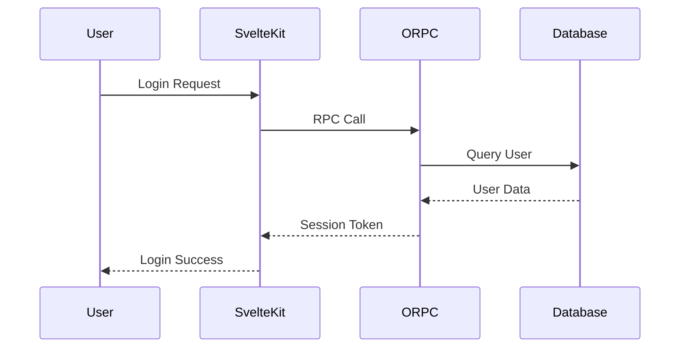
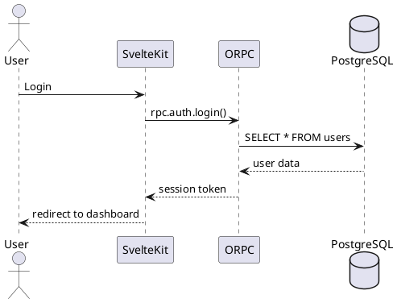

# Diagramming Tools Evaluation

## Overview

This document evaluates various diagramming tools for creating architecture documentation for the sambung-chat project, with focus on GitHub Markdown compatibility and ease of maintenance.

## Evaluation Criteria

1. **GitHub Markdown Compatibility** - Native support in GitHub's Markdown renderer
2. **Ease of Maintenance** - Simple to update, version control friendly
3. **Diagram Types Supported** - Flowcharts, sequence diagrams, ERD, etc.
4. **Learning Curve** - How quickly team members can adopt
5. **Extensibility** - Ability to customize and extend diagrams
6. **Export Options** - Ability to export to various formats if needed
7. **Tooling Support** - IDE integration, linting, validation

## Tools Evaluated

### 1. Mermaid.js ⭐ **RECOMMENDED**

**Type:** Text-to-diagram tool with GitHub native support

**Pros:**

- ✅ **Native GitHub Support** - Renders directly in GitHub Markdown without any setup
- ✅ **Version Control Friendly** - Plain text syntax, easy to diff
- ✅ **Zero Dependencies** - No external tools or image generation needed
- ✅ **Wide Diagram Support** - Flowcharts, sequence diagrams, class diagrams, state diagrams, ERD, mind maps, and more
- ✅ **IDE Support** - Excellent VS Code extensions with preview and IntelliSense
- ✅ **Active Community** - Well-maintained with regular updates
- ✅ **Low Learning Curve** - Intuitive syntax similar to other diagram tools

**Cons:**

- ❌ Limited styling options compared to graphical tools
- ❌ Complex diagrams can become verbose
- ❌ Some advanced features may require workarounds

**GitHub Rendering:** Perfect - supported natively since 2022

**Example Syntax:**



**Maintenance:** Excellent - text-based, easy to update, clear diffs

---

### 2. PlantUML

**Type:** Text-to-diagram tool requiring external rendering

**Pros:**

- ✅ Mature and stable tool with extensive features
- ✅ Excellent UML support (class, use case, activity, component, deployment)
- ✅ Powerful standard library and macros
- ✅ Can generate images locally or via online services

**Cons:**

- ❌ **No Native GitHub Support** - Requires external rendering (images must be committed)
- ❌ Java dependency for local rendering
- ❌ Requires additional build step for automated image generation
- ❌ Steeper learning curve than Mermaid
- ❌ Image files in version control can cause merge conflicts

**GitHub Rendering:** Poor - requires pre-rendered images or external services like PlantUML Server

**Example Syntax:**



**Maintenance:** Moderate - text-based but requires image generation step

---

### 3. Graphviz (DOT)

**Type:** Graph visualization software

**Pros:**

- ✅ Excellent for graph structures and dependency visualization
- ✅ Mature, stable, widely used
- ✅ Powerful layout algorithms

**Cons:**

- ❌ **No Native GitHub Support** - Requires pre-rendered images
- ❌ Steep learning curve
- ❌ Limited support for sequence diagrams and UML
- ❌ Syntax can be complex for large diagrams
- ❌ Manual positioning often required for good results

**GitHub Rendering:** Poor - requires pre-rendered images

**Maintenance:** Difficult - complex syntax, manual positioning needed

---

### 4. Excalidraw

**Type:** Hand-drawn style diagramming tool

**Pros:**

- ✅ Beautiful, informal visual style
- ✅ Great for brainstorming and architecture sketches
- ✅ Export to SVG, PNG, and other formats
- ✅ Web-based, no installation needed

**Cons:**

- ❌ **No Native GitHub Support** - Requires image exports
- ❌ Not text-based (binary or JSON format)
- ❌ Difficult to version control effectively
- ❌ Manual updates required for any changes
- ❌ No programmatic generation
- ❌ Merge conflicts on binary files

**GitHub Rendering:** Poor - requires exported images

**Maintenance:** Poor - manual updates, version control issues

---

### 5. Kroki

**Type:** Diagram rendering service supporting multiple formats

**Pros:**

- ✅ Supports multiple diagram formats (Mermaid, PlantUML, Graphviz, etc.)
- ✅ Can self-host or use cloud service
- ✅ Provides consistent rendering across tools

**Cons:**

- ❌ External service dependency
- ❌ Requires image generation or iframe embedding
- ❌ Not natively supported in GitHub
- ❌ Adds complexity to build pipeline
- ❌ Potential privacy concerns for proprietary code

**GitHub Rendering:** Mixed - can embed via iframes but not native

**Maintenance:** Moderate - depends on underlying tool used

---

### 6. Draw.io / diagrams.net

**Type:** Graphical diagram editor

**Pros:**

- ✅ Powerful GUI with extensive libraries
- ✅ Supports many diagram types
- ✅ Can export to SVG, PNG, XML
- ✅ Free and open source

**Cons:**

- ❌ **No Native GitHub Support** - Requires image exports
- ❌ XML format is verbose and hard to diff
- ❌ GUI-based - not scriptable
- ❌ Manual updates only
- ❌ Merge conflicts on XML files

**GitHub Rendering:** Poor - requires pre-rendered images

**Maintenance:** Poor - manual GUI updates, diff-unfriendly format

---

## Comparison Table

| Tool           | GitHub Native | Text-Based | Version Control | Diagram Types | Learning Curve | Overall Score |
| -------------- | ------------- | ---------- | --------------- | ------------- | -------------- | ------------- |
| **Mermaid.js** | ✅ Yes        | ✅ Yes     | ✅ Excellent    | ⭐⭐⭐⭐⭐    | Easy           | **9/10**      |
| PlantUML       | ❌ No         | ✅ Yes     | ⚠️ Good         | ⭐⭐⭐⭐⭐    | Moderate       | 6/10          |
| Graphviz       | ❌ No         | ✅ Yes     | ⚠️ Good         | ⭐⭐          | Hard           | 4/10          |
| Excalidraw     | ❌ No         | ❌ No      | ❌ Poor         | ⭐⭐⭐        | Easy           | 3/10          |
| Kroki          | ❌ No         | ✅ Yes     | ⚠️ Good         | ⭐⭐⭐⭐⭐    | Varies         | 5/10          |
| Draw.io        | ❌ No         | ❌ No      | ❌ Poor         | ⭐⭐⭐⭐⭐    | Easy           | 4/10          |

## Recommended Tool: **Mermaid.js**

### Justification

**Mermaid.js is the clear winner for this project** because:

1. **Native GitHub Support** - Diagrams render directly in GitHub Markdown, GitHub Issues, PRs, and Discussions without any setup or external dependencies

2. **Developer Experience** - Text-based syntax that's easy to write, read, and maintain directly in the codebase alongside documentation

3. **Version Control** - Plain text format means:
   - Clear diffs showing what changed
   - Easy to resolve merge conflicts
   - Git blame works effectively
   - No binary files to track

4. **Comprehensive Coverage** - Supports all required diagram types:
   - Flowcharts (system architecture, data flow)
   - Sequence diagrams (authentication flow, API requests)
   - Class diagrams (database schema/ERD)
   - State diagrams (session management)
   - Mind maps (component relationships)
   - Graph/Trees (package dependencies)

5. **Zero Friction** - No build steps, no image generation, no external services, no additional tooling setup required

6. **IDE Integration** - Excellent VS Code extension (`Bierner.markdown-mermaid`) with:
   - Live preview
   - Syntax highlighting
   - Error checking
   - Auto-completion

7. **Accessibility** - Text source can be read by screen users, plus we can add alt text to generated diagrams

### Mermaid.js Diagram Types for This Project

Based on the implementation plan, we'll use:

- **Flowcharts** - System architecture, component relationships, data flow, development workflow
- **Sequence Diagrams** - Authentication flows, API request lifecycle, CRUD operations
- **Class Diagrams** - Database ERD (entity relationships)
- **State Diagrams** - Session management, authentication states
- **Mind Maps** - Package dependency graph, tech stack overview

### Tooling Setup

**VS Code Extension:**

```bash
code --install-extension bierner.markdown-mermaid
```

**Markdown Syntax:**
\```mermaid
<diagram code>
\```

**Live Preview:** Available in VS Code and GitHub automatically

## Alternative: Hybrid Approach (Future Consideration)

If Mermaid.js limitations become problematic (e.g., complex diagrams requiring advanced styling), consider:

1. **Start with Mermaid.js** for all diagrams
2. **Use PlantUML** only for extremely complex UML diagrams that Mermaid cannot handle
3. **Generate SVG images** from PlantUML and commit them alongside the source

However, this should only be done if absolutely necessary, as it introduces complexity and maintenance overhead.

## Next Steps

1. ✅ Use Mermaid.js for all architecture diagrams
2. ✅ Create diagrams directly in Markdown files
3. ✅ Use VS Code extension for development
4. ✅ Test rendering in GitHub PR before merging
5. ✅ Maintain diagrams as text in version control

## Resources

- [Mermaid.js Documentation](https://mermaid.js.org/)
- [Mermaid Syntax Guide](https://mermaid.js.org/syntax/flowchart.html)
- [VS Code Extension](https://marketplace.visualstudio.com/items?itemName=bierner.markdown-mermaid)
- [Mermaid Live Editor](https://mermaid.live/) - Online editor for testing diagrams
- [GitHub Mermaid Support](https://github.blog/2022-02-14-include-diagrams-markdown-files-mermaid/)
